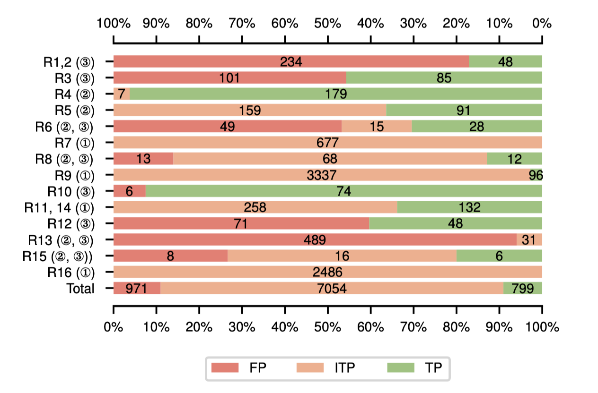

# Cryptoguard Experiment on 3489 fdroid apks 
version: 04.05.03 ([commit id 92551eebc9c9afbcd7c9556c3ae8ed268dbd6685](https://github.com/CryptoGuardOSS/cryptoguard/releases/tag/Release_04.05.03_2020-11-25-02-42_)), the latest version.

setting:
    - max memory limit: 16GB 
    - timeout limit: 6h (original paper set 10m timeout, we found 10m timeout kills 144 apks and extended this to 6h with 4 apks timeout.)

---

F-droid datasets: 3489 apks. Apk name list: `fdroid-3489apks-list`

Original fdroid results: `/result_nofix`

Rule-based results: `/result_nofix_rulebased` 

Verification results: `/verified_alarms`

Def-use-fix results: `/result_def-use-fix` and Rule-based Def-use-fix results: `/result_def-use-fix_rulebased`

Minimal working examples: `/MWEs`

#### Note that the rule number in above results is accordding to tool implementation.

| Paper  rule number | Tool rule number | Paper high-level rules                                       |
| ------------------ | ---------------- | ------------------------------------------------------------ |
| rule1, 2           | rule3            | Rule 1: Do not use predictable/constant cryptographic keys.  & Rule 2: Do not use predictable/constant passwords for PBE. |
| rule3              | rule14           | Rule 3: Do not use predictable/constant passwords for  KeyStore. |
| rule4              | rule6            | Rule 4: Do not use custom Hostname verifiers to accept all  hosts. |
| rule5              | rule4            | Rule 5: Do not use custom TrustManager to trust all  certificates. |
| rule6              | rule12           | Rule 6: Do not use custom SSLSocketFactory without manual  Hostname verification. |
| rule7              | rule7            | Rule 7: Do not use HTTP.                                     |
| rule8              | rule11           | Rule 8: Do not use predictable/constant PRNG seeds.          |
| rule9              | rule13           | Rule 9: Do not use cryptographically insecure PRNGs (e.g.,  \texttt{java.util.Random}). |
| rule10             | rule9            | Rule 10: Do not use static Salts in PBE.                     |
| rule11, 14         | rule1            | Rule 11: Do not use ECB mode in symmetric ciphers. & Rule  14: Do not use 64-bit block ciphers (e.g., DES, IDEA, Blowfish, RC4, RC2). |
| rule12             | rule10           | Rule 12: Do not use static IVs in CBC mode symmetric ciphers. |
| rule13             | rule8            | Rule 13: Do not use fewer than 1,000 iterations for PBE.     |
| rule15             | rule5            | Rule 15: Do not use insecure asymmetric ciphers (e.g, RSA,  ECC). |
| rule16             | rule2            | Rule 16: Do not use insecure cryptographic hash (e.g., SHA1,  MD5, MD4, MD2). |

---

All original results are shown as [Original fdroid results](/result_nofix). Based on the merged results [Rule-based results](/result_nofix_rulebased), we manually verified the top-10 offending methods and some other sample misuses. The overall verification results are shown as the following figure.

