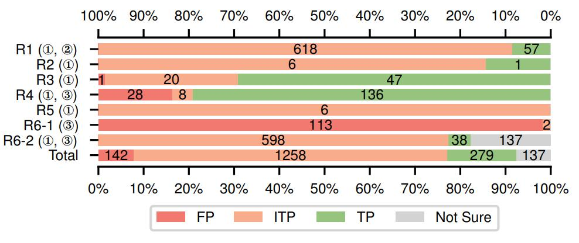

# CryptoREX artifacts

To make CryptoREX compatible with Python3 and able to generate necessary information for manual verification, we tweaked CryptoREX's source code. The modified version of CryptoREX is available at [CryptoREX](CryptoREX). You may follow the instructions at [CryptoREX/README.md](CryptoREX/README.md) to install and test it on your machine.

We then ran our modified version of CryptoREX on our data set consisting of [1437 firmware images](./crawled_firmwares_urls). The original report is shown as [raw_report.log](raw_report.log). Based on the original report, we manually verified most of the reported misuses. The overall verification results are shown as the following figure. We can see Rule 1, 2, 5, 6-1, and 6-2 are basically not reliable as they produce too many useless results. As of Rule 3, 4, the two rules have relatively high accuracy, and indeed reveal some security problems in firmware.

We have explained the flaws of the six rules, as well as that of CryptoREX's design and implementation in our paper. Also, we will provide Minimum Working Examples (MWEs) in this repository; see [MWEs/README.md](MWEs/README.md). MWE refers to a kind of proof of concept (PoC) of CryptoREX's flaws. You can simply have a look at the source code of our MWEs and CryptoREX's reports on them, to gain an intuitive view of what CryptoREX do wrong while detecting cryptographic misuses. 

In case you are interested in the True Positives CryptoREX found, we briefly summarize them here:

1. Rule 1, Misuse-8 and Rule 3, Misuse-3: Using DES-ECB and constant key to encrypt configuration file.
2. Rule 3, Misuse-1: Hardcoding the encrypted Amazon Simple Storage Service access key in firmware, and using a constant key to decrpyt it in run-time. It is very easy to recover the access key by reverse engineering.
3. Rule 3, Misuse-[4, 6, 8]: Using constant strings (in this case, "admin" and "password") as default passwords. This paradigm is usually considered to be insecure.
4. Rule 4, Misuse-[3, 5-10]: Using constant salts to encrypt passwords, rendering the encrypted passwords more likely to be cracked by dictionary attck.
5. Rule 6-2, Misuse-15: `rand()` without seeding - *mod_auth.so* uses predictable nonce value for HTTP Digest Access Authentication, making it prone to suffer from reply attacks.
6. Rule 6-2, Misuse-21: `rand()` without seeding - *libavahi-core.so.7.0.2* uses predictable DNS Query packet ID, making it prone to suffer from DNS poisoning.

For more detailed information, see [verified_misuses](verified_misuses).
