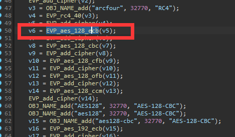
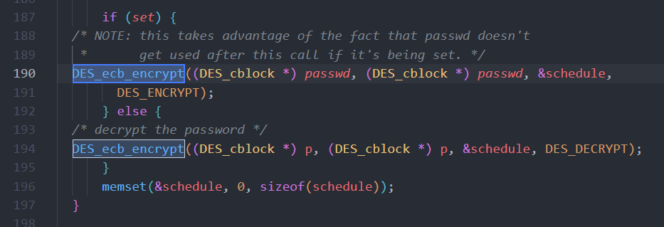

# Summary

| Pattern | # of Raw Misuses | # of Reported Misuses | # of Grouped Misuses |
| ------- | ---------------- | --------------------- | -------------------- |
| ITP-1   | 140              | 49                    | 9                    |
| ITP-2   | 478              | 229                   | 13                   |
| ITP-3   | 0                | 0                     | 0                    |
| TP      | 5               | 3                    | 1                    |
| FP      | 0                | 0                     | 0                    |
| Total   | 623              | 281                   | 23                   |

# Misuse-1 (ITP-2)

Pattern: ITP-2

Desc: Encrypt password via `DES_ecb_encrypt` and save to file

```
--------------------------------------
File: /home/xx/CRYPTOREX/CRYPTOREX_criticism/tmp/extract/Netgear/DC112A_V1.0.0.60_1.0.60.zip/DC112A_V1.0.0.60_1.0.60/_DC112A-V1.0.0.60_1.0.60.chk.extracted/squashfs-root/usr/sbin/afppasswd
Rule: Rule-4. Do not use electronic code book (ECB) mode for encryption
Function name: DES_ecb_encrypt (0x0)
Data: 
Path: ['0x9088']
Count: 3
Call stack:
--------------------------------------
--------------------------------------
File: /home/xx/CRYPTOREX/CRYPTOREX_criticism/tmp/extract/Netgear/DC112A_V1.0.0.60_1.0.60.zip/DC112A_V1.0.0.60_1.0.60/_DC112A-V1.0.0.60_1.0.60.chk.extracted/squashfs-root/usr/sbin/afppasswd
Rule: Rule-4. Do not use electronic code book (ECB) mode for encryption
Function name: DES_ecb_encrypt (0x0)
Data: 
Path: ['0x9064']
Count: 3
Call stack:
--------------------------------------
--------------------------------------
File: /home/xx/CRYPTOREX/CRYPTOREX_criticism/tmp/extract/Netgear/WNDR4500v2-V1.0.0.72_1.0.45.zip/WNDR4500v2-V1.0.0.72_1.0.45/_WNDR4500v2-V1.0.0.72_1.0.45.chk.extracted/squashfs-root/usr/sbin/afppasswd
Rule: Rule-4. Do not use electronic code book (ECB) mode for encryption
Function name: DES_ecb_encrypt (0x0)
Data: 
Path: ['0x401324']
Count: 1
Call stack:
--------------------------------------
--------------------------------------
File: /home/xx/CRYPTOREX/CRYPTOREX_criticism/tmp/extract/Netgear/WNDR4500v2-V1.0.0.72_1.0.45.zip/WNDR4500v2-V1.0.0.72_1.0.45/_WNDR4500v2-V1.0.0.72_1.0.45.chk.extracted/squashfs-root/usr/sbin/afppasswd
Rule: Rule-4. Do not use electronic code book (ECB) mode for encryption
Function name: DES_ecb_encrypt (0x0)
Data: 
Path: ['0x4012f0']
Count: 1
Call stack:
--------------------------------------
--------------------------------------
File: /home/xx/CRYPTOREX/CRYPTOREX_criticism/tmp/extract/Netgear/WNDR4500-V1.0.1.46_1.0.76.zip/WNDR4500-V1.0.1.46_1.0.76/_WNDR4500-V1.0.1.46_1.0.76.chk.extracted/squashfs-root/usr/sbin/afppasswd
Rule: Rule-4. Do not use electronic code book (ECB) mode for encryption
Function name: DES_ecb_encrypt (0x0)
Data: 
Path: ['0x401274']
Count: 1
Call stack:
--------------------------------------
--------------------------------------
File: /home/xx/CRYPTOREX/CRYPTOREX_criticism/tmp/extract/Netgear/WNDR4500-V1.0.1.46_1.0.76.zip/WNDR4500-V1.0.1.46_1.0.76/_WNDR4500-V1.0.1.46_1.0.76.chk.extracted/squashfs-root/usr/sbin/afppasswd
Rule: Rule-4. Do not use electronic code book (ECB) mode for encryption
Function name: DES_ecb_encrypt (0x0)
Data: 
Path: ['0x401240']
Count: 1
Call stack:
--------------------------------------
```

# Misuse-2 (ITP-2)

Pattern: ITP-2

Desc: NTLM

```
--------------------------------------
File: /home/xx/CRYPTOREX/CRYPTOREX_criticism/tmp/extract/Netgear/EX6120-V1.0.0.64_1.0.39.zip/EX6120-V1.0.0.64_1.0.39/_EX6120-V1.0.0.64_1.0.39.chk.extracted/squashfs-root/usr/sbin/curl
Rule: Rule-4. Do not use electronic code book (ECB) mode for encryption
Function name: DES_ecb_encrypt (0x0)
Data: 
Path: ['0x43d288']
Count: 5
Call stack:
--------------------------------------
--------------------------------------
File: /home/xx/CRYPTOREX/CRYPTOREX_criticism/tmp/extract/Netgear/EX6120-V1.0.0.64_1.0.39.zip/EX6120-V1.0.0.64_1.0.39/_EX6120-V1.0.0.64_1.0.39.chk.extracted/squashfs-root/usr/sbin/curl
Rule: Rule-4. Do not use electronic code book (ECB) mode for encryption
Function name: DES_ecb_encrypt (0x0)
Data: 
Path: ['0x43d2b4']
Count: 5
Call stack:
--------------------------------------
--------------------------------------
File: /home/xx/CRYPTOREX/CRYPTOREX_criticism/tmp/extract/Netgear/EX6120-V1.0.0.64_1.0.39.zip/EX6120-V1.0.0.64_1.0.39/_EX6120-V1.0.0.64_1.0.39.chk.extracted/squashfs-root/usr/sbin/curl
Rule: Rule-4. Do not use electronic code book (ECB) mode for encryption
Function name: DES_ecb_encrypt (0x0)
Data: 
Path: ['0x43d2e0']
Count: 5
Call stack:
--------------------------------------
--------------------------------------
File: /home/xx/CRYPTOREX/CRYPTOREX_criticism/tmp/extract/Netgear/EX6120-V1.0.0.64_1.0.39.zip/EX6120-V1.0.0.64_1.0.39/_EX6120-V1.0.0.64_1.0.39.chk.extracted/squashfs-root/usr/sbin/curl
Rule: Rule-4. Do not use electronic code book (ECB) mode for encryption
Function name: DES_ecb_encrypt (0x0)
Data: 
Path: ['0x43d3cc']
Count: 5
Call stack:
--------------------------------------
--------------------------------------
File: /home/xx/CRYPTOREX/CRYPTOREX_criticism/tmp/extract/Netgear/EX6120-V1.0.0.64_1.0.39.zip/EX6120-V1.0.0.64_1.0.39/_EX6120-V1.0.0.64_1.0.39.chk.extracted/squashfs-root/usr/sbin/curl
Rule: Rule-4. Do not use electronic code book (ECB) mode for encryption
Function name: DES_ecb_encrypt (0x0)
Data: 
Path: ['0x43d3f8']
Count: 5
Call stack:
--------------------------------------
--------------------------------------
File: /home/xx/CRYPTOREX/CRYPTOREX_criticism/tmp/extract/Netgear/DC112A_V1.0.0.60_1.0.60.zip/DC112A_V1.0.0.60_1.0.60/_DC112A-V1.0.0.60_1.0.60.chk.extracted/squashfs-root/sbin/curl
Rule: Rule-4. Do not use electronic code book (ECB) mode for encryption
Function name: DES_ecb_encrypt (0x0)
Data: 
Path: ['0x35638']
Count: 4
Call stack:
--------------------------------------
--------------------------------------
File: /home/xx/CRYPTOREX/CRYPTOREX_criticism/tmp/extract/Netgear/DC112A_V1.0.0.60_1.0.60.zip/DC112A_V1.0.0.60_1.0.60/_DC112A-V1.0.0.60_1.0.60.chk.extracted/squashfs-root/sbin/curl
Rule: Rule-4. Do not use electronic code book (ECB) mode for encryption
Function name: DES_ecb_encrypt (0x0)
Data: 
Path: ['0x35658']
Count: 4
Call stack:
--------------------------------------
--------------------------------------
File: /home/xx/CRYPTOREX/CRYPTOREX_criticism/tmp/extract/Netgear/DC112A_V1.0.0.60_1.0.60.zip/DC112A_V1.0.0.60_1.0.60/_DC112A-V1.0.0.60_1.0.60.chk.extracted/squashfs-root/sbin/curl
Rule: Rule-4. Do not use electronic code book (ECB) mode for encryption
Function name: DES_ecb_encrypt (0x0)
Data: 
Path: ['0x35678']
Count: 4
Call stack:
--------------------------------------
--------------------------------------
File: /home/xx/CRYPTOREX/CRYPTOREX_criticism/tmp/extract/Netgear/DC112A_V1.0.0.60_1.0.60.zip/DC112A_V1.0.0.60_1.0.60/_DC112A-V1.0.0.60_1.0.60.chk.extracted/squashfs-root/sbin/curl
Rule: Rule-4. Do not use electronic code book (ECB) mode for encryption
Function name: DES_ecb_encrypt (0x0)
Data: 
Path: ['0x356f0']
Count: 4
Call stack:
--------------------------------------
--------------------------------------
File: /home/xx/CRYPTOREX/CRYPTOREX_criticism/tmp/extract/Netgear/DC112A_V1.0.0.60_1.0.60.zip/DC112A_V1.0.0.60_1.0.60/_DC112A-V1.0.0.60_1.0.60.chk.extracted/squashfs-root/sbin/curl
Rule: Rule-4. Do not use electronic code book (ECB) mode for encryption
Function name: DES_ecb_encrypt (0x0)
Data: 
Path: ['0x35710']
Count: 4
Call stack:
--------------------------------------
--------------------------------------
File: /home/xx/CRYPTOREX/CRYPTOREX_criticism/tmp/extract/Netgear/WNDR4500v2-V1.0.0.72_1.0.45.zip/WNDR4500v2-V1.0.0.72_1.0.45/_WNDR4500v2-V1.0.0.72_1.0.45.chk.extracted/squashfs-root/sbin/curl
Rule: Rule-4. Do not use electronic code book (ECB) mode for encryption
Function name: DES_ecb_encrypt (0x0)
Data: 
Path: ['0x43d674']
Count: 1
Call stack:
--------------------------------------
--------------------------------------
File: /home/xx/CRYPTOREX/CRYPTOREX_criticism/tmp/extract/Netgear/WNDR4500v2-V1.0.0.72_1.0.45.zip/WNDR4500v2-V1.0.0.72_1.0.45/_WNDR4500v2-V1.0.0.72_1.0.45.chk.extracted/squashfs-root/sbin/curl
Rule: Rule-4. Do not use electronic code book (ECB) mode for encryption
Function name: DES_ecb_encrypt (0x0)
Data: 
Path: ['0x43d584']
Count: 1
Call stack:
--------------------------------------
--------------------------------------
File: /home/xx/CRYPTOREX/CRYPTOREX_criticism/tmp/extract/Netgear/WNDR4500-V1.0.1.46_1.0.76.zip/WNDR4500-V1.0.1.46_1.0.76/_WNDR4500-V1.0.1.46_1.0.76.chk.extracted/squashfs-root/opt/remote/bin/curl
Rule: Rule-4. Do not use electronic code book (ECB) mode for encryption
Function name: DES_ecb_encrypt (0x0)
Data: 
Path: ['0x440a08']
Count: 1
Call stack:
--------------------------------------
--------------------------------------
File: /home/xx/CRYPTOREX/CRYPTOREX_criticism/tmp/extract/Netgear/WNDR4500-V1.0.1.46_1.0.76.zip/WNDR4500-V1.0.1.46_1.0.76/_WNDR4500-V1.0.1.46_1.0.76.chk.extracted/squashfs-root/opt/remote/bin/curl
Rule: Rule-4. Do not use electronic code book (ECB) mode for encryption
Function name: DES_ecb_encrypt (0x0)
Data: 
Path: ['0x440910']
Count: 1
Call stack:
--------------------------------------
--------------------------------------
File: /home/xx/CRYPTOREX/CRYPTOREX_criticism/tmp/extract/Netgear/D6300-V1.0.0.102_1.0.102.zip/D6300-V1.0.0.102_1.0.102/_D6300-V1.0.0.102_1.0.102.chk.extracted/jffs2-root/sbin/curl
Rule: Rule-4. Do not use electronic code book (ECB) mode for encryption
Function name: DES_ecb_encrypt (0x0)
Data: 
Path: ['0x43a744']
Count: 1
Call stack:
--------------------------------------
--------------------------------------
File: /home/xx/CRYPTOREX/CRYPTOREX_criticism/tmp/extract/Netgear/D6300-V1.0.0.102_1.0.102.zip/D6300-V1.0.0.102_1.0.102/_D6300-V1.0.0.102_1.0.102.chk.extracted/jffs2-root/sbin/curl
Rule: Rule-4. Do not use electronic code book (ECB) mode for encryption
Function name: DES_ecb_encrypt (0x0)
Data: 
Path: ['0x43a76c']
Count: 1
Call stack:
--------------------------------------
--------------------------------------
File: /home/xx/CRYPTOREX/CRYPTOREX_criticism/tmp/extract/Netgear/D6300-V1.0.0.102_1.0.102.zip/D6300-V1.0.0.102_1.0.102/_D6300-V1.0.0.102_1.0.102.chk.extracted/jffs2-root/sbin/curl
Rule: Rule-4. Do not use electronic code book (ECB) mode for encryption
Function name: DES_ecb_encrypt (0x0)
Data: 
Path: ['0x43a794']
Count: 1
Call stack:
--------------------------------------
--------------------------------------
File: /home/xx/CRYPTOREX/CRYPTOREX_criticism/tmp/extract/Netgear/D6300-V1.0.0.102_1.0.102.zip/D6300-V1.0.0.102_1.0.102/_D6300-V1.0.0.102_1.0.102.chk.extracted/jffs2-root/sbin/curl
Rule: Rule-4. Do not use electronic code book (ECB) mode for encryption
Function name: DES_ecb_encrypt (0x0)
Data: 
Path: ['0x43a684']
Count: 1
Call stack:
--------------------------------------
--------------------------------------
File: /home/xx/CRYPTOREX/CRYPTOREX_criticism/tmp/extract/Netgear/D6300-V1.0.0.102_1.0.102.zip/D6300-V1.0.0.102_1.0.102/_D6300-V1.0.0.102_1.0.102.chk.extracted/jffs2-root/sbin/curl
Rule: Rule-4. Do not use electronic code book (ECB) mode for encryption
Function name: DES_ecb_encrypt (0x0)
Data: 
Path: ['0x43a6b0']
Count: 1
Call stack:
--------------------------------------
--------------------------------------
File: /home/xx/CRYPTOREX/CRYPTOREX_criticism/tmp/extract/Netgear/EX6110_EX3110_EX5000_EX2800-V1.0.1.80.zip/EX6110_EX3110_EX5000_EX2800-V1.0.1.80/_EX6110_EX3110_EX5000_EX2800-V1.0.1.80.img.extracted/squashfs-root/sbin/curl
Rule: Rule-4. Do not use electronic code book (ECB) mode for encryption
Function name: DES_ecb_encrypt (0x0)
Data: 
Path: ['0x476114']
Count: 1
Call stack:
--------------------------------------
--------------------------------------
File: /home/xx/CRYPTOREX/CRYPTOREX_criticism/tmp/extract/Netgear/EX6110_EX3110_EX5000_EX2800-V1.0.1.80.zip/EX6110_EX3110_EX5000_EX2800-V1.0.1.80/_EX6110_EX3110_EX5000_EX2800-V1.0.1.80.img.extracted/squashfs-root/sbin/curl
Rule: Rule-4. Do not use electronic code book (ECB) mode for encryption
Function name: DES_ecb_encrypt (0x0)
Data: 
Path: ['0x476140']
Count: 1
Call stack:
--------------------------------------
--------------------------------------
File: /home/xx/CRYPTOREX/CRYPTOREX_criticism/tmp/extract/Netgear/EX6110_EX3110_EX5000_EX2800-V1.0.1.80.zip/EX6110_EX3110_EX5000_EX2800-V1.0.1.80/_EX6110_EX3110_EX5000_EX2800-V1.0.1.80.img.extracted/squashfs-root/sbin/curl
Rule: Rule-4. Do not use electronic code book (ECB) mode for encryption
Function name: DES_ecb_encrypt (0x0)
Data: 
Path: ['0x47616c']
Count: 1
Call stack:
--------------------------------------
--------------------------------------
File: /home/xx/CRYPTOREX/CRYPTOREX_criticism/tmp/extract/Netgear/EX6110_EX3110_EX5000_EX2800-V1.0.1.80.zip/EX6110_EX3110_EX5000_EX2800-V1.0.1.80/_EX6110_EX3110_EX5000_EX2800-V1.0.1.80.img.extracted/squashfs-root/sbin/curl
Rule: Rule-4. Do not use electronic code book (ECB) mode for encryptionUsed to Implement Protocol
Function name: DES_ecb_encrypt (0x0)
Data: 
Path: ['0x476258']
Count: 1
Call stack:
--------------------------------------
--------------------------------------
File: /home/xx/CRYPTOREX/CRYPTOREX_criticism/tmp/extract/Netgear/EX6110_EX3110_EX5000_EX2800-V1.0.1.80.zip/EX6110_EX3110_EX5000_EX2800-V1.0.1.80/_EX6110_EX3110_EX5000_EX2800-V1.0.1.80.img.extracted/squashfs-root/sbin/curl
Rule: Rule-4. Do not use electronic code book (ECB) mode for encryptionUsed to Implement Protocol
Function name: DES_ecb_encrypt (0x0)
Data: 
Path: ['0x476284']
Count: 1
Call stack:
--------------------------------------
--------------------------------------
File: /home/xx/CRYPTOREX/CRYPTOREX_criticism/tmp/extract/D-Link/DNR-326_FIRMWARE_1.20.ZIP/DNR-326_FIRMWARE_1.20/_DNR326_FW_120b02.bin.extracted/squashfs-root/lib/libcurl.so.4
Rule: Rule-4. Do not use electronic code book (ECB) mode for encryptionUsed to Implement Protocol
Function name: DES_ecb_encrypt (0x0)
Data: 
Path: ['0x430410']
Count: 1
Call stack:
--------------------------------------
--------------------------------------
File: /home/xx/CRYPTOREX/CRYPTOREX_criticism/tmp/extract/D-Link/DNR-326_FIRMWARE_1.20.ZIP/DNR-326_FIRMWARE_1.20/_DNR326_FW_120b02.bin.extracted/squashfs-root/lib/libcurl.so.4
Rule: Rule-4. Do not use electronic code book (ECB) mode for encryptionUsed to Implement Protocol
Function name: DES_ecb_encrypt (0x0)
Data: 
Path: ['0x430430']
Count: 1
Call stack:
--------------------------------------
--------------------------------------
File: /home/xx/CRYPTOREX/CRYPTOREX_criticism/tmp/extract/D-Link/DNR-326_FIRMWARE_1.20.ZIP/DNR-326_FIRMWARE_1.20/_DNR326_FW_120b02.bin.extracted/squashfs-root/lib/libcurl.so.4
Rule: Rule-4. Do not use electronic code book (ECB) mode for encryptionUsed to Implement Protocol
Function name: DES_ecb_encrypt (0x0)
Data: 
Path: ['0x430450']
Count: 1
Call stack:
--------------------------------------
--------------------------------------
File: /home/xx/CRYPTOREX/CRYPTOREX_criticism/tmp/extract/D-Link/DNR-326_FIRMWARE_1.20.ZIP/DNR-326_FIRMWARE_1.20/_DNR326_FW_120b02.bin.extracted/squashfs-root/lib/libcurl.so.4
Rule: Rule-4. Do not use electronic code book (ECB) mode for encryptionUsed to Implement Protocol
Function name: DES_ecb_encrypt (0x0)
Data: 
Path: ['0x430b34']
Count: 1
Call stack:
--------------------------------------
--------------------------------------
File: /home/xx/CRYPTOREX/CRYPTOREX_criticism/tmp/extract/D-Link/DNR-326_FIRMWARE_1.20.ZIP/DNR-326_FIRMWARE_1.20/_DNR326_FW_120b02.bin.extracted/squashfs-root/lib/libcurl.so.4
Rule: Rule-4. Do not use electronic code book (ECB) mode for encryptionUsed to Implement Protocol
Function name: DES_ecb_encrypt (0x0)
Data: 
Path: ['0x430b6c']
Count: 1
Call stack:
--------------------------------------
--------------------------------------
File: /home/xx/CRYPTOREX/CRYPTOREX_criticism/tmp/extract/D-Link/DNS-345_A2_FIRMWARE_1.03B06.ZIP/DNS-345_A2_FIRMWARE_1.03B06/_DNS-345_A2_FW_v1.03b06.extracted/squashfs-root/lib/libcurl.so.4
Rule: Rule-4. Do not use electronic code book (ECB) mode for encryptionUsed to Implement Protocol
Function name: DES_ecb_encrypt (0x0)
Data: 
Path: ['0x42ef08']
Count: 1
Call stack:
--------------------------------------
--------------------------------------
File: /home/xx/CRYPTOREX/CRYPTOREX_criticism/tmp/extract/D-Link/DNS-345_A2_FIRMWARE_1.03B06.ZIP/DNS-345_A2_FIRMWARE_1.03B06/_DNS-345_A2_FW_v1.03b06.extracted/squashfs-root/lib/libcurl.so.4
Rule: Rule-4. Do not use electronic code book (ECB) mode for encryptionUsed to Implement Protocol
Function name: DES_ecb_encrypt (0x0)
Data: 
Path: ['0x42ef28']
Count: 1
Call stack:
--------------------------------------
--------------------------------------
File: /home/xx/CRYPTOREX/CRYPTOREX_criticism/tmp/extract/D-Link/DNS-345_A2_FIRMWARE_1.03B06.ZIP/DNS-345_A2_FIRMWARE_1.03B06/_DNS-345_A2_FW_v1.03b06.extracted/squashfs-root/lib/libcurl.so.4
Rule: Rule-4. Do not use electronic code book (ECB) mode for encryptionUsed to Implement Protocol
Function name: DES_ecb_encrypt (0x0)
Data: 
Path: ['0x42ef48']
Count: 1
Call stack:
--------------------------------------
--------------------------------------
File: /home/xx/CRYPTOREX/CRYPTOREX_criticism/tmp/extract/D-Link/DNS-345_A2_FIRMWARE_1.03B06.ZIP/DNS-345_A2_FIRMWARE_1.03B06/_DNS-345_A2_FW_v1.03b06.extracted/squashfs-root/lib/libcurl.so.4
Rule: Rule-4. Do not use electronic code book (ECB) mode for encryptionUsed to Implement Protocol
Function name: DES_ecb_encrypt (0x0)
Data: 
Path: ['0x42f640']
Count: 1
Call stack:
--------------------------------------
--------------------------------------
File: /home/xx/CRYPTOREX/CRYPTOREX_criticism/tmp/extract/D-Link/DNS-345_A2_FIRMWARE_1.03B06.ZIP/DNS-345_A2_FIRMWARE_1.03B06/_DNS-345_A2_FW_v1.03b06.extracted/squashfs-root/lib/libcurl.so.4
Rule: Rule-4. Do not use electronic code book (ECB) mode for encryptionUsed to Implement Protocol

Function name: DES_ecb_encrypt (0x0)
Data: 
Path: ['0x42f67c']
Count: 1
Call stack:
--------------------------------------
--------------------------------------
File: /home/xx/CRYPTOREX/CRYPTOREX_criticism/tmp/extract/Netgear/DC112A_V1.0.0.60_1.0.60.zip/DC112A_V1.0.0.60_1.0.60/_DC112A-V1.0.0.60_1.0.60.chk.extracted/squashfs-root/usr/lib/libcurl.so.4.3.0
Rule: Rule-4. Do not use electronic code book (ECB) mode for encryptionUsed to Implement Protocol
Function name: DES_ecb_encrypt (0x0)
Data: 
Path: ['0x42059c']
Count: 4
Call stack:
--------------------------------------
--------------------------------------
File: /home/xx/CRYPTOREX/CRYPTOREX_criticism/tmp/extract/Netgear/DC112A_V1.0.0.60_1.0.60.zip/DC112A_V1.0.0.60_1.0.60/_DC112A-V1.0.0.60_1.0.60.chk.extracted/squashfs-root/usr/lib/libcurl.so.4.3.0
Rule: Rule-4. Do not use electronic code book (ECB) mode for encryptionUsed to Implement Protocol
Function name: DES_ecb_encrypt (0x0)
Data: 
Path: ['0x4205bc']
Count: 4
Call stack:
--------------------------------------
--------------------------------------
File: /home/xx/CRYPTOREX/CRYPTOREX_criticism/tmp/extract/Netgear/DC112A_V1.0.0.60_1.0.60.zip/DC112A_V1.0.0.60_1.0.60/_DC112A-V1.0.0.60_1.0.60.chk.extracted/squashfs-root/usr/lib/libcurl.so.4.3.0
Rule: Rule-4. Do not use electronic code book (ECB) mode for encryptionUsed to Implement Protocol

Function name: DES_ecb_encrypt (0x0)
Data: 
Path: ['0x4205dc']
Count: 4
Call stack:
--------------------------------------
--------------------------------------
File: /home/xx/CRYPTOREX/CRYPTOREX_criticism/tmp/extract/Netgear/DC112A_V1.0.0.60_1.0.60.zip/DC112A_V1.0.0.60_1.0.60/_DC112A-V1.0.0.60_1.0.60.chk.extracted/squashfs-root/usr/lib/libcurl.so.4.3.0
Rule: Rule-4. Do not use electronic code book (ECB) mode for encryptionUsed to Implement Protocol

Function name: DES_ecb_encrypt (0x0)
Data: 
Path: ['0x420654']
Count: 4
Call stack:
--------------------------------------
--------------------------------------
File: /home/xx/CRYPTOREX/CRYPTOREX_criticism/tmp/extract/Netgear/DC112A_V1.0.0.60_1.0.60.zip/DC112A_V1.0.0.60_1.0.60/_DC112A-V1.0.0.60_1.0.60.chk.extracted/squashfs-root/usr/lib/libcurl.so.4.3.0
Rule: Rule-4. Do not use electronic code book (ECB) mode for encryptionUsed to Implement Protocol

Function name: DES_ecb_encrypt (0x0)
Data: 
Path: ['0x420684']
Count: 4
Call stack:
--------------------------------------
--------------------------------------
File: /home/xx/CRYPTOREX/CRYPTOREX_criticism/tmp/extract/D-Link/DSP-W215_REVA2_FIRMWARE_v1.24B01.zip/DSP-W215_REVA2_FIRMWARE_v1.24B01/_DSPW215A2_FW124B01.bin.extracted/squashfs-root/lib/libcurl.so.4.3.0
Rule: Rule-4. Do not use electronic code book (ECB) mode for encryptionUsed to Implement Protocol

Function name: DES_ecb_encrypt (0x0)
Data: 
Path: ['0x42f81c']
Count: 1
Call stack:
--------------------------------------
--------------------------------------
File: /home/xx/CRYPTOREX/CRYPTOREX_criticism/tmp/extract/D-Link/DSP-W215_REVA2_FIRMWARE_v1.24B01.zip/DSP-W215_REVA2_FIRMWARE_v1.24B01/_DSPW215A2_FW124B01.bin.extracted/squashfs-root/lib/libcurl.so.4.3.0
Rule: Rule-4. Do not use electronic code book (ECB) mode for encryptionUsed to Implement Protocol

Function name: DES_ecb_encrypt (0x0)
Data: 
Path: ['0x42f848']
Count: 1
Call stack:
--------------------------------------
--------------------------------------
File: /home/xx/CRYPTOREX/CRYPTOREX_criticism/tmp/extract/D-Link/DSP-W215_REVA2_FIRMWARE_v1.24B01.zip/DSP-W215_REVA2_FIRMWARE_v1.24B01/_DSPW215A2_FW124B01.bin.extracted/squashfs-root/lib/libcurl.so.4.3.0
Rule: Rule-4. Do not use electronic code book (ECB) mode for encryptionUsed to Implement Protocol

Function name: DES_ecb_encrypt (0x0)
Data: 
Path: ['0x42f8ec']
Count: 1
Call stack:
--------------------------------------
--------------------------------------
File: /home/xx/CRYPTOREX/CRYPTOREX_criticism/tmp/extract/D-Link/DSP-W215_REVA2_FIRMWARE_v1.24B01.zip/DSP-W215_REVA2_FIRMWARE_v1.24B01/_DSPW215A2_FW124B01.bin.extracted/squashfs-root/lib/libcurl.so.4.3.0
Rule: Rule-4. Do not use electronic code book (ECB) mode for encryptionUsed to Implement Protocol

Function name: DES_ecb_encrypt (0x0)
Data: 
Path: ['0x42f918']
Count: 1
Call stack:
--------------------------------------
--------------------------------------
File: /home/xx/CRYPTOREX/CRYPTOREX_criticism/tmp/extract/D-Link/DSP-W215_REVA2_FIRMWARE_v1.24B01.zip/DSP-W215_REVA2_FIRMWARE_v1.24B01/_DSPW215A2_FW124B01.bin.extracted/squashfs-root/lib/libcurl.so.4.3.0
Rule: Rule-4. Do not use electronic code book (ECB) mode for encryptionUsed to Implement Protocol
Function name: DES_ecb_encrypt (0x0)
Data: 
Path: ['0x42f944']
Count: 1
Call stack:
--------------------------------------
--------------------------------------
File: /home/xx/CRYPTOREX/CRYPTOREX_criticism/tmp/extract/D-Link/DCS-8200LH_REVA_FIRMWARE_1.01.01.ZIP/DCS-8200LH_REVA_FIRMWARE_1.01.01/_DCS-8200LH_A1_FW_1.01.01_r3845.bin.extracted/squashfs-root/lib/libcurl.so.4.3.0
Rule: Rule-4. Do not use electronic code book (ECB) mode for encryptionUsed to Implement Protocol
Function name: DES_ecb_encrypt (0x0)
Data: 
Path: ['0x42dfc4']
Count: 1
Call stack:
--------------------------------------
--------------------------------------
File: /home/xx/CRYPTOREX/CRYPTOREX_criticism/tmp/extract/D-Link/DCS-8200LH_REVA_FIRMWARE_1.01.01.ZIP/DCS-8200LH_REVA_FIRMWARE_1.01.01/_DCS-8200LH_A1_FW_1.01.01_r3845.bin.extracted/squashfs-root/lib/libcurl.so.4.3.0
Rule: Rule-4. Do not use electronic code book (ECB) mode for encryptionUsed to Implement Protocol
Function name: DES_ecb_encrypt (0x0)
Data: 
Path: ['0x42dff0']
Count: 1
Call stack:
--------------------------------------
--------------------------------------
File: /home/xx/CRYPTOREX/CRYPTOREX_criticism/tmp/extract/D-Link/DCS-8200LH_REVA_FIRMWARE_1.01.01.ZIP/DCS-8200LH_REVA_FIRMWARE_1.01.01/_DCS-8200LH_A1_FW_1.01.01_r3845.bin.extracted/squashfs-root/lib/libcurl.so.4.3.0
Rule: Rule-4. Do not use electronic code book (ECB) mode for encryptionUsed to Implement Protocol
Function name: DES_ecb_encrypt (0x0)
Data: 
Path: ['0x42e09c']
Count: 1
Call stack:
--------------------------------------
--------------------------------------
File: /home/xx/CRYPTOREX/CRYPTOREX_criticism/tmp/extract/D-Link/DCS-8200LH_REVA_FIRMWARE_1.01.01.ZIP/DCS-8200LH_REVA_FIRMWARE_1.01.01/_DCS-8200LH_A1_FW_1.01.01_r3845.bin.extracted/squashfs-root/lib/libcurl.so.4.3.0
Rule: Rule-4. Do not use electronic code book (ECB) mode for encryptionUsed to Implement Protocol
Function name: DES_ecb_encrypt (0x0)
Data: 
Path: ['0x42e0c8']
Count: 1
Call stack:
--------------------------------------
--------------------------------------
File: /home/xx/CRYPTOREX/CRYPTOREX_criticism/tmp/extract/D-Link/DCS-8200LH_REVA_FIRMWARE_1.01.01.ZIP/DCS-8200LH_REVA_FIRMWARE_1.01.01/_DCS-8200LH_A1_FW_1.01.01_r3845.bin.extracted/squashfs-root/lib/libcurl.so.4.3.0
Rule: Rule-4. Do not use electronic code book (ECB) mode for encryptionUsed to Implement Protocol
Function name: DES_ecb_encrypt (0x0)
Data: 
Path: ['0x42e0f4']
Count: 1
Call stack:
--------------------------------------
--------------------------------------
File: /home/xx/CRYPTOREX/CRYPTOREX_criticism/tmp/extract/Tomato/tomato-RT-AC3200-ARM--140-AIO-64K.zip/tomato-RT-AC3200-ARM--140-AIO-64K/image/_tomato-RT-AC3200-ARM--140-AIO-64K.trx.extracted/squashfs-root/usr/lib/libcurl.so.4.4.0
Rule: Rule-4. Do not use electronic code book (ECB) mode for encryptionUsed to Implement Protocol
Function name: DES_ecb_encrypt (0x0)
Data: 
Path: ['0x43a1b8']
Count: 1
Call stack:
--------------------------------------
--------------------------------------
File: /home/xx/CRYPTOREX/CRYPTOREX_criticism/tmp/extract/Tomato/tomato-RT-AC3200-ARM--140-AIO-64K.zip/tomato-RT-AC3200-ARM--140-AIO-64K/image/_tomato-RT-AC3200-ARM--140-AIO-64K.trx.extracted/squashfs-root/usr/lib/libcurl.so.4.4.0
Rule: Rule-4. Do not use electronic code book (ECB) mode for encryptionUsed to Implement Protocol
Function name: DES_ecb_encrypt (0x0)
Data: 
Path: ['0x43a1d8']
Count: 1
Call stack:
--------------------------------------
--------------------------------------
File: /home/xx/CRYPTOREX/CRYPTOREX_criticism/tmp/extract/Tomato/tomato-RT-AC3200-ARM--140-AIO-64K.zip/tomato-RT-AC3200-ARM--140-AIO-64K/image/_tomato-RT-AC3200-ARM--140-AIO-64K.trx.extracted/squashfs-root/usr/lib/libcurl.so.4.4.0
Rule: Rule-4. Do not use electronic code book (ECB) mode for encryptionUsed to Implement Protocol
Function name: DES_ecb_encrypt (0x0)
Data: 
Path: ['0x43a1f8']
Count: 1
Call stack:
--------------------------------------
--------------------------------------
File: /home/xx/CRYPTOREX/CRYPTOREX_criticism/tmp/extract/Tomato/tomato-RT-AC3200-ARM--140-AIO-64K.zip/tomato-RT-AC3200-ARM--140-AIO-64K/image/_tomato-RT-AC3200-ARM--140-AIO-64K.trx.extracted/squashfs-root/usr/lib/libcurl.so.4.4.0
Rule: Rule-4. Do not use electronic code book (ECB) mode for encryptionUsed to Implement Protocol
Function name: DES_ecb_encrypt (0x0)
Data: 
Path: ['0x43a278']
Count: 1
Call stack:
--------------------------------------
--------------------------------------
File: /home/xx/CRYPTOREX/CRYPTOREX_criticism/tmp/extract/Tomato/tomato-RT-AC3200-ARM--140-AIO-64K.zip/tomato-RT-AC3200-ARM--140-AIO-64K/image/_tomato-RT-AC3200-ARM--140-AIO-64K.trx.extracted/squashfs-root/usr/lib/libcurl.so.4.4.0
Rule: Rule-4. Do not use electronic code book (ECB) mode for encryptionUsed to Implement Protocol
Function name: DES_ecb_encrypt (0x0)
Data: 
Path: ['0x43a2a8']
Count: 1
Call stack:
--------------------------------------
--------------------------------------
File: /home/xx/CRYPTOREX/CRYPTOREX_criticism/tmp/extract/Netgear/EX6110_EX3110_EX5000_EX2800-V1.0.1.80.zip/EX6110_EX3110_EX5000_EX2800-V1.0.1.80/_EX6110_EX3110_EX5000_EX2800-V1.0.1.80.img.extracted/squashfs-root/lib/libcurl.so.4.7.0
Rule: Rule-4. Do not use electronic code book (ECB) mode for encryptionUsed to Implement Protoco
Function name: DES_ecb_encrypt (0x0)
Data: 
Path: ['0x412184']
Count: 1
Call stack:
--------------------------------------
--------------------------------------
File: /home/xx/CRYPTOREX/CRYPTOREX_criticism/tmp/extract/Netgear/EX6110_EX3110_EX5000_EX2800-V1.0.1.80.zip/EX6110_EX3110_EX5000_EX2800-V1.0.1.80/_EX6110_EX3110_EX5000_EX2800-V1.0.1.80.img.extracted/squashfs-root/lib/libcurl.so.4.7.0
Rule: Rule-4. Do not use electronic code book (ECB) mode for encryptionUsed to Implement Protocol
Function name: DES_ecb_encrypt (0x0)
Data: 
Path: ['0x4121b0']
Count: 1
Call stack:
--------------------------------------
--------------------------------------
File: /home/xx/CRYPTOREX/CRYPTOREX_criticism/tmp/extract/Netgear/EX6110_EX3110_EX5000_EX2800-V1.0.1.80.zip/EX6110_EX3110_EX5000_EX2800-V1.0.1.80/_EX6110_EX3110_EX5000_EX2800-V1.0.1.80.img.extracted/squashfs-root/lib/libcurl.so.4.7.0
Rule: Rule-4. Do not use electronic code book (ECB) mode for encryptionUsed to Implement Protocol
Function name: DES_ecb_encrypt (0x0)
Data: 
Path: ['0x4121dc']
Count: 1
Call stack:
--------------------------------------
--------------------------------------
File: /home/xx/CRYPTOREX/CRYPTOREX_criticism/tmp/extract/Netgear/EX6110_EX3110_EX5000_EX2800-V1.0.1.80.zip/EX6110_EX3110_EX5000_EX2800-V1.0.1.80/_EX6110_EX3110_EX5000_EX2800-V1.0.1.80.img.extracted/squashfs-root/lib/libcurl.so.4.7.0
Rule: Rule-4. Do not use electronic code book (ECB) mode for encryptionUsed to Implement Protocol
Function name: DES_ecb_encrypt (0x0)
Data: 
Path: ['0x4122c8']
Count: 1
Call stack:
--------------------------------------
--------------------------------------
File: /home/xx/CRYPTOREX/CRYPTOREX_criticism/tmp/extract/Netgear/EX6110_EX3110_EX5000_EX2800-V1.0.1.80.zip/EX6110_EX3110_EX5000_EX2800-V1.0.1.80/_EX6110_EX3110_EX5000_EX2800-V1.0.1.80.img.extracted/squashfs-root/lib/libcurl.so.4.7.0
Rule: Rule-4. Do not use electronic code book (ECB) mode for encryptionUsed to Implement Protocol
Function name: DES_ecb_encrypt (0x0)
Data: 
Path: ['0x4122f4']
Count: 1
Call stack:
--------------------------------------
--------------------------------------
File: /home/xx/CRYPTOREX/CRYPTOREX_criticism/tmp/extract/Tomato/freshtomato-RT-AC3200-ARM-2022.5-AIO-64K.zip/freshtomato-RT-AC3200-ARM-2022.5-AIO-64K/_freshtomato-RT-AC3200-ARM-2022.5-AIO-64K.trx.extracted/squashfs-root/usr/lib/libcurl.so.4.8.0
Rule: Rule-4. Do not use electronic code book (ECB) mode for encryptionUsed to Implement Protocol
Function name: DES_ecb_encrypt (0x0)
Data: 
Path: ['0x40e0a4']
Count: 1
Call stack:
--------------------------------------
--------------------------------------
File: /home/xx/CRYPTOREX/CRYPTOREX_criticism/tmp/extract/Tomato/freshtomato-RT-AC3200-ARM-2022.5-AIO-64K.zip/freshtomato-RT-AC3200-ARM-2022.5-AIO-64K/_freshtomato-RT-AC3200-ARM-2022.5-AIO-64K.trx.extracted/squashfs-root/usr/lib/libcurl.so.4.8.0
Rule: Rule-4. Do not use electronic code book (ECB) mode for encryptionUsed to Implement Protocol
Function name: DES_ecb_encrypt (0x0)
Data: 
Path: ['0x40e0c4']
Count: 1
Call stack:
--------------------------------------
--------------------------------------
File: /home/xx/CRYPTOREX/CRYPTOREX_criticism/tmp/extract/Tomato/freshtomato-RT-AC3200-ARM-2022.5-AIO-64K.zip/freshtomato-RT-AC3200-ARM-2022.5-AIO-64K/_freshtomato-RT-AC3200-ARM-2022.5-AIO-64K.trx.extracted/squashfs-root/usr/lib/libcurl.so.4.8.0
Rule: Rule-4. Do not use electronic code book (ECB) mode for encryptionUsed to Implement Protocol
Function name: DES_ecb_encrypt (0x0)
Data: 
Path: ['0x40e0e4']
Count: 1
Call stack:
--------------------------------------
--------------------------------------
File: /home/xx/CRYPTOREX/CRYPTOREX_criticism/tmp/extract/Tomato/freshtomato-RT-AC3200-ARM-2022.5-AIO-64K.zip/freshtomato-RT-AC3200-ARM-2022.5-AIO-64K/_freshtomato-RT-AC3200-ARM-2022.5-AIO-64K.trx.extracted/squashfs-root/usr/lib/libcurl.so.4.8.0
Rule: Rule-4. Do not use electronic code book (ECB) mode for encryptionUsed to Implement Protocol
Function name: DES_ecb_encrypt (0x0)
Data: 
Path: ['0x40e158']
Count: 1
Call stack:
--------------------------------------
--------------------------------------
File: /home/xx/CRYPTOREX/CRYPTOREX_criticism/tmp/extract/Tomato/freshtomato-RT-AC3200-ARM-2022.5-AIO-64K.zip/freshtomato-RT-AC3200-ARM-2022.5-AIO-64K/_freshtomato-RT-AC3200-ARM-2022.5-AIO-64K.trx.extracted/squashfs-root/usr/lib/libcurl.so.4.8.0
Rule: Rule-4. Do not use electronic code book (ECB) mode for encryptionUsed to Implement Protocol
Function name: DES_ecb_encrypt (0x0)
Data: 
Path: ['0x40e188']
Count: 1
Call stack:
--------------------------------------
--------------------------------------
File: /home/xx/CRYPTOREX/CRYPTOREX_criticism/tmp/extract/Tomato/freshtomato-K26USB-NVRAM32K_RT-MIPSR2-2022.5-AIO.zip/freshtomato-K26USB-NVRAM32K_RT-MIPSR2-2022.5-AIO/_freshtomato-K26USB-NVRAM32K_RT-MIPSR2-2022.5-AIO.trx.extracted/squashfs-root/usr/lib/libcurl.so.4.8.0
Rule: Rule-4. Do not use electronic code book (ECB) mode for encryptionUsed to Implement Protocol
Function name: DES_ecb_encrypt (0x0)
Data: 
Path: ['0x45bfb8']
Count: 1
Call stack:
--------------------------------------
--------------------------------------
File: /home/xx/CRYPTOREX/CRYPTOREX_criticism/tmp/extract/Tomato/freshtomato-K26USB-NVRAM32K_RT-MIPSR2-2022.5-AIO.zip/freshtomato-K26USB-NVRAM32K_RT-MIPSR2-2022.5-AIO/_freshtomato-K26USB-NVRAM32K_RT-MIPSR2-2022.5-AIO.trx.extracted/squashfs-root/usr/lib/libcurl.so.4.8.0
Rule: Rule-4. Do not use electronic code book (ECB) mode for encryptionUsed to Implement Protocol
Function name: DES_ecb_encrypt (0x0)
Data: 
Path: ['0x45bfec']
Count: 1
Call stack:
--------------------------------------
--------------------------------------
File: /home/xx/CRYPTOREX/CRYPTOREX_criticism/tmp/extract/Tomato/freshtomato-K26USB-NVRAM32K_RT-MIPSR2-2022.5-AIO.zip/freshtomato-K26USB-NVRAM32K_RT-MIPSR2-2022.5-AIO/_freshtomato-K26USB-NVRAM32K_RT-MIPSR2-2022.5-AIO.trx.extracted/squashfs-root/usr/lib/libcurl.so.4.8.0
Rule: Rule-4. Do not use electronic code book (ECB) mode for encryptionUsed to Implement Protocol
Function name: DES_ecb_encrypt (0x0)
Data: 
Path: ['0x45c098']
Count: 1
Call stack:
--------------------------------------
--------------------------------------
File: /home/xx/CRYPTOREX/CRYPTOREX_criticism/tmp/extract/Tomato/freshtomato-K26USB-NVRAM32K_RT-MIPSR2-2022.5-AIO.zip/freshtomato-K26USB-NVRAM32K_RT-MIPSR2-2022.5-AIO/_freshtomato-K26USB-NVRAM32K_RT-MIPSR2-2022.5-AIO.trx.extracted/squashfs-root/usr/lib/libcurl.so.4.8.0
Rule: Rule-4. Do not use electronic code book (ECB) mode for encryptionUsed to Implement Protocol
Function name: DES_ecb_encrypt (0x0)
Data: 
Path: ['0x45c0c4']
Count: 1
Call stack:
--------------------------------------
--------------------------------------
File: /home/xx/CRYPTOREX/CRYPTOREX_criticism/tmp/extract/Tomato/freshtomato-K26USB-NVRAM32K_RT-MIPSR2-2022.5-AIO.zip/freshtomato-K26USB-NVRAM32K_RT-MIPSR2-2022.5-AIO/_freshtomato-K26USB-NVRAM32K_RT-MIPSR2-2022.5-AIO.trx.extracted/squashfs-root/usr/lib/libcurl.so.4.8.0
Rule: Rule-4. Do not use electronic code book (ECB) mode for encryptionUsed to Implement Protocol
Function name: DES_ecb_encrypt (0x0)
Data: 
Path: ['0x45c0f0']
Count: 1
Call stack:
--------------------------------------
--------------------------------------
File: /home/xx/CRYPTOREX/CRYPTOREX_criticism/tmp/extract/Linksys/FW_EA6200_1.1.41.188556_prod.img/_FW_EA6200_1.1.41.188556_prod.img.extracted/squashfs-root/lib/libcurl.so.5.3.0
Rule: Rule-4. Do not use electronic code book (ECB) mode for encryptionUsed to Implement Protocol
Function name: DES_ecb_encrypt (0x0)
Data: 
Path: ['0x438738']
Count: 1
Call stack:
--------------------------------------
--------------------------------------
File: /home/xx/CRYPTOREX/CRYPTOREX_criticism/tmp/extract/Linksys/FW_EA6200_1.1.41.188556_prod.img/_FW_EA6200_1.1.41.188556_prod.img.extracted/squashfs-root/lib/libcurl.so.5.3.0
Rule: Rule-4. Do not use electronic code book (ECB) mode for encryptionUsed to Implement Protocol
Function name: DES_ecb_encrypt (0x0)
Data: 
Path: ['0x438758']
Count: 1
Call stack:
--------------------------------------
--------------------------------------
File: /home/xx/CRYPTOREX/CRYPTOREX_criticism/tmp/extract/Linksys/FW_EA6200_1.1.41.188556_prod.img/_FW_EA6200_1.1.41.188556_prod.img.extracted/squashfs-root/lib/libcurl.so.5.3.0
Rule: Rule-4. Do not use electronic code book (ECB) mode for encryptionUsed to Implement Protocol
Function name: DES_ecb_encrypt (0x0)
Data: 
Path: ['0x438778']
Count: 1
Call stack:
--------------------------------------
--------------------------------------
File: /home/xx/CRYPTOREX/CRYPTOREX_criticism/tmp/extract/Linksys/FW_EA6200_1.1.41.188556_prod.img/_FW_EA6200_1.1.41.188556_prod.img.extracted/squashfs-root/lib/libcurl.so.5.3.0
Rule: Rule-4. Do not use electronic code book (ECB) mode for encryptionUsed to Implement Protocol
Function name: DES_ecb_encrypt (0x0)
Data: 
Path: ['0x4387f0']
Count: 1
Call stack:
--------------------------------------
--------------------------------------
File: /home/xx/CRYPTOREX/CRYPTOREX_criticism/tmp/extract/Linksys/FW_EA6200_1.1.41.188556_prod.img/_FW_EA6200_1.1.41.188556_prod.img.extracted/squashfs-root/lib/libcurl.so.5.3.0
Rule: Rule-4. Do not use electronic code book (ECB) mode for encryptionUsed to Implement Protocol
Function name: DES_ecb_encrypt (0x0)
Data: 
Path: ['0x438820']
Count: 1
Call stack:
--------------------------------------
--------------------------------------
File: /home/xx/CRYPTOREX/CRYPTOREX_criticism/tmp/extract/Linksys/FW_EA6700_1.1.40.176451_prod.img/_FW_EA6700_1.1.40.176451_prod.img.extracted/squashfs-root/lib/libcurl.so.5.3.0
Rule: Rule-4. Do not use electronic code book (ECB) mode for encryptionUsed to Implement Protocol
Function name: DES_ecb_encrypt (0x0)
Data: 
Path: ['0x43787c']
Count: 1
Call stack:
--------------------------------------
--------------------------------------
File: /home/xx/CRYPTOREX/CRYPTOREX_criticism/tmp/extract/Linksys/FW_EA6700_1.1.40.176451_prod.img/_FW_EA6700_1.1.40.176451_prod.img.extracted/squashfs-root/lib/libcurl.so.5.3.0
Rule: Rule-4. Do not use electronic code book (ECB) mode for encryptionUsed to Implement Protocol
Function name: DES_ecb_encrypt (0x0)
Data: 
Path: ['0x43789c']
Count: 1
Call stack:
--------------------------------------
--------------------------------------
File: /home/xx/CRYPTOREX/CRYPTOREX_criticism/tmp/extract/Linksys/FW_EA6700_1.1.40.176451_prod.img/_FW_EA6700_1.1.40.176451_prod.img.extracted/squashfs-root/lib/libcurl.so.5.3.0
Rule: Rule-4. Do not use electronic code book (ECB) mode for encryptionUsed to Implement Protocol
Function name: DES_ecb_encrypt (0x0)
Data: 
Path: ['0x4378bc']
Count: 1
Call stack:
--------------------------------------
--------------------------------------
File: /home/xx/CRYPTOREX/CRYPTOREX_criticism/tmp/extract/Linksys/FW_EA6700_1.1.40.176451_prod.img/_FW_EA6700_1.1.40.176451_prod.img.extracted/squashfs-root/lib/libcurl.so.5.3.0
Rule: Rule-4. Do not use electronic code book (ECB) mode for encryptionUsed to Implement Protocol
Function name: DES_ecb_encrypt (0x0)
Data: 
Path: ['0x437934']
Count: 1
Call stack:
--------------------------------------
--------------------------------------
File: /home/xx/CRYPTOREX/CRYPTOREX_criticism/tmp/extract/Linksys/FW_EA6700_1.1.40.176451_prod.img/_FW_EA6700_1.1.40.176451_prod.img.extracted/squashfs-root/lib/libcurl.so.5.3.0
Rule: Rule-4. Do not use electronic code book (ECB) mode for encryptionUsed to Implement Protocol
Function name: DES_ecb_encrypt (0x0)
Data: 
Path: ['0x437964']
Count: 1
Call stack:
--------------------------------------
--------------------------------------
File: /home/xx/CRYPTOREX/CRYPTOREX_criticism/tmp/extract/Linksys/FW_EA3500_1.1.40.162464_prod.zip/FW_EA3500_1.1.40.162464_prod/_FW_EA3500_1.1.40.162464_prod.SSA.extracted/jffs2-root/lib/libcurl.so.5.3.0
Rule: Rule-4. Do not use electronic code book (ECB) mode for encryptionUsed to Implement Protocol
Function name: DES_ecb_encrypt (0x0)
Data: 
Path: ['0x43afa0']
Count: 1
Call stack:
--------------------------------------
--------------------------------------
File: /home/xx/CRYPTOREX/CRYPTOREX_criticism/tmp/extract/Linksys/FW_EA3500_1.1.40.162464_prod.zip/FW_EA3500_1.1.40.162464_prod/_FW_EA3500_1.1.40.162464_prod.SSA.extracted/jffs2-root/lib/libcurl.so.5.3.0
Rule: Rule-4. Do not use electronic code book (ECB) mode for encryptionUsed to Implement Protocol
Function name: DES_ecb_encrypt (0x0)
Data: 
Path: ['0x43afc0']
Count: 1
Call stack:
--------------------------------------
--------------------------------------
File: /home/xx/CRYPTOREX/CRYPTOREX_criticism/tmp/extract/Linksys/FW_EA3500_1.1.40.162464_prod.zip/FW_EA3500_1.1.40.162464_prod/_FW_EA3500_1.1.40.162464_prod.SSA.extracted/jffs2-root/lib/libcurl.so.5.3.0
Rule: Rule-4. Do not use electronic code book (ECB) mode for encryptionUsed to Implement Protocol
Function name: DES_ecb_encrypt (0x0)
Data: 
Path: ['0x43afe0']
Count: 1
Call stack:
--------------------------------------
--------------------------------------
File: /home/xx/CRYPTOREX/CRYPTOREX_criticism/tmp/extract/Linksys/FW_EA3500_1.1.40.162464_prod.zip/FW_EA3500_1.1.40.162464_prod/_FW_EA3500_1.1.40.162464_prod.SSA.extracted/jffs2-root/lib/libcurl.so.5.3.0
Rule: Rule-4. Do not use electronic code book (ECB) mode for encryptionUsed to Implement Protocol
Function name: DES_ecb_encrypt (0x0)
Data: 
Path: ['0x43af2c']
Count: 1
Call stack:
--------------------------------------
--------------------------------------
File: /home/xx/CRYPTOREX/CRYPTOREX_criticism/tmp/extract/Linksys/FW_EA3500_1.1.40.162464_prod.zip/FW_EA3500_1.1.40.162464_prod/_FW_EA3500_1.1.40.162464_prod.SSA.extracted/jffs2-root/lib/libcurl.so.5.3.0
Rule: Rule-4. Do not use electronic code book (ECB) mode for encryptionUsed to Implement Protocol
Function name: DES_ecb_encrypt (0x0)
Data: 
Path: ['0x43af4c']
Count: 1
Call stack:
--------------------------------------
--------------------------------------
File: /home/xx/CRYPTOREX/CRYPTOREX_criticism/tmp/extract/Linksys/FW_EA6900v2_2.0.3.186963_prod.img/_FW_EA6900v2_2.0.3.186963_prod.img.extracted/jffs2-root/lib/libcurl.so.5.3.0
Rule: Rule-4. Do not use electronic code book (ECB) mode for encryptionUsed to Implement Protocol
Function name: DES_ecb_encrypt (0x0)
Data: 
Path: ['0x444c8c']
Count: 1
Call stack:
--------------------------------------
--------------------------------------
File: /home/xx/CRYPTOREX/CRYPTOREX_criticism/tmp/extract/Linksys/FW_EA6900v2_2.0.3.186963_prod.img/_FW_EA6900v2_2.0.3.186963_prod.img.extracted/jffs2-root/lib/libcurl.so.5.3.0
Rule: Rule-4. Do not use electronic code book (ECB) mode for encryptionUsed to Implement Protocol
Function name: DES_ecb_encrypt (0x0)
Data: 
Path: ['0x444cb8']
Count: 1
Call stack:
--------------------------------------
--------------------------------------
File: /home/xx/CRYPTOREX/CRYPTOREX_criticism/tmp/extract/Linksys/FW_EA6900v2_2.0.3.186963_prod.img/_FW_EA6900v2_2.0.3.186963_prod.img.extracted/jffs2-root/lib/libcurl.so.5.3.0
Rule: Rule-4. Do not use electronic code book (ECB) mode for encryptionUsed to Implement Protocol
Function name: DES_ecb_encrypt (0x0)
Data: 
Path: ['0x444ce4']
Count: 1
Call stack:
--------------------------------------
--------------------------------------
File: /home/xx/CRYPTOREX/CRYPTOREX_criticism/tmp/extract/Linksys/FW_EA6900v2_2.0.3.186963_prod.img/_FW_EA6900v2_2.0.3.186963_prod.img.extracted/jffs2-root/lib/libcurl.so.5.3.0
Rule: Rule-4. Do not use electronic code book (ECB) mode for encryptionUsed to Implement Protocol
Function name: DES_ecb_encrypt (0x0)
Data: 
Path: ['0x444dc4']
Count: 1
Call stack:
--------------------------------------
--------------------------------------
File: /home/xx/CRYPTOREX/CRYPTOREX_criticism/tmp/extract/Linksys/FW_EA6900v2_2.0.3.186963_prod.img/_FW_EA6900v2_2.0.3.186963_prod.img.extracted/jffs2-root/lib/libcurl.so.5.3.0
Rule: Rule-4. Do not use electronic code book (ECB) mode for encryptionUsed to Implement Protocol
Function name: DES_ecb_encrypt (0x0)
Data: 
Path: ['0x444df4']
Count: 1
Call stack:
--------------------------------------
--------------------------------------
File: /home/xx/CRYPTOREX/CRYPTOREX_criticism/tmp/extract/Linksys/FW_WRT1200ACV2_2.0.6.191786_prod.img/_FW_WRT1200ACV2_2.0.6.191786_prod.img.extracted/jffs2-root/lib/libcurl.so.5.3.0
Rule: Rule-4. Do not use electronic code book (ECB) mode for encryptionUsed to Implement Protocol
Function name: DES_ecb_encrypt (0x0)
Data: 
Path: ['0x437570']
Count: 3
Call stack:
--------------------------------------
--------------------------------------
File: /home/xx/CRYPTOREX/CRYPTOREX_criticism/tmp/extract/Linksys/FW_WRT1200ACV2_2.0.6.191786_prod.img/_FW_WRT1200ACV2_2.0.6.191786_prod.img.extracted/jffs2-root/lib/libcurl.so.5.3.0
Rule: Rule-4. Do not use electronic code book (ECB) mode for encryptionUsed to Implement Protocol
Function name: DES_ecb_encrypt (0x0)
Data: 
Path: ['0x437590']
Count: 3
Call stack:
--------------------------------------
--------------------------------------
File: /home/xx/CRYPTOREX/CRYPTOREX_criticism/tmp/extract/Linksys/FW_WRT1200ACV2_2.0.6.191786_prod.img/_FW_WRT1200ACV2_2.0.6.191786_prod.img.extracted/jffs2-root/lib/libcurl.so.5.3.0
Rule: Rule-4. Do not use electronic code book (ECB) mode for encryptionUsed to Implement Protocol
Function name: DES_ecb_encrypt (0x0)
Data: 
Path: ['0x4375b0']
Count: 3
Call stack:
--------------------------------------
--------------------------------------
File: /home/xx/CRYPTOREX/CRYPTOREX_criticism/tmp/extract/Linksys/FW_WRT1200ACV2_2.0.6.191786_prod.img/_FW_WRT1200ACV2_2.0.6.191786_prod.img.extracted/jffs2-root/lib/libcurl.so.5.3.0
Rule: Rule-4. Do not use electronic code book (ECB) mode for encryptionUsed to Implement Protocol
Function name: DES_ecb_encrypt (0x0)
Data: 
Path: ['0x43762c']
Count: 3
Call stack:
--------------------------------------
--------------------------------------
File: /home/xx/CRYPTOREX/CRYPTOREX_criticism/tmp/extract/Linksys/FW_WRT1200ACV2_2.0.6.191786_prod.img/_FW_WRT1200ACV2_2.0.6.191786_prod.img.extracted/jffs2-root/lib/libcurl.so.5.3.0
Rule: Rule-4. Do not use electronic code book (ECB) mode for encryptionUsed to Implement Protocol
Function name: DES_ecb_encrypt (0x0)
Data: 
Path: ['0x43764c']
Count: 3
Call stack:
--------------------------------------
--------------------------------------
File: /home/xx/CRYPTOREX/CRYPTOREX_criticism/tmp/extract/Linksys/FW_EA2700_1.1.40.189581_prod.img/_FW_EA2700_1.1.40.189581_prod.img.extracted/squashfs-root/lib/libcurl.so.5.3.0
Rule: Rule-4. Do not use electronic code book (ECB) mode for encryptionUsed to Implement Protocol
Function name: DES_ecb_encrypt (0x0)
Data: 
Path: ['0x448bd4']
Count: 1
Call stack:
--------------------------------------
--------------------------------------
File: /home/xx/CRYPTOREX/CRYPTOREX_criticism/tmp/extract/Linksys/FW_EA2700_1.1.40.189581_prod.img/_FW_EA2700_1.1.40.189581_prod.img.extracted/squashfs-root/lib/libcurl.so.5.3.0
Rule: Rule-4. Do not use electronic code book (ECB) mode for encryptionUsed to Implement Protocol
Function name: DES_ecb_encrypt (0x0)
Data: 
Path: ['0x448ae4']
Count: 1
Call stack:
--------------------------------------
```

# Misuse-3 (ITP-2)

Pattern: ITP-2

Sum: 10

Desc: NTLM

```
--------------------------------------
File: /home/xx/CRYPTOREX/CRYPTOREX_criticism/tmp/extract/Netgear/R7100LG_V1.0.0.70_1.0.6.zip/R7100LG_V1.0.0.70_1.0.6/_R7100LG-V1.0.0.70_1.0.6EUS.chk.extracted/squashfs-root/bin/fbwifi
Rule: Rule-4. Do not use electronic code book (ECB) mode for encryptionUsed to Implement Protocol
Function name: DES_ecb_encrypt (0x0)
Data: 
Path: ['0x5d6e4']
Count: 2
Call stack:
--------------------------------------
--------------------------------------
File: /home/xx/CRYPTOREX/CRYPTOREX_criticism/tmp/extract/Netgear/R7100LG_V1.0.0.70_1.0.6.zip/R7100LG_V1.0.0.70_1.0.6/_R7100LG-V1.0.0.70_1.0.6EUS.chk.extracted/squashfs-root/bin/fbwifi
Rule: Rule-4. Do not use electronic code book (ECB) mode for encryptionUsed to Implement Protocol
Function name: DES_ecb_encrypt (0x0)
Data: 
Path: ['0x5d704']
Count: 2
Call stack:
--------------------------------------
--------------------------------------
File: /home/xx/CRYPTOREX/CRYPTOREX_criticism/tmp/extract/Netgear/R7100LG_V1.0.0.70_1.0.6.zip/R7100LG_V1.0.0.70_1.0.6/_R7100LG-V1.0.0.70_1.0.6EUS.chk.extracted/squashfs-root/bin/fbwifi
Rule: Rule-4. Do not use electronic code book (ECB) mode for encryptionUsed to Implement Protocol
Function name: DES_ecb_encrypt (0x0)
Data: 
Path: ['0x5d724']
Count: 2
Call stack:
--------------------------------------
--------------------------------------
File: /home/xx/CRYPTOREX/CRYPTOREX_criticism/tmp/extract/Netgear/R7100LG_V1.0.0.70_1.0.6.zip/R7100LG_V1.0.0.70_1.0.6/_R7100LG-V1.0.0.70_1.0.6EUS.chk.extracted/squashfs-root/bin/fbwifi
Rule: Rule-4. Do not use electronic code book (ECB) mode for encryptionUsed to Implement Protocol
Function name: DES_ecb_encrypt (0x0)
Data: 
Path: ['0x5d7a4']
Count: 2
Call stack:
--------------------------------------
--------------------------------------
File: /home/xx/CRYPTOREX/CRYPTOREX_criticism/tmp/extract/Netgear/R7100LG_V1.0.0.70_1.0.6.zip/R7100LG_V1.0.0.70_1.0.6/_R7100LG-V1.0.0.70_1.0.6EUS.chk.extracted/squashfs-root/bin/fbwifi
Rule: Rule-4. Do not use electronic code book (ECB) mode for encryptionUsed to Implement Protocol
Function name: DES_ecb_encrypt (0x0)
Data: 
Path: ['0x5d7c4']
Count: 2
Call stack:
--------------------------------------
```

# Misuse-4 (ITP-2)

Pattern: ITP-2

Desc: NTLM

```
--------------------------------------
File: /home/xx/CRYPTOREX/CRYPTOREX_criticism/tmp/extract/Netgear/RBR20-V2.7.4.24.zip/RBR20-V2.7.4.24/_RBR20-V2.7.4.24.img.extracted/squashfs-root/data/funjsq/bin/funjsq_cli
Rule: Rule-4. Do not use electronic code book (ECB) mode for encryptionUsed to Implement Protocol
Function name: DES_ecb_encrypt (0x0)
Data: 
Path: ['0x1ec9c']
Count: 2
Call stack:
--------------------------------------
```

# Misuse-5 (ITP-1)

Pattern: ITP-1

Desc: Using ECB to implement various encryption modes

```
--------------------------------------
File: /home/xx/CRYPTOREX/CRYPTOREX_criticism/tmp/extract/D-Link/DAP-2610_REVA_FIRMWARE_v1.01RC017.zip/DAP-2610_REVA_FIRMWARE_v1.01RC017/_DAP2610-firmware-v101-rc017.bin.extracted/squashfs-root/usr/sbin/hostapd
Rule: Rule-4. Do not use electronic code book (ECB) mode for encryptionUsed to Implement Another Mode
Function name: EVP_aes_192_ecb (0x0)
Data: 
Path: ['0x71ea8']
Count: 1
Call stack:
--------------------------------------
--------------------------------------
File: /home/xx/CRYPTOREX/CRYPTOREX_criticism/tmp/extract/D-Link/DAP-2610_REVA_FIRMWARE_v1.01RC017.zip/DAP-2610_REVA_FIRMWARE_v1.01RC017/_DAP2610-firmware-v101-rc017.bin.extracted/squashfs-root/usr/sbin/hostapd
Rule: Rule-4. Do not use electronic code book (ECB) mode for encryptionUsed to Implement Another Mode
Function name: EVP_aes_256_ecb (0x0)
Data: 
Path: ['0x71ea4']
Count: 1
Call stack:
--------------------------------------
--------------------------------------
File: /home/xx/CRYPTOREX/CRYPTOREX_criticism/tmp/extract/D-Link/DAP-2610_REVA_FIRMWARE_v1.01RC017.zip/DAP-2610_REVA_FIRMWARE_v1.01RC017/_DAP2610-firmware-v101-rc017.bin.extracted/squashfs-root/usr/sbin/hostapd
Rule: Rule-4. Do not use electronic code book (ECB) mode for encryptionUsed to Implement Another Mode
Function name: EVP_aes_128_ecb (0x0)
Data: 
Path: ['0x71ea0']
Count: 1
Call stack:
--------------------------------------
--------------------------------------
File: /home/xx/CRYPTOREX/CRYPTOREX_criticism/tmp/extract/Linksys/FW_WRT1200ACV2_2.0.6.191786_prod.img/_FW_WRT1200ACV2_2.0.6.191786_prod.img.extracted/jffs2-root/usr/sbin/hostapd
Rule: Rule-4. Do not use electronic code book (ECB) mode for encryptionUsed to Implement Another Mode
Function name: EVP_aes_192_ecb (0x0)
Data: 
Path: ['0x5c0c8']
Count: 3
Call stack:
--------------------------------------
--------------------------------------
File: /home/xx/CRYPTOREX/CRYPTOREX_criticism/tmp/extract/Linksys/FW_WRT1200ACV2_2.0.6.191786_prod.img/_FW_WRT1200ACV2_2.0.6.191786_prod.img.extracted/jffs2-root/usr/sbin/hostapd
Rule: Rule-4. Do not use electronic code book (ECB) mode for encryptionUsed to Implement Another Mode
Function name: EVP_aes_256_ecb (0x0)
Data: 
Path: ['0x5c0c4']
Count: 3
Call stack:
--------------------------------------
--------------------------------------
File: /home/xx/CRYPTOREX/CRYPTOREX_criticism/tmp/extract/Linksys/FW_WRT1200ACV2_2.0.6.191786_prod.img/_FW_WRT1200ACV2_2.0.6.191786_prod.img.extracted/jffs2-root/usr/sbin/hostapd
Rule: Rule-4. Do not use electronic code book (ECB) mode for encryptionUsed to Implement Another Mode
Function name: EVP_aes_128_ecb (0x0)
Data: 
Path: ['0x5c0c0']
Count: 3
Call stack:
--------------------------------------
```

# Misuse-6 (ITP-1)

Pattern: ITP-1

Desc: Using ECB to implement various encryption modes

```
--------------------------------------
File: /home/xx/CRYPTOREX/CRYPTOREX_criticism/tmp/extract/D-Link/DAP-2695_FIRMWARE_1.00RC015.ZIP/DAP-2695_FIRMWARE_1.00RC015/DAP-2695_FIRMWARE_1.00RC015/_DAP-2695_FIRMWARE_1.00RC015.bin.extracted/squashfs-root/sbin/hostapd
Rule: Rule-4. Do not use electronic code book (ECB) mode for encryptionUsed to Implement Another Mode
Function name: AES_encrypt (0x0)
Data: 
Path: ['0x47350c']
Count: 1
Call stack:
-> aes_encrypt (0x47350c)
--------------------------------------
--------------------------------------
File: /home/xx/CRYPTOREX/CRYPTOREX_criticism/tmp/extract/D-Link/DAP-2695_FIRMWARE_1.00RC015.ZIP/DAP-2695_FIRMWARE_1.00RC015/DAP-2695_FIRMWARE_1.00RC015/_DAP-2695_FIRMWARE_1.00RC015.bin.extracted/squashfs-root/sbin/hostapd
Rule: Rule-4. Do not use electronic code book (ECB) mode for encryptionUsed to Implement Another Mode
Function name: AES_decrypt (0x0)
Data: 
Path: ['0x473454']
Count: 1
Call stack:
-> aes_decrypt (0x473454)
--------------------------------------
--------------------------------------
File: /home/xx/CRYPTOREX/CRYPTOREX_criticism/tmp/extract/D-Link/DAP-3662_REVA_FIRMWARE_1.00RC015.ZIP/DAP-3662_REVA_FIRMWARE_1.00RC015/_DAP3662-firmware-v100-rc015.bin.extracted/squashfs-root/sbin/hostapd
Rule: Rule-4. Do not use electronic code book (ECB) mode for encryptionUsed to Implement Another Mode
Function name: AES_encrypt (0x0)
Data: 
Path: ['0x4736fc']
Count: 1
Call stack:
-> aes_encrypt (0x4736fc)
--------------------------------------
--------------------------------------
File: /home/xx/CRYPTOREX/CRYPTOREX_criticism/tmp/extract/D-Link/DAP-3662_REVA_FIRMWARE_1.00RC015.ZIP/DAP-3662_REVA_FIRMWARE_1.00RC015/_DAP3662-firmware-v100-rc015.bin.extracted/squashfs-root/sbin/hostapd
Rule: Rule-4. Do not use electronic code book (ECB) mode for encryptionUsed to Implement Another Mode
Function name: AES_decrypt (0x0)
Data: 
Path: ['0x473644']
Count: 1
Call stack:
-> aes_decrypt (0x473644)
--------------------------------------
--------------------------------------
File: /home/xx/CRYPTOREX/CRYPTOREX_criticism/tmp/extract/D-Link/DAP-3320_FIRMWARE_1.01.RC014.ZIP/DAP-3320_FIRMWARE_1.01.RC014/_DAP-3320_FW_v1.01-rc014.bin.extracted/squashfs-root/sbin/hostapd
Rule: Rule-4. Do not use electronic code book (ECB) mode for encryptionUsed to Implement Another Mode
Function name: AES_encrypt (0x0)
Data: 
Path: ['0x47237c']
Count: 1
Call stack:
-> aes_encrypt (0x47237c)
--------------------------------------
--------------------------------------
File: /home/xx/CRYPTOREX/CRYPTOREX_criticism/tmp/extract/D-Link/DAP-3320_FIRMWARE_1.01.RC014.ZIP/DAP-3320_FIRMWARE_1.01.RC014/_DAP-3320_FW_v1.01-rc014.bin.extracted/squashfs-root/sbin/hostapd
Rule: Rule-4. Do not use electronic code book (ECB) mode for encryptionUsed to Implement Another Mode
Function name: AES_decrypt (0x0)
Data: 
Path: ['0x4722c4']
Count: 1
Call stack:
-> aes_decrypt (0x4722c4)
--------------------------------------
--------------------------------------
File: /home/xx/CRYPTOREX/CRYPTOREX_criticism/tmp/extract/D-Link/DAP-2330_REVA_FIRMWARE_1.00.ZIP/DAP-2330_REVA_FIRMWARE_1.00/_DAP2330-firmware-v100-rc008.bin.extracted/squashfs-root/sbin/hostapd
Rule: Rule-4. Do not use electronic code book (ECB) mode for encryptionUsed to Implement Another Mode
Function name: AES_encrypt (0x0)
Data: 
Path: ['0x46b47c']
Count: 1
Call stack:
-> aes_encrypt (0x46b47c)
--------------------------------------
--------------------------------------
File: /home/xx/CRYPTOREX/CRYPTOREX_criticism/tmp/extract/D-Link/DAP-2330_REVA_FIRMWARE_1.00.ZIP/DAP-2330_REVA_FIRMWARE_1.00/_DAP2330-firmware-v100-rc008.bin.extracted/squashfs-root/sbin/hostapd
Rule: Rule-4. Do not use electronic code book (ECB) mode for encryptionUsed to Implement Another Mode
Function name: AES_decrypt (0x0)
Data: 
Path: ['0x46b3c4']
Count: 1
Call stack:
-> aes_decrypt (0x46b3c4)
--------------------------------------
--------------------------------------
File: /home/xx/CRYPTOREX/CRYPTOREX_criticism/tmp/extract/D-Link/DAP-2660_REVA_FIRMWARE_1.00.ZIP/DAP-2660_REVA_FIRMWARE_1.00/_DAP2660-firmware-v100-rc010.bin.extracted/squashfs-root/sbin/hostapd
Rule: Rule-4. Do not use electronic code book (ECB) mode for encryptionUsed to Implement Another Mode
Function name: AES_encrypt (0x0)
Data: 
Path: ['0x46b54c']
Count: 1
Call stack:
-> aes_encrypt (0x46b54c)
--------------------------------------
--------------------------------------
File: /home/xx/CRYPTOREX/CRYPTOREX_criticism/tmp/extract/D-Link/DAP-2660_REVA_FIRMWARE_1.00.ZIP/DAP-2660_REVA_FIRMWARE_1.00/_DAP2660-firmware-v100-rc010.bin.extracted/squashfs-root/sbin/hostapd
Rule: Rule-4. Do not use electronic code book (ECB) mode for encryptionUsed to Implement Another Mode
Function name: AES_decrypt (0x0)
Data: 
Path: ['0x46b494']
Count: 1
Call stack:
-> aes_decrypt (0x46b494)
--------------------------------------
--------------------------------------
File: /home/xx/CRYPTOREX/CRYPTOREX_criticism/tmp/extract/Linksys/FW_EA3500_1.1.40.162464_prod.zip/FW_EA3500_1.1.40.162464_prod/_FW_EA3500_1.1.40.162464_prod.SSA.extracted/jffs2-root/usr/sbin/hostapd
Rule: Rule-4. Do not use electronic code book (ECB) mode for encryptionUsed to Implement Another Mode

Function name: AES_encrypt (0x0)
Data: 
Path: ['0x454e0']
Count: 1
Call stack:
-> sub_454e0 (0x454e0)
--------------------------------------
--------------------------------------
File: /home/xx/CRYPTOREX/CRYPTOREX_criticism/tmp/extract/Linksys/FW_EA3500_1.1.40.162464_prod.zip/FW_EA3500_1.1.40.162464_prod/_FW_EA3500_1.1.40.162464_prod.SSA.extracted/jffs2-root/usr/sbin/hostapd
Rule: Rule-4. Do not use electronic code book (ECB) mode for encryptionUsed to Implement Another Mode

Function name: AES_decrypt (0x0)
Data: 
Path: ['0x4547c']
Count: 1
Call stack:
-> sub_4547c (0x4547c)
--------------------------------------
```

# Misuse-7 (ITP-2)

Pattern: ITP-2

Desc: NTLM

```
--------------------------------------
File: /home/xx/CRYPTOREX/CRYPTOREX_criticism/tmp/extract/D-Link/DAP-2695_FIRMWARE_1.00RC015.ZIP/DAP-2695_FIRMWARE_1.00RC015/DAP-2695_FIRMWARE_1.00RC015/_DAP-2695_FIRMWARE_1.00RC015.bin.extracted/squashfs-root/sbin/hostapd
Rule: Rule-4. Do not use electronic code book (ECB) mode for encryptionUsed to Implement Protocol
Function name: DES_ecb_encrypt (0x0)
Data: 
Path: ['0x473b08']
Count: 1
Call stack:
--------------------------------------
--------------------------------------
File: /home/xx/CRYPTOREX/CRYPTOREX_criticism/tmp/extract/D-Link/DAP-2610_REVA_FIRMWARE_v1.01RC017.zip/DAP-2610_REVA_FIRMWARE_v1.01RC017/_DAP2610-firmware-v101-rc017.bin.extracted/squashfs-root/usr/sbin/hostapd
Rule: Rule-4. Do not use electronic code book (ECB) mode for encryptionUsed to Implement Protocol
Function name: DES_ecb_encrypt (0x0)
Data: 
Path: ['0x71fe4']
Count: 1
Call stack:
--------------------------------------
--------------------------------------
File: /home/xx/CRYPTOREX/CRYPTOREX_criticism/tmp/extract/D-Link/DAP-3662_REVA_FIRMWARE_1.00RC015.ZIP/DAP-3662_REVA_FIRMWARE_1.00RC015/_DAP3662-firmware-v100-rc015.bin.extracted/squashfs-root/sbin/hostapd
Rule: Rule-4. Do not use electronic code book (ECB) mode for encryptionUsed to Implement Protocol
Function name: DES_ecb_encrypt (0x0)
Data: 
Path: ['0x473cf8']
Count: 1
Call stack:
--------------------------------------
--------------------------------------
File: /home/xx/CRYPTOREX/CRYPTOREX_criticism/tmp/extract/D-Link/DAP-3320_FIRMWARE_1.01.RC014.ZIP/DAP-3320_FIRMWARE_1.01.RC014/_DAP-3320_FW_v1.01-rc014.bin.extracted/squashfs-root/sbin/hostapd
Rule: Rule-4. Do not use electronic code book (ECB) mode for encryptionUsed to Implement Protocol
Function name: DES_ecb_encrypt (0x0)
Data: 
Path: ['0x472978']
Count: 1
Call stack:
--------------------------------------
--------------------------------------
File: /home/xx/CRYPTOREX/CRYPTOREX_criticism/tmp/extract/D-Link/DAP-2330_REVA_FIRMWARE_1.00.ZIP/DAP-2330_REVA_FIRMWARE_1.00/_DAP2330-firmware-v100-rc008.bin.extracted/squashfs-root/sbin/hostapd
Rule: Rule-4. Do not use electronic code book (ECB) mode for encryptionUsed to Implement Protocol
Function name: DES_ecb_encrypt (0x0)
Data: 
Path: ['0x46ba78']
Count: 1
Call stack:
--------------------------------------
--------------------------------------
File: /home/xx/CRYPTOREX/CRYPTOREX_criticism/tmp/extract/D-Link/DAP-2660_REVA_FIRMWARE_1.00.ZIP/DAP-2660_REVA_FIRMWARE_1.00/_DAP2660-firmware-v100-rc010.bin.extracted/squashfs-root/sbin/hostapd
Rule: Rule-4. Do not use electronic code book (ECB) mode for encryptionUsed to Implement Protocol
Function name: DES_ecb_encrypt (0x0)
Data: 
Path: ['0x46bb48']
Count: 1
Call stack:
--------------------------------------
--------------------------------------
File: /home/xx/CRYPTOREX/CRYPTOREX_criticism/tmp/extract/Linksys/FW_EA3500_1.1.40.162464_prod.zip/FW_EA3500_1.1.40.162464_prod/_FW_EA3500_1.1.40.162464_prod.SSA.extracted/jffs2-root/usr/sbin/hostapd
Rule: Rule-4. Do not use electronic code book (ECB) mode for encryptionUsed to Implement Protocol

Function name: DES_ecb_encrypt (0x0)
Data: 
Path: ['0x45880']
Count: 1
Call stack:
--------------------------------------
--------------------------------------
File: /home/xx/CRYPTOREX/CRYPTOREX_criticism/tmp/extract/Linksys/FW_WRT1200ACV2_2.0.6.191786_prod.img/_FW_WRT1200ACV2_2.0.6.191786_prod.img.extracted/jffs2-root/usr/sbin/hostapd
Rule: Rule-4. Do not use electronic code book (ECB) mode for encryptionUsed to Implement Protocol
Function name: DES_ecb_encrypt (0x0)
Data: 
Path: ['0x5c274']
Count: 3
Call stack:
-> sub_5c274 (0x5c274)
--------------------------------------
```

# Misuse-8 (TP)

Pattern: TP

Desc: `j_DES_processFile(0, s, "/tmp/.lic", (int)"MENLO_ACCESS_LOGIC_POINT");`

```
--------------------------------------
File: /home/xx/CRYPTOREX/CRYPTOREX_criticism/tmp/extract/Netgear/FVS318N_V4.3.5-3.zip/FVS318N_V4.3.5-3/_FVS318N_v4.3.5-3.img.extracted/squashfs-root/lib/libSys.so
Rule: Rule-4. Do not use electronic code book (ECB) mode for encryptionTP
Function name: DES_ecb_encrypt (0x0)
Data: 
Path: ['0x42b0bc']
Count: 2
Call stack:
--------------------------------------
--------------------------------------
File: /home/xx/CRYPTOREX/CRYPTOREX_criticism/tmp/extract/D-Link/DSR-250N_FIRMWARE_1.05B20.ZIP/DSR-250N_FIRMWARE_1.05B20/dsr250n_105B20/_DSR-250N_FW_1.05B20_WW.extracted/squashfs-root/lib/libSys.so
Rule: Rule-4. Do not use electronic code book (ECB) mode for encryption
Function name: DES_ecb_encrypt (0x0)
Data: 
Path: ['0x42a768']
Count: 2
Call stack:
--------------------------------------
--------------------------------------
File: /home/xx/CRYPTOREX/CRYPTOREX_criticism/tmp/extract/D-Link/DSR-150_A1_FIRMWARE_1.08B29.ZIP/DSR-150_A1_FIRMWARE_1.08B29/_DSR-150_A1_FW1.08B29_WW.extracted/squashfs-root/lib/libSys.so
Rule: Rule-4. Do not use electronic code book (ECB) mode for encryptionTP
Function name: DES_ecb_encrypt (0x0)
Data: 
Path: ['0x42b5bc']
Count: 1
Call stack:
--------------------------------------
```

# Misuse-9 (ITP-2)

Pattern: ITP-2

Desc: NTLM

```
--------------------------------------
File: /home/xx/CRYPTOREX/CRYPTOREX_criticism/tmp/extract/Netgear/LBR1020_V2.6.3.58.zip/LBR1020_V2.6.3.58/_LBR1020-V2.6.3.58.img.extracted/squashfs-root/usr/sbin/openvpn
Rule: Rule-4. Do not use electronic code book (ECB) mode for encryptionUsed to Implement Protocol
Function name: DES_ecb_encrypt (0x0)
Data: 
Path: ['0x1cdc4']
Count: 2
Call stack:
--------------------------------------
--------------------------------------
File: /home/xx/CRYPTOREX/CRYPTOREX_criticism/tmp/extract/Netgear/LBR20_V2.6.5.32.zip/LBR20_V2.6.5.32/_LBR20-V2.6.5.32.img.extracted/squashfs-root/usr/sbin/openvpn
Rule: Rule-4. Do not use electronic code book (ECB) mode for encryptionUsed to Implement Protocol
Function name: DES_ecb_encrypt (0x0)
Data: 
Path: ['0x1ce58']
Count: 7
Call stack:
--------------------------------------
--------------------------------------
File: /home/xx/CRYPTOREX/CRYPTOREX_criticism/tmp/extract/Netgear/AC1450-V1.0.0.36_10.0.17.zip/AC1450-V1.0.0.36_10.0.17/_AC1450-V1.0.0.36_10.0.17.chk.extracted/squashfs-root/usr/local/sbin/openvpn
Rule: Rule-4. Do not use electronic code book (ECB) mode for encryptionUsed to Implement Protocol
Function name: DES_ecb_encrypt (0x0)
Data: 
Path: ['0x120b8']
Count: 3
Call stack:
--------------------------------------
--------------------------------------
File: /home/xx/CRYPTOREX/CRYPTOREX_criticism/tmp/extract/Linksys/FW_WRT1200ACV2_2.0.6.191786_prod.img/_FW_WRT1200ACV2_2.0.6.191786_prod.img.extracted/jffs2-root/sbin/openvpn
Rule: Rule-4. Do not use electronic code book (ECB) mode for encryptionUsed to Implement Protocol

Function name: DES_ecb_encrypt (0x0)
Data: 
Path: ['0x1ba50']
Count: 3
Call stack:
--------------------------------------
--------------------------------------
File: /home/xx/CRYPTOREX/CRYPTOREX_criticism/tmp/extract/Tomato/tomato-RT-AC3200-ARM--140-AIO-64K.zip/tomato-RT-AC3200-ARM--140-AIO-64K/image/_tomato-RT-AC3200-ARM--140-AIO-64K.trx.extracted/squashfs-root/usr/sbin/openvpn
Rule: Rule-4. Do not use electronic code book (ECB) mode for encryptionUsed to Implement Protocol

Function name: DES_ecb_encrypt (0x0)
Data: 
Path: ['0x17298']
Count: 1
Call stack:
--------------------------------------
--------------------------------------
File: /home/xx/CRYPTOREX/CRYPTOREX_criticism/tmp/extract/Tomato/tomato-K26USB-1.28.RT-MIPSR2-140-AIO.zip/tomato-K26USB-1.28.RT-MIPSR2-140-AIO/image/_tomato-K26USB-1.28.RT-MIPSR2-140-AIO.trx.extracted/squashfs-root/usr/sbin/openvpn
Rule: Rule-4. Do not use electronic code book (ECB) mode for encryptionUsed to Implement Protocol
Function name: DES_ecb_encrypt (0x0)
Data: 
Path: ['0x418100']
Count: 1
Call stack:
--------------------------------------
--------------------------------------
File: /home/xx/CRYPTOREX/CRYPTOREX_criticism/tmp/extract/Tomato/freshtomato-RT-AC3200-ARM-2022.5-AIO-64K.zip/freshtomato-RT-AC3200-ARM-2022.5-AIO-64K/_freshtomato-RT-AC3200-ARM-2022.5-AIO-64K.trx.extracted/squashfs-root/usr/sbin/openvpn
Rule: Rule-4. Do not use electronic code book (ECB) mode for encryptionUsed to Implement Protocol
Function name: DES_ecb_encrypt (0x0)
Data: 
Path: ['0x18c90']
Count: 1
Call stack:
--------------------------------------
--------------------------------------
File: /home/xx/CRYPTOREX/CRYPTOREX_criticism/tmp/extract/Tomato/freshtomato-K26USB-NVRAM32K_RT-MIPSR2-2022.5-AIO.zip/freshtomato-K26USB-NVRAM32K_RT-MIPSR2-2022.5-AIO/_freshtomato-K26USB-NVRAM32K_RT-MIPSR2-2022.5-AIO.trx.extracted/squashfs-root/usr/sbin/openvpn
Rule: Rule-4. Do not use electronic code book (ECB) mode for encryptionUsed to Implement Protocol
Function name: DES_ecb_encrypt (0x0)
Data: 
Path: ['0x41a99c']
Count: 1
Call stack:
--------------------------------------
```

# Misuse-10 (ITP-1)

Pattern: ITP-1

Desc: `EVP_aes_128_ecb`Register but not used



```
--------------------------------------
File: /home/xx/CRYPTOREX/CRYPTOREX_criticism/tmp/extract/Netgear/FVS318G_V3.1.1-18.zip/FVS318G_V3.1.1-18/_fvs318g_v3.1.1-18.img.extracted/squashfs-root/pfrm1.0/shttpd
Rule: Rule-4. Do not use electronic code book (ECB) mode for encryption
Function name: EVP_aes_128_ecb (0x0)
Data: 
Path: ['0x19ad0']
Count: 1
Call stack:
--------------------------------------
--------------------------------------
File: /home/xx/CRYPTOREX/CRYPTOREX_criticism/tmp/extract/Netgear/FVS318G_V3.1.1-18.zip/FVS318G_V3.1.1-18/_fvs318g_v3.1.1-18.img.extracted/squashfs-root/pfrm1.0/shttpd
Rule: Rule-4. Do not use electronic code book (ECB) mode for encryptionNOT SURE
Function name: EVP_aes_192_ecb (0x0)
Data: 
Path: ['0x19b5c']
Count: 1
Call stack:
--------------------------------------
--------------------------------------
File: /home/xx/CRYPTOREX/CRYPTOREX_criticism/tmp/extract/Netgear/FVS318G_V3.1.1-18.zip/FVS318G_V3.1.1-18/_fvs318g_v3.1.1-18.img.extracted/squashfs-root/pfrm1.0/shttpd
Rule: Rule-4. Do not use electronic code book (ECB) mode for encryptionNOT SURE
Function name: EVP_aes_256_ecb (0x0)
Data: 
Path: ['0x19be8']
Count: 1
Call stack:
--------------------------------------
```

# Misuse-11 (ITP-1)

Pattern: ITP-1

Desc: AES_ECB -> AES_CTR (UMAC-1)

```
--------------------------------------
File: /home/xx/CRYPTOREX/CRYPTOREX_criticism/tmp/extract/D-Link/DNS-345_A2_FIRMWARE_1.03B06.ZIP/DNS-345_A2_FIRMWARE_1.03B06/_DNS-345_A2_FW_v1.03b06.extracted/squashfs-root/sbin/ssh-keygen
Rule: Rule-4. Do not use electronic code book (ECB) mode for encryptionUsed to Implement Another Mode
Function name: AES_encrypt (0x0)
Data: 
Path: ['0x11c98']
Count: 1
Call stack:
--------------------------------------
```

# Misuse-12 (ITP-1)

Pattern: ITP-1

Desc: AES_ECB -> AES_CTR (UMAC-1)

```
--------------------------------------
File: /home/xx/CRYPTOREX/CRYPTOREX_criticism/tmp/extract/Netgear/RBS40-V2.7.4.24.zip/RBS40-V2.7.4.24/_RBS40-V2.7.4.24.img.extracted/squashfs-root/usr/sbin/sshd
Rule: Rule-4. Do not use electronic code book (ECB) mode for encryptionUsed to Implement Another Mode
Function name: AES_encrypt (0x0)
Data: 
Path: ['0x458954']
Count: 6
Call stack:
--------------------------------------
--------------------------------------
File: /home/xx/CRYPTOREX/CRYPTOREX_criticism/tmp/extract/Netgear/RBS40-V2.7.4.24.zip/RBS40-V2.7.4.24/_RBS40-V2.7.4.24.img.extracted/squashfs-root/usr/sbin/sshd
Rule: Rule-4. Do not use electronic code book (ECB) mode for encryptionUsed to Implement Another Mode
Function name: AES_encrypt (0x0)
Data: 
Path: ['0x4588ec']
Count: 6
Call stack:
--------------------------------------
--------------------------------------
File: /home/xx/CRYPTOREX/CRYPTOREX_criticism/tmp/extract/Netgear/RBS40-V2.7.4.24.zip/RBS40-V2.7.4.24/_RBS40-V2.7.4.24.img.extracted/squashfs-root/usr/sbin/sshd
Rule: Rule-4. Do not use electronic code book (ECB) mode for encryptionUsed to Implement Another Mode
Function name: AES_encrypt (0x0)
Data: 
Path: ['0x458ee0']
Count: 6
Call stack:
--------------------------------------
--------------------------------------
File: /home/xx/CRYPTOREX/CRYPTOREX_criticism/tmp/extract/Netgear/RBS40-V2.7.4.24.zip/RBS40-V2.7.4.24/_RBS40-V2.7.4.24.img.extracted/squashfs-root/usr/sbin/sshd
Rule: Rule-4. Do not use electronic code book (ECB) mode for encryptionUsed to Implement Another Mode
Function name: AES_encrypt (0x0)
Data: 
Path: ['0x4597a4']
Count: 6
Call stack:
--------------------------------------
--------------------------------------
File: /home/xx/CRYPTOREX/CRYPTOREX_criticism/tmp/extract/Netgear/RBS40-V2.7.4.24.zip/RBS40-V2.7.4.24/_RBS40-V2.7.4.24.img.extracted/squashfs-root/usr/sbin/sshd
Rule: Rule-4. Do not use electronic code book (ECB) mode for encryptionUsed to Implement Another Mode
Function name: AES_encrypt (0x0)
Data: 
Path: ['0x45973c']
Count: 6
Call stack:
--------------------------------------
--------------------------------------
File: /home/xx/CRYPTOREX/CRYPTOREX_criticism/tmp/extract/Netgear/RBS40-V2.7.4.24.zip/RBS40-V2.7.4.24/_RBS40-V2.7.4.24.img.extracted/squashfs-root/usr/sbin/sshd
Rule: Rule-4. Do not use electronic code book (ECB) mode for encryptionUsed to Implement Another Mode
Function name: AES_encrypt (0x0)
Data: 
Path: ['0x459f20']
Count: 6
Call stack:
--------------------------------------
--------------------------------------
File: /home/xx/CRYPTOREX/CRYPTOREX_criticism/tmp/extract/Netgear/RBS40-V2.7.4.24.zip/RBS40-V2.7.4.24/_RBS40-V2.7.4.24.img.extracted/squashfs-root/usr/sbin/sshd
Rule: Rule-4. Do not use electronic code book (ECB) mode for encryptionUsed to Implement Another Mode
Function name: AES_encrypt (0x0)
Data: 
Path: ['0x459324']
Count: 6
Call stack:
--------------------------------------
--------------------------------------
File: /home/xx/CRYPTOREX/CRYPTOREX_criticism/tmp/extract/Netgear/RBS40-V2.7.4.24.zip/RBS40-V2.7.4.24/_RBS40-V2.7.4.24.img.extracted/squashfs-root/usr/sbin/sshd
Rule: Rule-4. Do not use electronic code book (ECB) mode for encryptionUsed to Implement Another Mode
Function name: AES_encrypt (0x0)
Data: 
Path: ['0x45a3ac']
Count: 6
Call stack:
--------------------------------------
```

# Misuse-13 (ITP-2)

Pattern: ITP-2

Desc: NTLM

```
--------------------------------------
File: /home/xx/CRYPTOREX/CRYPTOREX_criticism/tmp/extract/Linksys/FW_EA6200_1.1.41.188556_prod.img/_FW_EA6200_1.1.41.188556_prod.img.extracted/squashfs-root/usr/sbin/stunnel
Rule: Rule-4. Do not use electronic code book (ECB) mode for encryptionUsed to Implement Protocol
Function name: DES_ecb_encrypt (0x0)
Data: 
Path: ['0x410910']
Count: 2
Call stack:
--------------------------------------
--------------------------------------
File: /home/xx/CRYPTOREX/CRYPTOREX_criticism/tmp/extract/Linksys/FW_EA6900v2_2.0.3.186963_prod.img/_FW_EA6900v2_2.0.3.186963_prod.img.extracted/jffs2-root/usr/sbin/stunnel
Rule: Rule-4. Do not use electronic code book (ECB) mode for encryptionUsed to Implement Protocol
Function name: DES_ecb_encrypt (0x0)
Data: 
Path: ['0x413908']
Count: 1
Call stack:
--------------------------------------
--------------------------------------
File: /home/xx/CRYPTOREX/CRYPTOREX_criticism/tmp/extract/Linksys/FW_WRT1200ACV2_2.0.6.191786_prod.img/_FW_WRT1200ACV2_2.0.6.191786_prod.img.extracted/jffs2-root/usr/sbin/stunnel
Rule: Rule-4. Do not use electronic code book (ECB) mode for encryptionUsed to Implement Protocol
Function name: DES_ecb_encrypt (0x0)
Data: 
Path: ['0x411674']
Count: 2
Call stack:
--------------------------------------
--------------------------------------
File: /home/xx/CRYPTOREX/CRYPTOREX_criticism/tmp/extract/Linksys/FW_WRT1900ACSV2_2.0.1.177097_prod.img/_FW_WRT1900ACSV2_2.0.1.177097_prod.img.extracted/jffs2-root/usr/sbin/stunnel
Rule: Rule-4. Do not use electronic code book (ECB) mode for encryptionUsed to Implement Protocol
Function name: DES_ecb_encrypt (0x0)
Data: 
Path: ['0x410fe4']
Count: 1
Call stack:
--------------------------------------
--------------------------------------
File: /home/xx/CRYPTOREX/CRYPTOREX_criticism/tmp/extract/Linksys/FW_EA2700_1.1.40.189581_prod.img/_FW_EA2700_1.1.40.189581_prod.img.extracted/squashfs-root/usr/sbin/stunnel
Rule: Rule-4. Do not use electronic code book (ECB) mode for encryptionUsed to Implement Protocol
Function name: DES_ecb_encrypt (0x0)
Data: 
Path: ['0x4158d8']
Count: 1
Call stack:
--------------------------------------
```

# Misuse-14 (ITP-1)

Pattern: ITP-1

Desc: AES_ECB -> AES_CTR

```
--------------------------------------
File: /home/xx/CRYPTOREX/CRYPTOREX_criticism/tmp/extract/Tomato/tomato-RT-AC3200-ARM--140-AIO-64K.zip/tomato-RT-AC3200-ARM--140-AIO-64K/image/_tomato-RT-AC3200-ARM--140-AIO-64K.trx.extracted/squashfs-root/usr/sbin/tor
Rule: Rule-4. Do not use electronic code book (ECB) mode for encryptionUsed to Implement Another Mode
Function name: EVP_aes_192_ecb (0x0)
Data: 
Path: ['0x57a3ec']
Count: 1
Call stack:
--------------------------------------
--------------------------------------
File: /home/xx/CRYPTOREX/CRYPTOREX_criticism/tmp/extract/Tomato/tomato-RT-AC3200-ARM--140-AIO-64K.zip/tomato-RT-AC3200-ARM--140-AIO-64K/image/_tomato-RT-AC3200-ARM--140-AIO-64K.trx.extracted/squashfs-root/usr/sbin/tor
Rule: Rule-4. Do not use electronic code book (ECB) mode for encryptionUsed to Implement Another Mode
Function name: EVP_aes_256_ecb (0x0)
Data: 
Path: ['0x57a3bc']
Count: 1
Call stack:
--------------------------------------
--------------------------------------
File: /home/xx/CRYPTOREX/CRYPTOREX_criticism/tmp/extract/Tomato/tomato-RT-AC3200-ARM--140-AIO-64K.zip/tomato-RT-AC3200-ARM--140-AIO-64K/image/_tomato-RT-AC3200-ARM--140-AIO-64K.trx.extracted/squashfs-root/usr/sbin/tor
Rule: Rule-4. Do not use electronic code book (ECB) mode for encryptionUsed to Implement Another Mode
Function name: EVP_aes_128_ecb (0x0)
Data: 
Path: ['0x57a3e0']
Count: 1
Call stack:
--------------------------------------
```

# Misuse-15 (ITP-2)

Pattern: ITP-2

Desc: Encrypting password and saving to file



```
--------------------------------------
File: /home/xx/CRYPTOREX/CRYPTOREX_criticism/tmp/extract/Netgear/DC112A_V1.0.0.60_1.0.60.zip/DC112A_V1.0.0.60_1.0.60/_DC112A-V1.0.0.60_1.0.60.chk.extracted/squashfs-root/usr/lib/uams/uams_randnum.so
Rule: Rule-4. Do not use electronic code book (ECB) mode for encryptionTP
Function name: DES_ecb_encrypt (0x0)
Data: 
Path: ['0x40167c']
Count: 3
Call stack:
--------------------------------------
--------------------------------------
File: /home/xx/CRYPTOREX/CRYPTOREX_criticism/tmp/extract/Netgear/DC112A_V1.0.0.60_1.0.60.zip/DC112A_V1.0.0.60_1.0.60/_DC112A-V1.0.0.60_1.0.60.chk.extracted/squashfs-root/usr/lib/uams/uams_randnum.so
Rule: Rule-4. Do not use electronic code book (ECB) mode for encryptionTP
Function name: DES_ecb_encrypt (0x0)
Data: 
Path: ['0x401638']
Count: 3
Call stack:
--------------------------------------
--------------------------------------
File: /home/xx/CRYPTOREX/CRYPTOREX_criticism/tmp/extract/Netgear/DC112A_V1.0.0.60_1.0.60.zip/DC112A_V1.0.0.60_1.0.60/_DC112A-V1.0.0.60_1.0.60.chk.extracted/squashfs-root/usr/lib/uams/uams_randnum.so
Rule: Rule-4. Do not use electronic code book (ECB) mode for encryptionTP
Function name: DES_ecb_encrypt (0x0)
Data: 
Path: ['0x401f48']
Count: 3
Call stack:
--------------------------------------
--------------------------------------
File: /home/xx/CRYPTOREX/CRYPTOREX_criticism/tmp/extract/Netgear/DC112A_V1.0.0.60_1.0.60.zip/DC112A_V1.0.0.60_1.0.60/_DC112A-V1.0.0.60_1.0.60.chk.extracted/squashfs-root/usr/lib/uams/uams_randnum.so
Rule: Rule-4. Do not use electronic code book (ECB) mode for encryptionTP
Function name: DES_ecb_encrypt (0x0)
Data: 
Path: ['0x402130']
Count: 3
Call stack:
--------------------------------------
--------------------------------------
File: /home/xx/CRYPTOREX/CRYPTOREX_criticism/tmp/extract/Netgear/DC112A_V1.0.0.60_1.0.60.zip/DC112A_V1.0.0.60_1.0.60/_DC112A-V1.0.0.60_1.0.60.chk.extracted/squashfs-root/usr/lib/uams/uams_randnum.so
Rule: Rule-4. Do not use electronic code book (ECB) mode for encryptionTP
Function name: DES_ecb_encrypt (0x0)
Data: 
Path: ['0x4021e0']
Count: 3
Call stack:
--------------------------------------
--------------------------------------
File: /home/xx/CRYPTOREX/CRYPTOREX_criticism/tmp/extract/Netgear/DC112A_V1.0.0.60_1.0.60.zip/DC112A_V1.0.0.60_1.0.60/_DC112A-V1.0.0.60_1.0.60.chk.extracted/squashfs-root/usr/lib/uams/uams_randnum.so
Rule: Rule-4. Do not use electronic code book (ECB) mode for encryptionTP
Function name: DES_ecb_encrypt (0x0)
Data: 
Path: ['0x402334']
Count: 3
Call stack:
--------------------------------------
--------------------------------------
File: /home/xx/CRYPTOREX/CRYPTOREX_criticism/tmp/extract/Netgear/DC112A_V1.0.0.60_1.0.60.zip/DC112A_V1.0.0.60_1.0.60/_DC112A-V1.0.0.60_1.0.60.chk.extracted/squashfs-root/usr/lib/uams/uams_randnum.so
Rule: Rule-4. Do not use electronic code book (ECB) mode for encryptionTP
Function name: DES_ecb_encrypt (0x0)
Data: 
Path: ['0x40238c']
Count: 3
Call stack:
--------------------------------------
--------------------------------------
File: /home/xx/CRYPTOREX/CRYPTOREX_criticism/tmp/extract/Netgear/WNDR4500v2-V1.0.0.72_1.0.45.zip/WNDR4500v2-V1.0.0.72_1.0.45/_WNDR4500v2-V1.0.0.72_1.0.45.chk.extracted/squashfs-root/usr/lib/uams/uams_randnum.so
Rule: Rule-4. Do not use electronic code book (ECB) mode for encryptionTP
Function name: DES_ecb_encrypt (0x0)
Data: 
Path: ['0x401a48']
Count: 1
Call stack:
--------------------------------------
--------------------------------------
File: /home/xx/CRYPTOREX/CRYPTOREX_criticism/tmp/extract/Netgear/WNDR4500v2-V1.0.0.72_1.0.45.zip/WNDR4500v2-V1.0.0.72_1.0.45/_WNDR4500v2-V1.0.0.72_1.0.45.chk.extracted/squashfs-root/usr/lib/uams/uams_randnum.so
Rule: Rule-4. Do not use electronic code book (ECB) mode for encryptionTP
Function name: DES_ecb_encrypt (0x0)
Data: 
Path: ['0x401a14']
Count: 1
Call stack:
--------------------------------------
--------------------------------------
File: /home/xx/CRYPTOREX/CRYPTOREX_criticism/tmp/extract/Netgear/WNDR4500v2-V1.0.0.72_1.0.45.zip/WNDR4500v2-V1.0.0.72_1.0.45/_WNDR4500v2-V1.0.0.72_1.0.45.chk.extracted/squashfs-root/usr/lib/uams/uams_randnum.so
Rule: Rule-4. Do not use electronic code book (ECB) mode for encryptionTP
Function name: DES_ecb_encrypt (0x0)
Data: 
Path: ['0x40248c']
Count: 1
Call stack:
--------------------------------------
--------------------------------------
File: /home/xx/CRYPTOREX/CRYPTOREX_criticism/tmp/extract/Netgear/WNDR4500v2-V1.0.0.72_1.0.45.zip/WNDR4500v2-V1.0.0.72_1.0.45/_WNDR4500v2-V1.0.0.72_1.0.45.chk.extracted/squashfs-root/usr/lib/uams/uams_randnum.so
Rule: Rule-4. Do not use electronic code book (ECB) mode for encryptionTP
Function name: DES_ecb_encrypt (0x0)
Data: 
Path: ['0x402748']
Count: 1
Call stack:
--------------------------------------
--------------------------------------
File: /home/xx/CRYPTOREX/CRYPTOREX_criticism/tmp/extract/Netgear/WNDR4500v2-V1.0.0.72_1.0.45.zip/WNDR4500v2-V1.0.0.72_1.0.45/_WNDR4500v2-V1.0.0.72_1.0.45.chk.extracted/squashfs-root/usr/lib/uams/uams_randnum.so
Rule: Rule-4. Do not use electronic code book (ECB) mode for encryptionTP
Function name: DES_ecb_encrypt (0x0)
Data: 
Path: ['0x402860']
Count: 1
Call stack:
--------------------------------------
--------------------------------------
File: /home/xx/CRYPTOREX/CRYPTOREX_criticism/tmp/extract/Netgear/WNDR4500v2-V1.0.0.72_1.0.45.zip/WNDR4500v2-V1.0.0.72_1.0.45/_WNDR4500v2-V1.0.0.72_1.0.45.chk.extracted/squashfs-root/usr/lib/uams/uams_randnum.so
Rule: Rule-4. Do not use electronic code book (ECB) mode for encryptionTP
Function name: DES_ecb_encrypt (0x0)
Data: 
Path: ['0x402a40']
Count: 1
Call stack:
--------------------------------------
--------------------------------------
File: /home/xx/CRYPTOREX/CRYPTOREX_criticism/tmp/extract/Netgear/WNDR4500v2-V1.0.0.72_1.0.45.zip/WNDR4500v2-V1.0.0.72_1.0.45/_WNDR4500v2-V1.0.0.72_1.0.45.chk.extracted/squashfs-root/usr/lib/uams/uams_randnum.so
Rule: Rule-4. Do not use electronic code book (ECB) mode for encryptionTP
Function name: DES_ecb_encrypt (0x0)
Data: 
Path: ['0x402ac0']
Count: 1
Call stack:
--------------------------------------
--------------------------------------
File: /home/xx/CRYPTOREX/CRYPTOREX_criticism/tmp/extract/Netgear/WNDR4500-V1.0.1.46_1.0.76.zip/WNDR4500-V1.0.1.46_1.0.76/_WNDR4500-V1.0.1.46_1.0.76.chk.extracted/squashfs-root/usr/lib/uams/uams_randnum.so
Rule: Rule-4. Do not use electronic code book (ECB) mode for encryptionTP
Function name: DES_ecb_encrypt (0x0)
Data: 
Path: ['0x401a38']
Count: 1
Call stack:
--------------------------------------
--------------------------------------
File: /home/xx/CRYPTOREX/CRYPTOREX_criticism/tmp/extract/Netgear/WNDR4500-V1.0.1.46_1.0.76.zip/WNDR4500-V1.0.1.46_1.0.76/_WNDR4500-V1.0.1.46_1.0.76.chk.extracted/squashfs-root/usr/lib/uams/uams_randnum.so
Rule: Rule-4. Do not use electronic code book (ECB) mode for encryptionTP
Function name: DES_ecb_encrypt (0x0)
Data: 
Path: ['0x401a04']
Count: 1
Call stack:
--------------------------------------
--------------------------------------
File: /home/xx/CRYPTOREX/CRYPTOREX_criticism/tmp/extract/Netgear/WNDR4500-V1.0.1.46_1.0.76.zip/WNDR4500-V1.0.1.46_1.0.76/_WNDR4500-V1.0.1.46_1.0.76.chk.extracted/squashfs-root/usr/lib/uams/uams_randnum.so
Rule: Rule-4. Do not use electronic code book (ECB) mode for encryptionTP
Function name: DES_ecb_encrypt (0x0)
Data: 
Path: ['0x40247c']
Count: 1
Call stack:
--------------------------------------
--------------------------------------
File: /home/xx/CRYPTOREX/CRYPTOREX_criticism/tmp/extract/Netgear/WNDR4500-V1.0.1.46_1.0.76.zip/WNDR4500-V1.0.1.46_1.0.76/_WNDR4500-V1.0.1.46_1.0.76.chk.extracted/squashfs-root/usr/lib/uams/uams_randnum.so
Rule: Rule-4. Do not use electronic code book (ECB) mode for encryptionTP
Function name: DES_ecb_encrypt (0x0)
Data: 
Path: ['0x402738']
Count: 1
Call stack:
--------------------------------------
--------------------------------------
File: /home/xx/CRYPTOREX/CRYPTOREX_criticism/tmp/extract/Netgear/WNDR4500-V1.0.1.46_1.0.76.zip/WNDR4500-V1.0.1.46_1.0.76/_WNDR4500-V1.0.1.46_1.0.76.chk.extracted/squashfs-root/usr/lib/uams/uams_randnum.so
Rule: Rule-4. Do not use electronic code book (ECB) mode for encryptionTP
Function name: DES_ecb_encrypt (0x0)
Data: 
Path: ['0x402850']
Count: 1
Call stack:
--------------------------------------
--------------------------------------
File: /home/xx/CRYPTOREX/CRYPTOREX_criticism/tmp/extract/Netgear/WNDR4500-V1.0.1.46_1.0.76.zip/WNDR4500-V1.0.1.46_1.0.76/_WNDR4500-V1.0.1.46_1.0.76.chk.extracted/squashfs-root/usr/lib/uams/uams_randnum.so
Rule: Rule-4. Do not use electronic code book (ECB) mode for encryptionTP
Function name: DES_ecb_encrypt (0x0)
Data: 
Path: ['0x402a30']
Count: 1
Call stack:
--------------------------------------
--------------------------------------
File: /home/xx/CRYPTOREX/CRYPTOREX_criticism/tmp/extract/Netgear/WNDR4500-V1.0.1.46_1.0.76.zip/WNDR4500-V1.0.1.46_1.0.76/_WNDR4500-V1.0.1.46_1.0.76.chk.extracted/squashfs-root/usr/lib/uams/uams_randnum.so
Rule: Rule-4. Do not use electronic code book (ECB) mode for encryptionTP
Function name: DES_ecb_encrypt (0x0)
Data: 
Path: ['0x402ab0']
Count: 1
Call stack:
--------------------------------------
--------------------------------------
File: /home/xx/CRYPTOREX/CRYPTOREX_criticism/tmp/extract/D-Link/DNS-345_A2_FIRMWARE_1.03B06.ZIP/DNS-345_A2_FIRMWARE_1.03B06/_DNS-345_A2_FW_v1.03b06.extracted/squashfs-root/lib/uams/uams_randnum.so
Rule: Rule-4. Do not use electronic code book (ECB) mode for encryptionTP
Function name: DES_ecb_encrypt (0x0)
Data: 
Path: ['0x400e40']
Count: 1
Call stack:
--------------------------------------
--------------------------------------
File: /home/xx/CRYPTOREX/CRYPTOREX_criticism/tmp/extract/D-Link/DNS-345_A2_FIRMWARE_1.03B06.ZIP/DNS-345_A2_FIRMWARE_1.03B06/_DNS-345_A2_FW_v1.03b06.extracted/squashfs-root/lib/uams/uams_randnum.so
Rule: Rule-4. Do not use electronic code book (ECB) mode for encryptionTP
Function name: DES_ecb_encrypt (0x0)
Data: 
Path: ['0x400e9c']
Count: 1
Call stack:
--------------------------------------
--------------------------------------
File: /home/xx/CRYPTOREX/CRYPTOREX_criticism/tmp/extract/D-Link/DNS-345_A2_FIRMWARE_1.03B06.ZIP/DNS-345_A2_FIRMWARE_1.03B06/_DNS-345_A2_FW_v1.03b06.extracted/squashfs-root/lib/uams/uams_randnum.so
Rule: Rule-4. Do not use electronic code book (ECB) mode for encryptionTP
Function name: DES_ecb_encrypt (0x0)
Data: 
Path: ['0x400fb4']
Count: 1
Call stack:
--------------------------------------
--------------------------------------
File: /home/xx/CRYPTOREX/CRYPTOREX_criticism/tmp/extract/D-Link/DNS-345_A2_FIRMWARE_1.03B06.ZIP/DNS-345_A2_FIRMWARE_1.03B06/_DNS-345_A2_FW_v1.03b06.extracted/squashfs-root/lib/uams/uams_randnum.so
Rule: Rule-4. Do not use electronic code book (ECB) mode for encryptionTP
Function name: DES_ecb_encrypt (0x0)
Data: 
Path: ['0x401798']
Count: 1
Call stack:
--------------------------------------
--------------------------------------
File: /home/xx/CRYPTOREX/CRYPTOREX_criticism/tmp/extract/D-Link/DNS-345_A2_FIRMWARE_1.03B06.ZIP/DNS-345_A2_FIRMWARE_1.03B06/_DNS-345_A2_FW_v1.03b06.extracted/squashfs-root/lib/uams/uams_randnum.so
Rule: Rule-4. Do not use electronic code book (ECB) mode for encryptionTP
Function name: DES_ecb_encrypt (0x0)
Data: 
Path: ['0x401628']
Count: 1
Call stack:
--------------------------------------
--------------------------------------
File: /home/xx/CRYPTOREX/CRYPTOREX_criticism/tmp/extract/D-Link/DNS-345_A2_FIRMWARE_1.03B06.ZIP/DNS-345_A2_FIRMWARE_1.03B06/_DNS-345_A2_FW_v1.03b06.extracted/squashfs-root/lib/uams/uams_randnum.so
Rule: Rule-4. Do not use electronic code book (ECB) mode for encryptionTP
Function name: DES_ecb_encrypt (0x0)
Data: 
Path: ['0x4019dc']
Count: 1
Call stack:
--------------------------------------
--------------------------------------
File: /home/xx/CRYPTOREX/CRYPTOREX_criticism/tmp/extract/D-Link/DNS-345_A2_FIRMWARE_1.03B06.ZIP/DNS-345_A2_FIRMWARE_1.03B06/_DNS-345_A2_FW_v1.03b06.extracted/squashfs-root/lib/uams/uams_randnum.so
Rule: Rule-4. Do not use electronic code book (ECB) mode for encryptionTP
Function name: DES_ecb_encrypt (0x0)
Data: 
Path: ['0x401a00']
Count: 1
Call stack:
--------------------------------------
```

# Misuse-16 (ITP-2)

Pattern: ITP-2

Desc: NTLM

```
--------------------------------------
File: /home/xx/CRYPTOREX/CRYPTOREX_criticism/tmp/extract/Netgear/EX6120-V1.0.0.64_1.0.39.zip/EX6120-V1.0.0.64_1.0.39/_EX6120-V1.0.0.64_1.0.39.chk.extracted/squashfs-root/bin/wget
Rule: Rule-4. Do not use electronic code book (ECB) mode for encryptionUsed to Implement Protocol
Function name: DES_ecb_encrypt (0x0)
Data: 
Path: ['0x4714ec']
Count: 2
Call stack:
--------------------------------------
--------------------------------------
File: /home/xx/CRYPTOREX/CRYPTOREX_criticism/tmp/extract/Netgear/EX6120-V1.0.0.64_1.0.39.zip/EX6120-V1.0.0.64_1.0.39/_EX6120-V1.0.0.64_1.0.39.chk.extracted/squashfs-root/bin/wget
Rule: Rule-4. Do not use electronic code book (ECB) mode for encryptionUsed to Implement Protocol
Function name: DES_ecb_encrypt (0x0)
Data: 
Path: ['0x471550']
Count: 2
Call stack:
--------------------------------------
--------------------------------------
File: /home/xx/CRYPTOREX/CRYPTOREX_criticism/tmp/extract/Netgear/EX6120-V1.0.0.64_1.0.39.zip/EX6120-V1.0.0.64_1.0.39/_EX6120-V1.0.0.64_1.0.39.chk.extracted/squashfs-root/bin/wget
Rule: Rule-4. Do not use electronic code book (ECB) mode for encryptionUsed to Implement Protocol
Function name: DES_ecb_encrypt (0x0)
Data: 
Path: ['0x471250']
Count: 2
Call stack:
--------------------------------------
--------------------------------------
File: /home/xx/CRYPTOREX/CRYPTOREX_criticism/tmp/extract/Netgear/EX6120-V1.0.0.64_1.0.39.zip/EX6120-V1.0.0.64_1.0.39/_EX6120-V1.0.0.64_1.0.39.chk.extracted/squashfs-root/bin/wget
Rule: Rule-4. Do not use electronic code book (ECB) mode for encryptionUsed to Implement Protocol
Function name: DES_ecb_encrypt (0x0)
Data: 
Path: ['0x4712a4']
Count: 2
Call stack:
--------------------------------------
--------------------------------------
File: /home/xx/CRYPTOREX/CRYPTOREX_criticism/tmp/extract/Netgear/EX6120-V1.0.0.64_1.0.39.zip/EX6120-V1.0.0.64_1.0.39/_EX6120-V1.0.0.64_1.0.39.chk.extracted/squashfs-root/bin/wget
Rule: Rule-4. Do not use electronic code book (ECB) mode for encryptionUsed to Implement Protocol
Function name: DES_ecb_encrypt (0x0)
Data: 
Path: ['0x471304']
Count: 2
Call stack:
--------------------------------------
--------------------------------------
File: /home/xx/CRYPTOREX/CRYPTOREX_criticism/tmp/extract/Netgear/DC112A_V1.0.0.60_1.0.60.zip/DC112A_V1.0.0.60_1.0.60/_DC112A-V1.0.0.60_1.0.60.chk.extracted/squashfs-root/bin/wget
Rule: Rule-4. Do not use electronic code book (ECB) mode for encryptionUsed to Implement Protocol
Function name: DES_ecb_encrypt (0x0)
Data: 
Path: ['0x2c0d8']
Count: 2
Call stack:
--------------------------------------
--------------------------------------
File: /home/xx/CRYPTOREX/CRYPTOREX_criticism/tmp/extract/Netgear/DC112A_V1.0.0.60_1.0.60.zip/DC112A_V1.0.0.60_1.0.60/_DC112A-V1.0.0.60_1.0.60.chk.extracted/squashfs-root/bin/wget
Rule: Rule-4. Do not use electronic code book (ECB) mode for encryptionUsed to Implement Protocol
Function name: DES_ecb_encrypt (0x0)
Data: 
Path: ['0x2c0f8']
Count: 2
Call stack:
--------------------------------------
--------------------------------------
File: /home/xx/CRYPTOREX/CRYPTOREX_criticism/tmp/extract/Netgear/DC112A_V1.0.0.60_1.0.60.zip/DC112A_V1.0.0.60_1.0.60/_DC112A-V1.0.0.60_1.0.60.chk.extracted/squashfs-root/bin/wget
Rule: Rule-4. Do not use electronic code book (ECB) mode for encryptionUsed to Implement Protocol
Function name: DES_ecb_encrypt (0x0)
Data: 
Path: ['0x2bfe0']
Count: 2
Call stack:
--------------------------------------
--------------------------------------
File: /home/xx/CRYPTOREX/CRYPTOREX_criticism/tmp/extract/Netgear/DC112A_V1.0.0.60_1.0.60.zip/DC112A_V1.0.0.60_1.0.60/_DC112A-V1.0.0.60_1.0.60.chk.extracted/squashfs-root/bin/wget
Rule: Rule-4. Do not use electronic code book (ECB) mode for encryptionUsed to Implement Protocol
Function name: DES_ecb_encrypt (0x0)
Data: 
Path: ['0x2c000']
Count: 2
Call stack:
--------------------------------------
--------------------------------------
File: /home/xx/CRYPTOREX/CRYPTOREX_criticism/tmp/extract/Netgear/DC112A_V1.0.0.60_1.0.60.zip/DC112A_V1.0.0.60_1.0.60/_DC112A-V1.0.0.60_1.0.60.chk.extracted/squashfs-root/bin/wget
Rule: Rule-4. Do not use electronic code book (ECB) mode for encryptionUsed to Implement Protocol
Function name: DES_ecb_encrypt (0x0)
Data: 
Path: ['0x2c020']
Count: 2
Call stack:
--------------------------------------
--------------------------------------
File: /home/xx/CRYPTOREX/CRYPTOREX_criticism/tmp/extract/Netgear/WNDR3400v3-V1.0.1.38_1.0.68.zip/WNDR3400v3-V1.0.1.38_1.0.68/_WNDR3400v3-V1.0.1.38_1.0.68.chk.extracted/squashfs-root/bin/wget
Rule: Rule-4. Do not use electronic code book (ECB) mode for encryptionUsed to Implement Protocol
Function name: DES_ecb_encrypt (0x0)
Data: 
Path: ['0x43c898']
Count: 1
Call stack:
--------------------------------------
--------------------------------------
File: /home/xx/CRYPTOREX/CRYPTOREX_criticism/tmp/extract/Netgear/WNDR3400v3-V1.0.1.38_1.0.68.zip/WNDR3400v3-V1.0.1.38_1.0.68/_WNDR3400v3-V1.0.1.38_1.0.68.chk.extracted/squashfs-root/bin/wget
Rule: Rule-4. Do not use electronic code book (ECB) mode for encryptionUsed to Implement Protocol
Function name: DES_ecb_encrypt (0x0)
Data: 
Path: ['0x43c6f4']
Count: 1
Call stack:
--------------------------------------
--------------------------------------
File: /home/xx/CRYPTOREX/CRYPTOREX_criticism/tmp/extract/Netgear/WNR3500Lv2-V1.2.0.70_50.0.110.zip/WNR3500Lv2-V1.2.0.70_50.0.110/_WNR3500Lv2-V1.2.0.70_50.0.110.chk.extracted/squashfs-root/bin/wget
Rule: Rule-4. Do not use electronic code book (ECB) mode for encryptionUsed to Implement Protocol
Function name: DES_ecb_encrypt (0x0)
Data: 
Path: ['0x448430']
Count: 1
Call stack:
--------------------------------------
--------------------------------------
File: /home/xx/CRYPTOREX/CRYPTOREX_criticism/tmp/extract/Netgear/WNR3500Lv2-V1.2.0.70_50.0.110.zip/WNR3500Lv2-V1.2.0.70_50.0.110/_WNR3500Lv2-V1.2.0.70_50.0.110.chk.extracted/squashfs-root/bin/wget
Rule: Rule-4. Do not use electronic code book (ECB) mode for encryptionUsed to Implement Protocol
Function name: DES_ecb_encrypt (0x0)
Data: 
Path: ['0x448294']
Count: 1
Call stack:
--------------------------------------
--------------------------------------
File: /home/xx/CRYPTOREX/CRYPTOREX_criticism/tmp/extract/Netgear/EX6000-V1.0.0.44_1.0.28.zip/EX6000-V1.0.0.44_1.0.28/_EX6000-V1.0.0.44_1.0.28.chk.extracted/squashfs-root/bin/wget
Rule: Rule-4. Do not use electronic code book (ECB) mode for encryptionUsed to Implement Protocol
Function name: DES_ecb_encrypt (0x0)
Data: 
Path: ['0x4714bc']
Count: 2
Call stack:
--------------------------------------
--------------------------------------
File: /home/xx/CRYPTOREX/CRYPTOREX_criticism/tmp/extract/Netgear/EX6000-V1.0.0.44_1.0.28.zip/EX6000-V1.0.0.44_1.0.28/_EX6000-V1.0.0.44_1.0.28.chk.extracted/squashfs-root/bin/wget
Rule: Rule-4. Do not use electronic code book (ECB) mode for encryptionUsed to Implement Protocol
Function name: DES_ecb_encrypt (0x0)
Data: 
Path: ['0x471520']
Count: 2
Call stack:
--------------------------------------
--------------------------------------
File: /home/xx/CRYPTOREX/CRYPTOREX_criticism/tmp/extract/Netgear/EX6000-V1.0.0.44_1.0.28.zip/EX6000-V1.0.0.44_1.0.28/_EX6000-V1.0.0.44_1.0.28.chk.extracted/squashfs-root/bin/wget
Rule: Rule-4. Do not use electronic code book (ECB) mode for encryptionUsed to Implement Protocol
Function name: DES_ecb_encrypt (0x0)
Data: 
Path: ['0x471220']
Count: 2
Call stack:
--------------------------------------
--------------------------------------
File: /home/xx/CRYPTOREX/CRYPTOREX_criticism/tmp/extract/Netgear/EX6000-V1.0.0.44_1.0.28.zip/EX6000-V1.0.0.44_1.0.28/_EX6000-V1.0.0.44_1.0.28.chk.extracted/squashfs-root/bin/wget
Rule: Rule-4. Do not use electronic code book (ECB) mode for encryptionUsed to Implement Protocol
Function name: DES_ecb_encrypt (0x0)
Data: 
Path: ['0x471274']
Count: 2
Call stack:
--------------------------------------
--------------------------------------
File: /home/xx/CRYPTOREX/CRYPTOREX_criticism/tmp/extract/Netgear/EX6000-V1.0.0.44_1.0.28.zip/EX6000-V1.0.0.44_1.0.28/_EX6000-V1.0.0.44_1.0.28.chk.extracted/squashfs-root/bin/wget
Rule: Rule-4. Do not use electronic code book (ECB) mode for encryptionUsed to Implement Protocol
Function name: DES_ecb_encrypt (0x0)
Data: 
Path: ['0x4712d4']
Count: 2
Call stack:
--------------------------------------
--------------------------------------
File: /home/xx/CRYPTOREX/CRYPTOREX_criticism/tmp/extract/Netgear/EX3700_EX3800-V1.0.0.90_1.0.59.zip/EX3700_EX3800-V1.0.0.90_1.0.59/_EX3700_EX3800-V1.0.0.90_1.0.59.chk.extracted/squashfs-root/bin/wget
Rule: Rule-4. Do not use electronic code book (ECB) mode for encryptionUsed to Implement Protocol
Function name: DES_ecb_encrypt (0x0)
Data: 
Path: ['0x4714dc']
Count: 1
Call stack:
--------------------------------------
--------------------------------------
File: /home/xx/CRYPTOREX/CRYPTOREX_criticism/tmp/extract/Netgear/EX3700_EX3800-V1.0.0.90_1.0.59.zip/EX3700_EX3800-V1.0.0.90_1.0.59/_EX3700_EX3800-V1.0.0.90_1.0.59.chk.extracted/squashfs-root/bin/wget
Rule: Rule-4. Do not use electronic code book (ECB) mode for encryptionUsed to Implement Protocol
Function name: DES_ecb_encrypt (0x0)
Data: 
Path: ['0x471540']
Count: 1
Call stack:
--------------------------------------
--------------------------------------
File: /home/xx/CRYPTOREX/CRYPTOREX_criticism/tmp/extract/Netgear/EX3700_EX3800-V1.0.0.90_1.0.59.zip/EX3700_EX3800-V1.0.0.90_1.0.59/_EX3700_EX3800-V1.0.0.90_1.0.59.chk.extracted/squashfs-root/bin/wget
Rule: Rule-4. Do not use electronic code book (ECB) mode for encryptionUsed to Implement Protocol
Function name: DES_ecb_encrypt (0x0)
Data: 
Path: ['0x471240']
Count: 1
Call stack:
--------------------------------------
--------------------------------------
File: /home/xx/CRYPTOREX/CRYPTOREX_criticism/tmp/extract/Netgear/EX3700_EX3800-V1.0.0.90_1.0.59.zip/EX3700_EX3800-V1.0.0.90_1.0.59/_EX3700_EX3800-V1.0.0.90_1.0.59.chk.extracted/squashfs-root/bin/wget
Rule: Rule-4. Do not use electronic code book (ECB) mode for encryptionUsed to Implement Protocol
Function name: DES_ecb_encrypt (0x0)
Data: 
Path: ['0x471294']
Count: 1
Call stack:
--------------------------------------
--------------------------------------
File: /home/xx/CRYPTOREX/CRYPTOREX_criticism/tmp/extract/Netgear/EX3700_EX3800-V1.0.0.90_1.0.59.zip/EX3700_EX3800-V1.0.0.90_1.0.59/_EX3700_EX3800-V1.0.0.90_1.0.59.chk.extracted/squashfs-root/bin/wget
Rule: Rule-4. Do not use electronic code book (ECB) mode for encryptionUsed to Implement Protocol
Function name: DES_ecb_encrypt (0x0)
Data: 
Path: ['0x4712f4']
Count: 1
Call stack:
--------------------------------------
--------------------------------------
File: /home/xx/CRYPTOREX/CRYPTOREX_criticism/tmp/extract/Netgear/WNDR4500-V1.0.1.46_1.0.76.zip/WNDR4500-V1.0.1.46_1.0.76/_WNDR4500-V1.0.1.46_1.0.76.chk.extracted/squashfs-root/bin/wget
Rule: Rule-4. Do not use electronic code book (ECB) mode for encryptionUsed to Implement Protocol
Function name: DES_ecb_encrypt (0x0)
Data: 
Path: ['0x43c8e8']
Count: 1
Call stack:
--------------------------------------
--------------------------------------
File: /home/xx/CRYPTOREX/CRYPTOREX_criticism/tmp/extract/Netgear/WNDR4500-V1.0.1.46_1.0.76.zip/WNDR4500-V1.0.1.46_1.0.76/_WNDR4500-V1.0.1.46_1.0.76.chk.extracted/squashfs-root/bin/wget
Rule: Rule-4. Do not use electronic code book (ECB) mode for encryptionUsed to Implement Protocol
Function name: DES_ecb_encrypt (0x0)
Data: 
Path: ['0x43c744']
Count: 1
Call stack:
--------------------------------------
--------------------------------------
File: /home/xx/CRYPTOREX/CRYPTOREX_criticism/tmp/extract/Netgear/EX7000-V1.0.1.86_1.0.150_BETA.zip/EX7000-V1.0.1.86_1.0.150_BETA/_EX7000-V1.0.1.86_1.0.150.chk.extracted/squashfs-root/bin/wget
Rule: Rule-4. Do not use electronic code book (ECB) mode for encryptionUsed to Implement Protocol
Function name: DES_ecb_encrypt (0x0)
Data: 
Path: ['0x2c8fc']
Count: 1
Call stack:
--------------------------------------
--------------------------------------
File: /home/xx/CRYPTOREX/CRYPTOREX_criticism/tmp/extract/Netgear/EX7000-V1.0.1.86_1.0.150_BETA.zip/EX7000-V1.0.1.86_1.0.150_BETA/_EX7000-V1.0.1.86_1.0.150.chk.extracted/squashfs-root/bin/wget
Rule: Rule-4. Do not use electronic code book (ECB) mode for encryptionUsed to Implement Protocol
Function name: DES_ecb_encrypt (0x0)
Data: 
Path: ['0x2c91c']
Count: 1
Call stack:
--------------------------------------
--------------------------------------
File: /home/xx/CRYPTOREX/CRYPTOREX_criticism/tmp/extract/Netgear/EX7000-V1.0.1.86_1.0.150_BETA.zip/EX7000-V1.0.1.86_1.0.150_BETA/_EX7000-V1.0.1.86_1.0.150.chk.extracted/squashfs-root/bin/wget
Rule: Rule-4. Do not use electronic code book (ECB) mode for encryptionUsed to Implement Protocol
Function name: DES_ecb_encrypt (0x0)
Data: 
Path: ['0x2c804']
Count: 1
Call stack:
--------------------------------------
--------------------------------------
File: /home/xx/CRYPTOREX/CRYPTOREX_criticism/tmp/extract/Netgear/EX7000-V1.0.1.86_1.0.150_BETA.zip/EX7000-V1.0.1.86_1.0.150_BETA/_EX7000-V1.0.1.86_1.0.150.chk.extracted/squashfs-root/bin/wget
Rule: Rule-4. Do not use electronic code book (ECB) mode for encryptionUsed to Implement Protocol
Function name: DES_ecb_encrypt (0x0)
Data: 
Path: ['0x2c824']
Count: 1
Call stack:
--------------------------------------
--------------------------------------
File: /home/xx/CRYPTOREX/CRYPTOREX_criticism/tmp/extract/Netgear/EX7000-V1.0.1.86_1.0.150_BETA.zip/EX7000-V1.0.1.86_1.0.150_BETA/_EX7000-V1.0.1.86_1.0.150.chk.extracted/squashfs-root/bin/wget
Rule: Rule-4. Do not use electronic code book (ECB) mode for encryptionUsed to Implement Protocol
Function name: DES_ecb_encrypt (0x0)
Data: 
Path: ['0x2c844']
Count: 1
Call stack:
--------------------------------------
--------------------------------------
File: /home/xx/CRYPTOREX/CRYPTOREX_criticism/tmp/extract/Netgear/WN2500RPv2-V1.0.1.56_1.0.71.zip/WN2500RPv2-V1.0.1.56_1.0.71/_WN2500RPv2-V1.0.1.56_1.0.71.chk.extracted/squashfs-root/bin/wget
Rule: Rule-4. Do not use electronic code book (ECB) mode for encryptionUsed to Implement Protocol
Function name: DES_ecb_encrypt (0x0)
Data: 
Path: ['0x460568']
Count: 1
Call stack:
--------------------------------------
--------------------------------------
File: /home/xx/CRYPTOREX/CRYPTOREX_criticism/tmp/extract/Netgear/WN2500RPv2-V1.0.1.56_1.0.71.zip/WN2500RPv2-V1.0.1.56_1.0.71/_WN2500RPv2-V1.0.1.56_1.0.71.chk.extracted/squashfs-root/bin/wget
Rule: Rule-4. Do not use electronic code book (ECB) mode for encryptionUsed to Implement Protocol
Function name: DES_ecb_encrypt (0x0)
Data: 
Path: ['0x4605b8']
Count: 1
Call stack:
--------------------------------------
--------------------------------------
File: /home/xx/CRYPTOREX/CRYPTOREX_criticism/tmp/extract/Netgear/WN2500RPv2-V1.0.1.56_1.0.71.zip/WN2500RPv2-V1.0.1.56_1.0.71/_WN2500RPv2-V1.0.1.56_1.0.71.chk.extracted/squashfs-root/bin/wget
Rule: Rule-4. Do not use electronic code book (ECB) mode for encryptionUsed to Implement Protocol
Function name: DES_ecb_encrypt (0x0)
Data: 
Path: ['0x460318']
Count: 1
Call stack:
--------------------------------------
--------------------------------------
File: /home/xx/CRYPTOREX/CRYPTOREX_criticism/tmp/extract/Netgear/WN2500RPv2-V1.0.1.56_1.0.71.zip/WN2500RPv2-V1.0.1.56_1.0.71/_WN2500RPv2-V1.0.1.56_1.0.71.chk.extracted/squashfs-root/bin/wget
Rule: Rule-4. Do not use electronic code book (ECB) mode for encryptionUsed to Implement Protocol
Function name: DES_ecb_encrypt (0x0)
Data: 
Path: ['0x460368']
Count: 1
Call stack:
--------------------------------------
--------------------------------------
File: /home/xx/CRYPTOREX/CRYPTOREX_criticism/tmp/extract/Netgear/WN2500RPv2-V1.0.1.56_1.0.71.zip/WN2500RPv2-V1.0.1.56_1.0.71/_WN2500RPv2-V1.0.1.56_1.0.71.chk.extracted/squashfs-root/bin/wget
Rule: Rule-4. Do not use electronic code book (ECB) mode for encryptionUsed to Implement Protocol
Function name: DES_ecb_encrypt (0x0)
Data: 
Path: ['0x4603c0']
Count: 1
Call stack:
--------------------------------------
--------------------------------------
File: /home/xx/CRYPTOREX/CRYPTOREX_criticism/tmp/extract/D-Link/DNR-326_FIRMWARE_1.20.ZIP/DNR-326_FIRMWARE_1.20/_DNR326_FW_120b02.bin.extracted/squashfs-root/bin/wget
Rule: Rule-4. Do not use electronic code book (ECB) mode for encryptionUsed to Implement Protocol
Function name: DES_ecb_encrypt (0x0)
Data: 
Path: ['0x34cf8']
Count: 1
Call stack:
--------------------------------------
--------------------------------------
File: /home/xx/CRYPTOREX/CRYPTOREX_criticism/tmp/extract/D-Link/DNR-326_FIRMWARE_1.20.ZIP/DNR-326_FIRMWARE_1.20/_DNR326_FW_120b02.bin.extracted/squashfs-root/bin/wget
Rule: Rule-4. Do not use electronic code book (ECB) mode for encryptionUsed to Implement Protocol
Function name: DES_ecb_encrypt (0x0)
Data: 
Path: ['0x34d1c']
Count: 1
Call stack:
--------------------------------------
--------------------------------------
File: /home/xx/CRYPTOREX/CRYPTOREX_criticism/tmp/extract/D-Link/DNR-326_FIRMWARE_1.20.ZIP/DNR-326_FIRMWARE_1.20/_DNR326_FW_120b02.bin.extracted/squashfs-root/bin/wget
Rule: Rule-4. Do not use electronic code book (ECB) mode for encryptionUsed to Implement Protocol
Function name: DES_ecb_encrypt (0x0)
Data: 
Path: ['0x34bf0']
Count: 1
Call stack:
--------------------------------------
--------------------------------------
File: /home/xx/CRYPTOREX/CRYPTOREX_criticism/tmp/extract/D-Link/DNR-326_FIRMWARE_1.20.ZIP/DNR-326_FIRMWARE_1.20/_DNR326_FW_120b02.bin.extracted/squashfs-root/bin/wget
Rule: Rule-4. Do not use electronic code book (ECB) mode for encryptionUsed to Implement Protocol
Function name: DES_ecb_encrypt (0x0)
Data: 
Path: ['0x34c10']
Count: 1
Call stack:
--------------------------------------
--------------------------------------
File: /home/xx/CRYPTOREX/CRYPTOREX_criticism/tmp/extract/D-Link/DNR-326_FIRMWARE_1.20.ZIP/DNR-326_FIRMWARE_1.20/_DNR326_FW_120b02.bin.extracted/squashfs-root/bin/wget
Rule: Rule-4. Do not use electronic code book (ECB) mode for encryptionUsed to Implement Protocol
Function name: DES_ecb_encrypt (0x0)
Data: 
Path: ['0x34c30']
Count: 1
Call stack:
--------------------------------------
--------------------------------------
File: /home/xx/CRYPTOREX/CRYPTOREX_criticism/tmp/extract/Netgear/R7100LG_V1.0.0.70_1.0.6.zip/R7100LG_V1.0.0.70_1.0.6/_R7100LG-V1.0.0.70_1.0.6EUS.chk.extracted/squashfs-root/bin/wget
Rule: Rule-4. Do not use electronic code book (ECB) mode for encryptionUsed to Implement Protocol
Function name: DES_ecb_encrypt (0x0)
Data: 
Path: ['0x30de8']
Count: 1
Call stack:
--------------------------------------
--------------------------------------
File: /home/xx/CRYPTOREX/CRYPTOREX_criticism/tmp/extract/Netgear/R7100LG_V1.0.0.70_1.0.6.zip/R7100LG_V1.0.0.70_1.0.6/_R7100LG-V1.0.0.70_1.0.6EUS.chk.extracted/squashfs-root/bin/wget
Rule: Rule-4. Do not use electronic code book (ECB) mode for encryptionUsed to Implement Protocol
Function name: DES_ecb_encrypt (0x0)
Data: 
Path: ['0x30e08']
Count: 1
Call stack:
--------------------------------------
--------------------------------------
File: /home/xx/CRYPTOREX/CRYPTOREX_criticism/tmp/extract/Netgear/R7100LG_V1.0.0.70_1.0.6.zip/R7100LG_V1.0.0.70_1.0.6/_R7100LG-V1.0.0.70_1.0.6EUS.chk.extracted/squashfs-root/bin/wget
Rule: Rule-4. Do not use electronic code book (ECB) mode for encryptionUsed to Implement Protocol
Function name: DES_ecb_encrypt (0x0)
Data: 
Path: ['0x30cf0']
Count: 1
Call stack:
--------------------------------------
--------------------------------------
File: /home/xx/CRYPTOREX/CRYPTOREX_criticism/tmp/extract/Netgear/R7100LG_V1.0.0.70_1.0.6.zip/R7100LG_V1.0.0.70_1.0.6/_R7100LG-V1.0.0.70_1.0.6EUS.chk.extracted/squashfs-root/bin/wget
Rule: Rule-4. Do not use electronic code book (ECB) mode for encryptionUsed to Implement Protocol
Function name: DES_ecb_encrypt (0x0)
Data: 
Path: ['0x30d10']
Count: 1
Call stack:
--------------------------------------
--------------------------------------
File: /home/xx/CRYPTOREX/CRYPTOREX_criticism/tmp/extract/Netgear/R7100LG_V1.0.0.70_1.0.6.zip/R7100LG_V1.0.0.70_1.0.6/_R7100LG-V1.0.0.70_1.0.6EUS.chk.extracted/squashfs-root/bin/wget
Rule: Rule-4. Do not use electronic code book (ECB) mode for encryptionUsed to Implement Protocol
Function name: DES_ecb_encrypt (0x0)
Data: 
Path: ['0x30d30']
Count: 1
Call stack:
--------------------------------------
--------------------------------------
File: /home/xx/CRYPTOREX/CRYPTOREX_criticism/tmp/extract/Netgear/R7300-V1.0.0.74_1.0.29.zip/R7300-V1.0.0.74_1.0.29/_R7300-V1.0.0.74_1.0.29.chk.extracted/squashfs-root/bin/wget
Rule: Rule-4. Do not use electronic code book (ECB) mode for encryptionUsed to Implement Protocol
Function name: DES_ecb_encrypt (0x0)
Data: 
Path: ['0x2c808']
Count: 1
Call stack:
--------------------------------------
--------------------------------------
File: /home/xx/CRYPTOREX/CRYPTOREX_criticism/tmp/extract/Netgear/R7300-V1.0.0.74_1.0.29.zip/R7300-V1.0.0.74_1.0.29/_R7300-V1.0.0.74_1.0.29.chk.extracted/squashfs-root/bin/wget
Rule: Rule-4. Do not use electronic code book (ECB) mode for encryptionUsed to Implement Protocol
Function name: DES_ecb_encrypt (0x0)
Data: 
Path: ['0x2c828']
Count: 1
Call stack:
--------------------------------------
--------------------------------------
File: /home/xx/CRYPTOREX/CRYPTOREX_criticism/tmp/extract/Netgear/R7300-V1.0.0.74_1.0.29.zip/R7300-V1.0.0.74_1.0.29/_R7300-V1.0.0.74_1.0.29.chk.extracted/squashfs-root/bin/wget
Rule: Rule-4. Do not use electronic code book (ECB) mode for encryptionUsed to Implement Protocol
Function name: DES_ecb_encrypt (0x0)
Data: 
Path: ['0x2c710']
Count: 1
Call stack:
--------------------------------------
--------------------------------------
File: /home/xx/CRYPTOREX/CRYPTOREX_criticism/tmp/extract/Netgear/R7300-V1.0.0.74_1.0.29.zip/R7300-V1.0.0.74_1.0.29/_R7300-V1.0.0.74_1.0.29.chk.extracted/squashfs-root/bin/wget
Rule: Rule-4. Do not use electronic code book (ECB) mode for encryptionUsed to Implement Protocol
Function name: DES_ecb_encrypt (0x0)
Data: 
Path: ['0x2c730']
Count: 1
Call stack:
--------------------------------------
--------------------------------------
File: /home/xx/CRYPTOREX/CRYPTOREX_criticism/tmp/extract/Netgear/R7300-V1.0.0.74_1.0.29.zip/R7300-V1.0.0.74_1.0.29/_R7300-V1.0.0.74_1.0.29.chk.extracted/squashfs-root/bin/wget
Rule: Rule-4. Do not use electronic code book (ECB) mode for encryptionUsed to Implement Protocol
Function name: DES_ecb_encrypt (0x0)
Data: 
Path: ['0x2c750']
Count: 1
Call stack:
--------------------------------------
--------------------------------------
File: /home/xx/CRYPTOREX/CRYPTOREX_criticism/tmp/extract/Netgear/LBR1020_V2.6.3.58.zip/LBR1020_V2.6.3.58/_LBR1020-V2.6.3.58.img.extracted/squashfs-root/usr/bin/wget-ssl
Rule: Rule-4. Do not use electronic code book (ECB) mode for encryptionUsed to Implement Protocol
Function name: DES_ecb_encrypt (0x0)
Data: 
Path: ['0x3d11c']
Count: 9
Call stack:
--------------------------------------
--------------------------------------
File: /home/xx/CRYPTOREX/CRYPTOREX_criticism/tmp/extract/Netgear/LBR1020_V2.6.3.58.zip/LBR1020_V2.6.3.58/_LBR1020-V2.6.3.58.img.extracted/squashfs-root/usr/bin/wget-ssl
Rule: Rule-4. Do not use electronic code book (ECB) mode for encryptionUsed to Implement Protocol
Function name: DES_ecb_encrypt (0x0)
Data: 
Path: ['0x3d13c']
Count: 9
Call stack:
--------------------------------------
--------------------------------------
File: /home/xx/CRYPTOREX/CRYPTOREX_criticism/tmp/extract/Netgear/LBR1020_V2.6.3.58.zip/LBR1020_V2.6.3.58/_LBR1020-V2.6.3.58.img.extracted/squashfs-root/usr/bin/wget-ssl
Rule: Rule-4. Do not use electronic code book (ECB) mode for encryptionUsed to Implement Protocol
Function name: DES_ecb_encrypt (0x0)
Data: 
Path: ['0x3d15c']
Count: 9
Call stack:
--------------------------------------
--------------------------------------
File: /home/xx/CRYPTOREX/CRYPTOREX_criticism/tmp/extract/Netgear/LBR1020_V2.6.3.58.zip/LBR1020_V2.6.3.58/_LBR1020-V2.6.3.58.img.extracted/squashfs-root/usr/bin/wget-ssl
Rule: Rule-4. Do not use electronic code book (ECB) mode for encryptionUsed to Implement Protocol
Function name: DES_ecb_encrypt (0x0)
Data: 
Path: ['0x3d20c']
Count: 9
Call stack:
--------------------------------------
--------------------------------------
File: /home/xx/CRYPTOREX/CRYPTOREX_criticism/tmp/extract/Netgear/LBR1020_V2.6.3.58.zip/LBR1020_V2.6.3.58/_LBR1020-V2.6.3.58.img.extracted/squashfs-root/usr/bin/wget-ssl
Rule: Rule-4. Do not use electronic code book (ECB) mode for encryptionUsed to Implement Protocol
Function name: DES_ecb_encrypt (0x0)
Data: 
Path: ['0x3d22c']
Count: 9
Call stack:
--------------------------------------
```

# Misuse-17 (ITP-1)

Pattern: ITP-1

Desc: AES_ECB -> CBC/CCM/CTR/GCM/...

```
--------------------------------------
File: /home/xx/CRYPTOREX/CRYPTOREX_criticism/tmp/extract/Netgear/LBR1020_V2.6.3.58.zip/LBR1020_V2.6.3.58/_LBR1020-V2.6.3.58.img.extracted/squashfs-root/usr/sbin/wpa_passphrase
Rule: Rule-4. Do not use electronic code book (ECB) mode for encryption
Function name: EVP_aes_192_ecb (0x0)
Data: 
Path: ['0x149f0']
Count: 9
Call stack:
--------------------------------------
--------------------------------------
File: /home/xx/CRYPTOREX/CRYPTOREX_criticism/tmp/extract/Netgear/LBR1020_V2.6.3.58.zip/LBR1020_V2.6.3.58/_LBR1020-V2.6.3.58.img.extracted/squashfs-root/usr/sbin/wpa_passphrase
Rule: Rule-4. Do not use electronic code book (ECB) mode for encryption
Function name: EVP_aes_256_ecb (0x0)
Data: 
Path: ['0x149f4']
Count: 9
Call stack:
--------------------------------------
--------------------------------------
File: /home/xx/CRYPTOREX/CRYPTOREX_criticism/tmp/extract/Netgear/LBR1020_V2.6.3.58.zip/LBR1020_V2.6.3.58/_LBR1020-V2.6.3.58.img.extracted/squashfs-root/usr/sbin/wpa_passphrase
Rule: Rule-4. Do not use electronic code book (ECB) mode for encryption
Function name: EVP_aes_128_ecb (0x0)
Data: 
Path: ['0x149ec']
Count: 9
Call stack:
--------------------------------------
```

# Misuse-18 (ITP-2)

Pattern: ITP-2

Desc: NTLM

```
--------------------------------------
File: /home/xx/CRYPTOREX/CRYPTOREX_criticism/tmp/extract/Netgear/LBR1020_V2.6.3.58.zip/LBR1020_V2.6.3.58/_LBR1020-V2.6.3.58.img.extracted/squashfs-root/usr/sbin/wpa_passphrase
Rule: Rule-4. Do not use electronic code book (ECB) mode for encryption
Function name: DES_ecb_encrypt (0x0)
Data: 
Path: ['0x14b24']
Count: 9
Call stack:
--------------------------------------
```

# Misuse-19 (ITP-1)

Pattern: ITP-1

Desc: Use AES_encrypt to implements various encryption modes

```
--------------------------------------
File: /home/xx/CRYPTOREX/CRYPTOREX_criticism/tmp/extract/Netgear/EX6100-V1.0.2.28_1.1.138.zip/EX6100-V1.0.2.28_1.1.138/_EX6100-V1.0.2.28_1.1.138.chk.extracted/squashfs-root/bin/wpa_supplicant
Rule: Rule-4. Do not use electronic code book (ECB) mode for encryption
Function name: AES_encrypt (0x0)
Data: 
Path: ['0x424918']
Count: 1
Call stack:
-> aes_encrypt (0x424918)
--------------------------------------
--------------------------------------
File: /home/xx/CRYPTOREX/CRYPTOREX_criticism/tmp/extract/D-Link/DAP-2553_FIRMWARE_1.01.ZIP/DAP-2553_FIRMWARE_1.01/_dap2553_firmware_101.bin.extracted/squashfs-root/usr/sbin/wpa_supplicant
Rule: Rule-4. Do not use electronic code book (ECB) mode for encryption
Function name: AES_encrypt (0x0)
Data: 
Path: ['0x41f138']
Count: 1
Call stack:
-> aes_encrypt (0x41f138)
--------------------------------------
--------------------------------------
File: /home/xx/CRYPTOREX/CRYPTOREX_criticism/tmp/extract/Netgear/EX6100-V1.0.2.28_1.1.138.zip/EX6100-V1.0.2.28_1.1.138/_EX6100-V1.0.2.28_1.1.138.chk.extracted/squashfs-root/bin/wpa_supplicant
Rule: Rule-4. Do not use electronic code book (ECB) mode for encryption
Function name: AES_decrypt (0x0)
Data: 
Path: ['0x4249fc']
Count: 1
Call stack:
-> aes_decrypt (0x4249fc)
--------------------------------------
--------------------------------------
File: /home/xx/CRYPTOREX/CRYPTOREX_criticism/tmp/extract/D-Link/DAP-2553_FIRMWARE_1.01.ZIP/DAP-2553_FIRMWARE_1.01/_dap2553_firmware_101.bin.extracted/squashfs-root/usr/sbin/wpa_supplicant
Rule: Rule-4. Do not use electronic code book (ECB) mode for encryption
Function name: AES_decrypt (0x0)
Data: 
Path: ['0x41f218']
Count: 1
Call stack:
-> aes_decrypt (0x41f218)
--------------------------------------
```

# Misuse-20 (ITP-1)

Pattern: ITP-1

Desc: Using EVP_aes_128/192/256_ecb -> various modes

```
--------------------------------------
File: /home/xx/CRYPTOREX/CRYPTOREX_criticism/tmp/extract/Netgear/EX7700-V1.0.0.222.zip/EX7700-V1.0.0.222/_EX7700-V1.0.0.222.img.extracted/squashfs-root/usr/sbin/wpa_supplicant
Rule: Rule-4. Do not use electronic code book (ECB) mode for encryption
Function name: EVP_aes_192_ecb (0x0)
Data: 
Path: ['0xa24e0']
Count: 1
Call stack:
--------------------------------------
--------------------------------------
File: /home/xx/CRYPTOREX/CRYPTOREX_criticism/tmp/extract/Netgear/EX7700-V1.0.0.222.zip/EX7700-V1.0.0.222/_EX7700-V1.0.0.222.img.extracted/squashfs-root/usr/sbin/wpa_supplicant
Rule: Rule-4. Do not use electronic code book (ECB) mode for encryption

Function name: EVP_aes_256_ecb (0x0)
Data: 
Path: ['0xa24e4']
Count: 1
Call stack:
--------------------------------------
--------------------------------------
File: /home/xx/CRYPTOREX/CRYPTOREX_criticism/tmp/extract/Netgear/EX7700-V1.0.0.222.zip/EX7700-V1.0.0.222/_EX7700-V1.0.0.222.img.extracted/squashfs-root/usr/sbin/wpa_supplicant
Rule: Rule-4. Do not use electronic code book (ECB) mode for encryption
Function name: EVP_aes_128_ecb (0x0)
Data: 
Path: ['0xa24dc']
Count: 1
Call stack:
--------------------------------------
--------------------------------------
File: /home/xx/CRYPTOREX/CRYPTOREX_criticism/tmp/extract/Netgear/LBR1020_V2.6.3.58.zip/LBR1020_V2.6.3.58/_LBR1020-V2.6.3.58.img.extracted/squashfs-root/usr/sbin/wpa_supplicant
Rule: Rule-4. Do not use electronic code book (ECB) mode for encryption
Function name: EVP_aes_192_ecb (0x0)
Data: 
Path: ['0xa1b6c']
Count: 3
Call stack:
--------------------------------------
--------------------------------------
File: /home/xx/CRYPTOREX/CRYPTOREX_criticism/tmp/extract/Netgear/LBR1020_V2.6.3.58.zip/LBR1020_V2.6.3.58/_LBR1020-V2.6.3.58.img.extracted/squashfs-root/usr/sbin/wpa_supplicant
Rule: Rule-4. Do not use electronic code book (ECB) mode for encryption
Function name: EVP_aes_256_ecb (0x0)
Data: 
Path: ['0xa1b70']
Count: 3
Call stack:
--------------------------------------
--------------------------------------
File: /home/xx/CRYPTOREX/CRYPTOREX_criticism/tmp/extract/Netgear/LBR1020_V2.6.3.58.zip/LBR1020_V2.6.3.58/_LBR1020-V2.6.3.58.img.extracted/squashfs-root/usr/sbin/wpa_supplicant
Rule: Rule-4. Do not use electronic code book (ECB) mode for encryption
Function name: EVP_aes_128_ecb (0x0)
Data: 
Path: ['0xa1b68']
Count: 3
Call stack:
--------------------------------------
--------------------------------------
File: /home/xx/CRYPTOREX/CRYPTOREX_criticism/tmp/extract/Netgear/RBS40-V2.7.4.24.zip/RBS40-V2.7.4.24/_RBS40-V2.7.4.24.img.extracted/squashfs-root/usr/sbin/wpa_supplicant
Rule: Rule-4. Do not use electronic code book (ECB) mode for encryption
Function name: EVP_aes_192_ecb (0x0)
Data: 
Path: ['0xa1be4']
Count: 6
Call stack:
--------------------------------------
--------------------------------------
File: /home/xx/CRYPTOREX/CRYPTOREX_criticism/tmp/extract/Netgear/RBS40-V2.7.4.24.zip/RBS40-V2.7.4.24/_RBS40-V2.7.4.24.img.extracted/squashfs-root/usr/sbin/wpa_supplicant
Rule: Rule-4. Do not use electronic code book (ECB) mode for encryption
Function name: EVP_aes_256_ecb (0x0)
Data: 
Path: ['0xa1be8']
Count: 6
Call stack:
--------------------------------------
--------------------------------------
File: /home/xx/CRYPTOREX/CRYPTOREX_criticism/tmp/extract/Netgear/RBS40-V2.7.4.24.zip/RBS40-V2.7.4.24/_RBS40-V2.7.4.24.img.extracted/squashfs-root/usr/sbin/wpa_supplicant
Rule: Rule-4. Do not use electronic code book (ECB) mode for encryption
Function name: EVP_aes_128_ecb (0x0)
Data: 
Path: ['0xa1be0']
Count: 6
Call stack:
--------------------------------------
```

# Misuse-21 (ITP-2)

Pattern: ITP-2

Desc: NTLM

```
--------------------------------------
File: /home/xx/CRYPTOREX/CRYPTOREX_criticism/tmp/extract/Netgear/EX7700-V1.0.0.222.zip/EX7700-V1.0.0.222/_EX7700-V1.0.0.222.img.extracted/squashfs-root/usr/sbin/wpa_supplicant
Rule: Rule-4. Do not use electronic code book (ECB) mode for encryption
Function name: DES_ecb_encrypt (0x0)
Data: 
Path: ['0xa2614']
Count: 1
Call stack:
--------------------------------------
--------------------------------------
File: /home/xx/CRYPTOREX/CRYPTOREX_criticism/tmp/extract/Netgear/EX6100-V1.0.2.28_1.1.138.zip/EX6100-V1.0.2.28_1.1.138/_EX6100-V1.0.2.28_1.1.138.chk.extracted/squashfs-root/bin/wpa_supplicant
Rule: Rule-4. Do not use electronic code book (ECB) mode for encryption
Function name: DES_ecb_encrypt (0x0)
Data: 
Path: ['0x4242f4']
Count: 1
Call stack:
--------------------------------------
--------------------------------------
File: /home/xx/CRYPTOREX/CRYPTOREX_criticism/tmp/extract/Netgear/LBR1020_V2.6.3.58.zip/LBR1020_V2.6.3.58/_LBR1020-V2.6.3.58.img.extracted/squashfs-root/usr/sbin/wpa_supplicant
Rule: Rule-4. Do not use electronic code book (ECB) mode for encryption
Function name: DES_ecb_encrypt (0x0)
Data: 
Path: ['0xa1ca0']
Count: 3
Call stack:
--------------------------------------
--------------------------------------
File: /home/xx/CRYPTOREX/CRYPTOREX_criticism/tmp/extract/Netgear/RBS40-V2.7.4.24.zip/RBS40-V2.7.4.24/_RBS40-V2.7.4.24.img.extracted/squashfs-root/usr/sbin/wpa_supplicant
Rule: Rule-4. Do not use electronic code book (ECB) mode for encryption
Function name: DES_ecb_encrypt (0x0)
Data: 
Path: ['0xa1d18']
Count: 6
Call stack:
--------------------------------------
--------------------------------------
File: /home/xx/CRYPTOREX/CRYPTOREX_criticism/tmp/extract/D-Link/DAP-2553_FIRMWARE_1.01.ZIP/DAP-2553_FIRMWARE_1.01/_dap2553_firmware_101.bin.extracted/squashfs-root/usr/sbin/wpa_supplicant
Rule: Rule-4. Do not use electronic code book (ECB) mode for encryption
Function name: DES_ecb_encrypt (0x0)
Data: 
Path: ['0x41edfc']
Count: 1
Call stack:
--------------------------------------
```

# Misuse-22 (ITP-2)

Pattern: ITP-2

Desc: NTLM

```
--------------------------------------
File: /home/xx/CRYPTOREX/CRYPTOREX_criticism/tmp/extract/Netgear/LBR1020_V2.6.3.58.zip/LBR1020_V2.6.3.58/_LBR1020-V2.6.3.58.img.extracted/squashfs-root/opt/xagent/xagent
Rule: Rule-4. Do not use electronic code book (ECB) mode for encryptionUsed to Implement Protocol
Function name: DES_ecb_encrypt (0x0)
Data: 
Path: ['0x5cff8']
Count: 9
Call stack:
--------------------------------------
--------------------------------------
File: /home/xx/CRYPTOREX/CRYPTOREX_criticism/tmp/extract/Netgear/LBR1020_V2.6.3.58.zip/LBR1020_V2.6.3.58/_LBR1020-V2.6.3.58.img.extracted/squashfs-root/opt/xagent/xagent
Rule: Rule-4. Do not use electronic code book (ECB) mode for encryptionUsed to Implement Protocol

Function name: DES_ecb_encrypt (0x0)
Data: 
Path: ['0x5d018']
Count: 9
Call stack:
--------------------------------------
--------------------------------------
File: /home/xx/CRYPTOREX/CRYPTOREX_criticism/tmp/extract/Netgear/LBR1020_V2.6.3.58.zip/LBR1020_V2.6.3.58/_LBR1020-V2.6.3.58.img.extracted/squashfs-root/opt/xagent/xagent
Rule: Rule-4. Do not use electronic code book (ECB) mode for encryptionUsed to Implement Protocol

Function name: DES_ecb_encrypt (0x0)
Data: 
Path: ['0x5d038']
Count: 9
Call stack:
--------------------------------------
--------------------------------------
File: /home/xx/CRYPTOREX/CRYPTOREX_criticism/tmp/extract/Netgear/LBR1020_V2.6.3.58.zip/LBR1020_V2.6.3.58/_LBR1020-V2.6.3.58.img.extracted/squashfs-root/opt/xagent/xagent
Rule: Rule-4. Do not use electronic code book (ECB) mode for encryptionUsed to Implement Protocol

Function name: DES_ecb_encrypt (0x0)
Data: 
Path: ['0x5d0ac']
Count: 9
Call stack:
--------------------------------------
--------------------------------------
File: /home/xx/CRYPTOREX/CRYPTOREX_criticism/tmp/extract/Netgear/LBR1020_V2.6.3.58.zip/LBR1020_V2.6.3.58/_LBR1020-V2.6.3.58.img.extracted/squashfs-root/opt/xagent/xagent
Rule: Rule-4. Do not use electronic code book (ECB) mode for encryptionUsed to Implement Protocol

Function name: DES_ecb_encrypt (0x0)
Data: 
Path: ['0x5d0d0']
Count: 9
Call stack:
--------------------------------------
```

# Misuse-23 (ITP-2)

Pattern: ITP-2

Desc: NTLM

```
--------------------------------------
File: /home/xx/CRYPTOREX/CRYPTOREX_criticism/tmp/extract/Netgear/LBR1020_V2.6.3.58.zip/LBR1020_V2.6.3.58/_LBR1020-V2.6.3.58.img.extracted/squashfs-root/opt/xagent/xagent_control
Rule: Rule-4. Do not use electronic code book (ECB) mode for encryptionUsed to Implement Protocol
Function name: DES_ecb_encrypt (0x0)
Data: 
Path: ['0x5be58']
Count: 9
Call stack:
--------------------------------------
--------------------------------------
File: /home/xx/CRYPTOREX/CRYPTOREX_criticism/tmp/extract/Netgear/LBR1020_V2.6.3.58.zip/LBR1020_V2.6.3.58/_LBR1020-V2.6.3.58.img.extracted/squashfs-root/opt/xagent/xagent_control
Rule: Rule-4. Do not use electronic code book (ECB) mode for encryptionUsed to Implement Protocol
Function name: DES_ecb_encrypt (0x0)
Data: 
Path: ['0x5be78']
Count: 9
Call stack:
--------------------------------------
--------------------------------------
File: /home/xx/CRYPTOREX/CRYPTOREX_criticism/tmp/extract/Netgear/LBR1020_V2.6.3.58.zip/LBR1020_V2.6.3.58/_LBR1020-V2.6.3.58.img.extracted/squashfs-root/opt/xagent/xagent_control
Rule: Rule-4. Do not use electronic code book (ECB) mode for encryptionUsed to Implement Protocol
Function name: DES_ecb_encrypt (0x0)
Data: 
Path: ['0x5be98']
Count: 9
Call stack:
--------------------------------------
--------------------------------------
File: /home/xx/CRYPTOREX/CRYPTOREX_criticism/tmp/extract/Netgear/LBR1020_V2.6.3.58.zip/LBR1020_V2.6.3.58/_LBR1020-V2.6.3.58.img.extracted/squashfs-root/opt/xagent/xagent_control
Rule: Rule-4. Do not use electronic code book (ECB) mode for encryptionUsed to Implement Protocol
Function name: DES_ecb_encrypt (0x0)
Data: 
Path: ['0x5bf0c']
Count: 9
Call stack:
--------------------------------------
--------------------------------------
File: /home/xx/CRYPTOREX/CRYPTOREX_criticism/tmp/extract/Netgear/LBR1020_V2.6.3.58.zip/LBR1020_V2.6.3.58/_LBR1020-V2.6.3.58.img.extracted/squashfs-root/opt/xagent/xagent_control
Rule: Rule-4. Do not use electronic code book (ECB) mode for encryptionUsed to Implement Protocol
Function name: DES_ecb_encrypt (0x0)
Data: 
Path: ['0x5bf30']
Count: 9
Call stack:
--------------------------------------
```

tion name: DES_ecb_encrypt (0x0)
Data: 
Path: ['0x5bf0c']
Count: 9
Call stack:
--------------------------------------
--------------------------------------
File: /home/xx/CRYPTOREX/CRYPTOREX_criticism/tmp/extract/Netgear/LBR1020_V2.6.3.58.zip/LBR1020_V2.6.3.58/_LBR1020-V2.6.3.58.img.extracted/squashfs-root/opt/xagent/xagent_control
Rule: Rule-4. Do not use electronic code book (ECB) mode for encryptionUsed to Implement Protocol
Function name: DES_ecb_encrypt (0x0)
Data: 
Path: ['0x5bf30']
Count: 9
Call stack:
--------------------------------------
```


