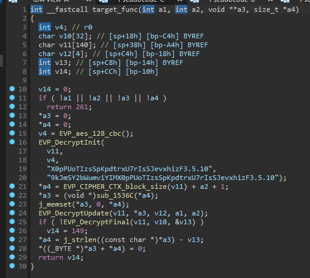
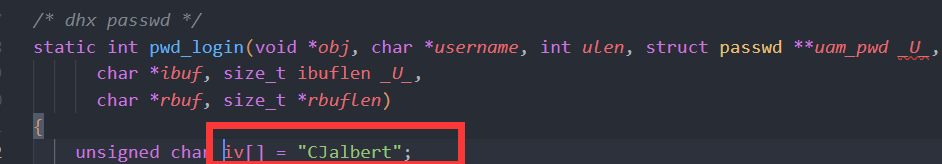
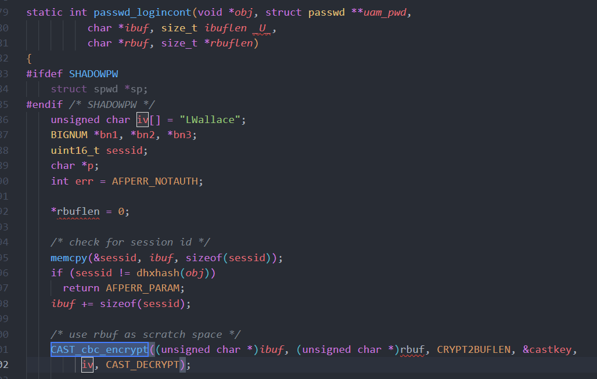

# Summary

| Pattern | # of Raw Misuses | # of Reported Misuses | # of Grouped Misuses |
| ------- | ---------------- | --------------------- | -------------------- |
| ITP-1   | 0                | 0                     | 0                    |
| ITP-2   | 6                | 6                     | 2                    |
| ITP-3   | 0                | 0                     | 0                    |
| TP      | 1                | 1                     | 1                    |
| FP      | 0                | 0                     | 0                    |
| Total   | 7                | 7                     | 3                    |

# Misuse-1 (TP)

Pattern: TP

Desc: AWS authorization

Dataflow: aes_128_cbc_decrypt -> sha1 -> HMAC -> base64 -> `sprintf("AWS %s:%s", AWSAccessKey, base64); `

Documentation from AWS: https://docs.aws.amazon.com/AmazonS3/latest/userguide/RESTAuthentication.html



```cpp
_DWORD *__fastcall sub_97F10(
        _DWORD *a1,
        char *accessKey,
        const char *buf,
        int a4,
        int a5,
        int a6,
        int a7,
        int a8,
        int a9)
{

  v35 = 0;
  v29 = 0;
  s = 0;
  base64_buf = 0;
  v33 = 0;
  sub_9C69C(&v22, "Authorization");
  v32 = sub_9D660(a4);
  v31 = "AWS %s:%s";
  v30 = "%s\n\n%s\n%s\n%s%s";
  v26 = 0;
  sub_11D68(a5, v27, 128);
  v33 = (void *)sub_97C68(a8, a9);
  if ( v33 )
  {
    s = sprintf_0(0, v30, v32, a7, v27, v33, a6);
    if ( s )
    {
      v10 = j_strlen(s);
      v11 = j_strlen(buf);
      sub_3B790((int)s, v10, (int)buf, v11, (int)&base64_buf, &v29);
      sub_153DC(s);
      v35 = sprintf_0(0, v31, accessKey, base64_buf);
      if ( v35 )
      {
        v23 = v35;
        v25 = 1;
        v26 = 1;
      }
      else
      {
        v12 = sub_11F10(18);
        log(4, "%s() \"%s\"", "s_AmazonS3GetAuthHeader", v12);
      }
      sub_153DC(base64_buf);
    }
    else
    {
      v13 = sub_11F10(18);
      log(4, "%s() \"%s\"", "s_AmazonS3GetAuthHeader", v13);
    }
    sub_153DC(v33);
  }
  else
  {
    v14 = sub_11F10(18);
    log(4, "%s() \"%s\"", "s_AmazonS3GetAuthHeader", v14);
  }
  v15 = v23;
  v16 = v24;
  v17 = v25;
  *a1 = v22;
  a1[1] = v15;
  a1[2] = v16;
  a1[3] = v17;
  a1[4] = v26;
  return a1;
}
```

```
--------------------------------------
File: /home/xx/CRYPTOREX/CRYPTOREX_criticism/tmp/extract/Netgear/R7300-V1.0.0.74_1.0.29.zip/R7300-V1.0.0.74_1.0.29/_R7300-V1.0.0.74_1.0.29.chk.extracted/squashfs-root/usr/sbin/NetReadyAgent
Rule: Rule-3. Do not use a non-random initialization vector (IV) for ciphertext block chaining (CBC) encryption
Function name: EVP_DecryptInit (0x3bbe0)
Data: 9kJmSY2bWumviYIM
Path: ['0x3bbc0']
Count: 1
Call stack:
--------------------------------------
```

# Misuse-2 (ITP-2)

Pattern: ITP-2

Desc: AFP

https://developer.apple.com/library/archive/documentation/Networking/Conceptual/AFP/AFPSecurity/AFPSecurity.html#//apple_ref/doc/uid/TP40000854-CH232-81479

```c++
/* -------------------------------- */
static int logincont1(void *obj _U_, char *ibuf, size_t ibuflen, char *rbuf, size_t *rbuflen)
{
    int ret;
    size_t nwritten;
    gcry_mpi_t Mb, K, clientNonce;
    unsigned char *K_bin = NULL;
    char serverNonce_bin[16];
    gcry_cipher_hd_t ctx;
    gcry_error_t ctxerror;
    uint16_t uint16;

    *rbuflen = 0;

    Mb = gcry_mpi_new(0);
    K = gcry_mpi_new(0);
    clientNonce = gcry_mpi_new(0);
    serverNonce = gcry_mpi_new(0);

    /* Packet size should be: Session ID + Ma + Encrypted client nonce */
    if (ibuflen != 2 + PRIMEBITS/8 + 16) {
        LOG(log_error, logtype_uams, "DHX2: Paket length not correct");
        ret = AFPERR_PARAM;
        goto error_noctx;
    }

    /* Skip session id */
    ibuf += 2;

    /* Extract Mb, client's "public" key */
    gcry_mpi_scan(&Mb, GCRYMPI_FMT_USG, ibuf, PRIMEBITS/8, NULL);
    ibuf += PRIMEBITS/8;

    /* Now finally generate the Key: K = Mb^Ra mod p */
    gcry_mpi_powm(K, Mb, Ra, p);

    /* We need K in binary form in order to ... */
    K_bin = calloc(1, PRIMEBITS/8);
    if (K_bin == NULL) {
        ret = AFPERR_MISC;
        goto error_noctx;
    }
    gcry_mpi_print(GCRYMPI_FMT_USG, K_bin, PRIMEBITS/8, &nwritten, K);
    if (nwritten < PRIMEBITS/8) {
        memmove(K_bin + PRIMEBITS/8 - nwritten, K_bin, nwritten);
        memset(K_bin, 0, PRIMEBITS/8 - nwritten);
    }

    /* ... generate the MD5 hash of K. K_MD5hash is what we actually use ! */
    K_MD5hash = calloc(1, K_hash_len = gcry_md_get_algo_dlen(GCRY_MD_MD5));
    if (K_MD5hash == NULL) {
        ret = AFPERR_MISC;
        goto error_noctx;
    }
    gcry_md_hash_buffer(GCRY_MD_MD5, K_MD5hash, K_bin, PRIMEBITS/8);
    free(K_bin);
    K_bin = NULL;

    /* FIXME: To support the Reconnect UAM, we need to store this key somewhere */

    /* Set up our encryption context. */
    ctxerror = gcry_cipher_open( &ctx, GCRY_CIPHER_CAST5, GCRY_CIPHER_MODE_CBC, 0);
    if (gcry_err_code(ctxerror) != GPG_ERR_NO_ERROR) {
        ret = AFPERR_MISC;
        goto error_ctx;
    }
    /* Set key */
    ctxerror = gcry_cipher_setkey(ctx, K_MD5hash, K_hash_len);
    if (gcry_err_code(ctxerror) != GPG_ERR_NO_ERROR) {
        ret = AFPERR_MISC;
        goto error_ctx;
    }
    /* Set the initialization vector for client->server transfer. */
    ctxerror = gcry_cipher_setiv(ctx, dhx_c2siv, sizeof(dhx_c2siv));
    if (gcry_err_code(ctxerror) != GPG_ERR_NO_ERROR) {
        ret = AFPERR_MISC;
        goto error_ctx;
    }
    /* Finally: decrypt client's md5_K(client nonce, C2SIV) inplace */
    ctxerror = gcry_cipher_decrypt(ctx, ibuf, 16, NULL, 0);
    if (gcry_err_code(ctxerror) != GPG_ERR_NO_ERROR) {
        ret = AFPERR_MISC;
        goto error_ctx;
    }
    /* Pull out clients nonce */
    gcry_mpi_scan(&clientNonce, GCRYMPI_FMT_USG, ibuf, 16, NULL);
    /* Increment nonce */
    gcry_mpi_add_ui(clientNonce, clientNonce, 1);

    /* Generate our nonce and remember it for Logincont2 */
    gcry_create_nonce(serverNonce_bin, 16); /* We'll use this here */
    gcry_mpi_scan(&serverNonce, GCRYMPI_FMT_USG, serverNonce_bin, 16, NULL); /* For use in Logincont2 */

    /* ---- Start building reply packet ---- */

    /* Session ID + 1 first */
    uint16 = htons(ID+1);
    memcpy(rbuf, &uint16, sizeof(uint16_t));
    rbuf += 2;
    *rbuflen += 2;

    /* Client nonce + 1 */
    gcry_mpi_print(GCRYMPI_FMT_USG, (unsigned char *)rbuf, PRIMEBITS/8, NULL, clientNonce);
    /* Server nonce */
    memcpy(rbuf+16, serverNonce_bin, 16);

    /* Set the initialization vector for server->client transfer. */
    ctxerror = gcry_cipher_setiv(ctx, dhx_s2civ, sizeof(dhx_s2civ));
    if (gcry_err_code(ctxerror) != GPG_ERR_NO_ERROR) {
        ret = AFPERR_MISC;
        goto error_ctx;
    }
    /* Encrypt md5_K(clientNonce+1, serverNonce) inplace */
    ctxerror = gcry_cipher_encrypt(ctx, rbuf, 32, NULL, 0);
    if (gcry_err_code(ctxerror) != GPG_ERR_NO_ERROR) {
        ret = AFPERR_MISC;
        goto error_ctx;
    }
    rbuf += 32;
    *rbuflen += 32;

    ret = AFPERR_AUTHCONT;
    goto exit;

error_ctx:
    gcry_cipher_close(ctx);
error_noctx:
    gcry_mpi_release(serverNonce);
    free(K_MD5hash);
    K_MD5hash=NULL;
exit:
    gcry_mpi_release(K);
    gcry_mpi_release(Mb);
    gcry_mpi_release(Ra);
    gcry_mpi_release(clientNonce);
    return ret;
}
```

```
--------------------------------------
File: /home/xx/CRYPTOREX/CRYPTOREX_criticism/tmp/extract/D-Link/DNS-345_A2_FIRMWARE_1.03B06.ZIP/DNS-345_A2_FIRMWARE_1.03B06/_DNS-345_A2_FW_v1.03b06.extracted/squashfs-root/lib/uams/uams_dhx2_pam.so
Rule: Rule-3. Do not use a non-random initialization vector (IV) for ciphertext block chaining (CBC) encryption
Function name: gcry_cipher_setiv (0x4019d0)
Data: LWallaceCJalbert
Path: ['0x4019c4']
Count: 1
Call stack:
--------------------------------------
--------------------------------------
File: /home/xx/CRYPTOREX/CRYPTOREX_criticism/tmp/extract/D-Link/DNS-345_A2_FIRMWARE_1.03B06.ZIP/DNS-345_A2_FIRMWARE_1.03B06/_DNS-345_A2_FW_v1.03b06.extracted/squashfs-root/lib/uams/uams_dhx2_pam.so
Rule: Rule-3. Do not use a non-random initialization vector (IV) for ciphertext block chaining (CBC) encryption
Function name: gcry_cipher_setiv (0x4027c8)
Data: LWallaceCJalbert
Path: ['0x4027bc']
Count: 1
Call stack:
--------------------------------------
--------------------------------------
File: /home/xx/CRYPTOREX/CRYPTOREX_criticism/tmp/extract/D-Link/DNS-345_A2_FIRMWARE_1.03B06.ZIP/DNS-345_A2_FIRMWARE_1.03B06/_DNS-345_A2_FW_v1.03b06.extracted/squashfs-root/lib/uams/uams_dhx2_passwd.so
Rule: Rule-3. Do not use a non-random initialization vector (IV) for ciphertext block chaining (CBC) encryption
Function name: gcry_cipher_setiv (0x401b34)
Data: LWallaceCJalbert
Path: ['0x401b28']
Count: 1
Call stack:
--------------------------------------
--------------------------------------
File: /home/xx/CRYPTOREX/CRYPTOREX_criticism/tmp/extract/D-Link/DNS-345_A2_FIRMWARE_1.03B06.ZIP/DNS-345_A2_FIRMWARE_1.03B06/_DNS-345_A2_FW_v1.03b06.extracted/squashfs-root/lib/uams/uams_dhx2_passwd.so
Rule: Rule-3. Do not use a non-random initialization vector (IV) for ciphertext block chaining (CBC) encryption
Function name: gcry_cipher_setiv (0x401884)
Data: LWallaceCJalbert
Path: ['0x401878']
Count: 1
Call stack:
--------------------------------------
```

# Misuse-3 (ITP-2)

Pattern: ITP-2

Desc: AFP




```f
--------------------------------------
File: /home/xx/CRYPTOREX/CRYPTOREX_criticism/tmp/extract/D-Link/DNS-345_A2_FIRMWARE_1.03B06.ZIP/DNS-345_A2_FIRMWARE_1.03B06/_DNS-345_A2_FW_v1.03b06.extracted/squashfs-root/lib/uams/uams_dhx_pam.so
Rule: Rule-3. Do not use a non-random initialization vector (IV) for ciphertext block chaining (CBC) encryption
Function name: CAST_cbc_encrypt (0x40149c)
Data: "CJalbert"
Path: ['0x40149c']
Count: 1
Call stack:
--------------------------------------
--------------------------------------
File: /home/xx/CRYPTOREX/CRYPTOREX_criticism/tmp/extract/D-Link/DNS-345_A2_FIRMWARE_1.03B06.ZIP/DNS-345_A2_FIRMWARE_1.03B06/_DNS-345_A2_FW_v1.03b06.extracted/squashfs-root/lib/uams/uams_dhx_passwd.so
Rule: Rule-3. Do not use a non-random initialization vector (IV) for ciphertext block chaining (CBC) encryption
Pattern: TP
Function name: CAST_cbc_encrypt (0x401094)
Data: "LWallace"
Path: ['0x4010e8', '0x4010c4', '0x4010a4', '0x401070']
Count: 1
Call stack:
-> sub_401070 (0x401070)
--------------------------------------
```
`
