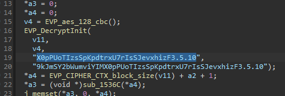
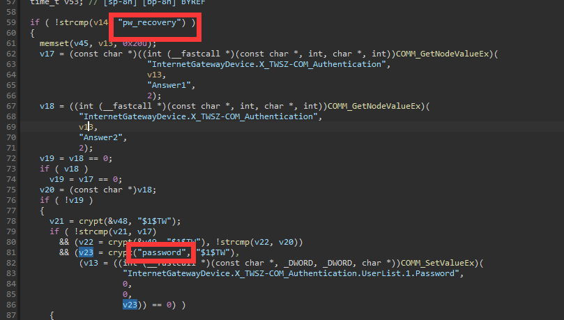

# Summary

| Pattern | # of Raw Misuses | # of Reported Misuses | # of Grouped Misuses |
| ------- | ---------------- | --------------------- | -------------------- |
| ITP-1   | 0                | 0                     | 0                    |
| ITP-2   | 0                | 0                     | 0                    |
| ITP-3   | 20               | 13                    | 2                    |
| TP      | 47               | 20                    | 5                    |
| FP      | 1                | 1                     | 1                    |
| Total   | 68               | 34                    | 8                    |

# Misuse-1 (TP)

Pattern: TP

Desc: AWS authorization

Dataflow: aes_128_cbc_decrypt -> sha1 -> HMAC -> base64 -> `sprintf("AWS %s:%s", AWSAccessKey, base64); `

https://docs.aws.amazon.com/AmazonS3/latest/API/sigv4-auth-using-authorization-header.html



```
--------------------------------------
File: /home/xx/CRYPTOREX/CRYPTOREX_criticism/tmp/extract/Netgear/R7300-V1.0.0.74_1.0.29.zip/R7300-V1.0.0.74_1.0.29/_R7300-V1.0.0.74_1.0.29.chk.extracted/squashfs-root/usr/sbin/NetReadyAgent
Rule: Rule-2. Do not use constant encryption keys
Function name: EVP_DecryptInit (0x3bbd4)
Data: "X0pPUoTIzsSpKpdtrxU7rIsSJevxhizF3.5.10"
Path: ['0x3bbc0']
Count: 1
Call stack:
--------------------------------------
```

# Misuse-2 (ITP-3)

Pattern: ITP-3

Desc: This function is merely used to test whether `EVP_aes_128_cbc` works well, and the derived `key` and `iv` are never **READ** in any places:

```
--------------------------------------
File: /home/xx/CRYPTOREX/CRYPTOREX_criticism/tmp/extract/Linksys/FW_EA6200_1.1.41.188556_prod.img/_FW_EA6200_1.1.41.188556_prod.img.extracted/squashfs-root/usr/sbin/eurl
Rule: Rule-2. Do not use constant encryption keys
Function name: EVP_BytesToKey (0x9388)
Data: "this_is_a_passphrase",0
Path: ['0x9100', '0x90f4', '0x90ec', '0x90e8', '0x90d8', '0x9368']
Count: 2
Call stack:
-> sub_90d8 (0x90d8)
-> sub_9368 (0x9368)
--------------------------------------
--------------------------------------
File: /home/xx/CRYPTOREX/CRYPTOREX_criticism/tmp/extract/Linksys/FW_EA6200_1.1.41.188556_prod.img/_FW_EA6200_1.1.41.188556_prod.img.extracted/squashfs-root/usr/sbin/eurl
Rule: Rule-2. Do not use constant encryption keys
Function name: EVP_BytesToKey (0x93e0)
Data: "this_is_a_passphrase",0
Path: ['0x9100', '0x90f4', '0x90ec', '0x90e8', '0x90d8', '0x93e0']
Count: 2
Call stack:
-> sub_90d8 (0x90d8)
--------------------------------------
--------------------------------------
File: /home/xx/CRYPTOREX/CRYPTOREX_criticism/tmp/extract/Linksys/FW_EA3500_1.1.40.162464_prod.zip/FW_EA3500_1.1.40.162464_prod/_FW_EA3500_1.1.40.162464_prod.SSA.extracted/jffs2-root/usr/sbin/eurl
Rule: Rule-2. Do not use constant encryption keys
Function name: EVP_BytesToKey (0xa534)
Data: "this_is_a_passphrase",0
Path: ['0x9cf4', '0x9ce8', '0x9ce0', '0x9cdc', '0x9cc8', '0xa534']
Count: 1
Call stack:
-> sub_9cc8 (0x9cc8)
--------------------------------------
--------------------------------------
File: /home/xx/CRYPTOREX/CRYPTOREX_criticism/tmp/extract/Linksys/FW_EA3500_1.1.40.162464_prod.zip/FW_EA3500_1.1.40.162464_prod/_FW_EA3500_1.1.40.162464_prod.SSA.extracted/jffs2-root/usr/sbin/eurl
Rule: Rule-2. Do not use constant encryption keys
Function name: EVP_BytesToKey (0xa598)
Data: "this_is_a_passphrase",0
Path: ['0x9cf4', '0x9ce8', '0x9ce0', '0x9cdc', '0x9cc8', '0xa598']
Count: 1
Call stack:
-> sub_9cc8 (0x9cc8)
--------------------------------------
--------------------------------------
File: /home/xx/CRYPTOREX/CRYPTOREX_criticism/tmp/extract/Linksys/FW_EA6900v2_2.0.3.186963_prod.img/_FW_EA6900v2_2.0.3.186963_prod.img.extracted/jffs2-root/usr/sbin/eurl
Rule: Rule-2. Do not use constant encryption keys
Function name: EVP_BytesToKey (0x401b00)
Data: "this_is_a_passphrase"
Path: ['0x401770', '0x401758', '0x401740', '0x401728', '0x4016f8', '0x401afc']
Count: 1
Call stack:
-> sub_4016f8 (0x4016f8)
--------------------------------------
--------------------------------------
File: /home/xx/CRYPTOREX/CRYPTOREX_criticism/tmp/extract/Linksys/FW_EA6900v2_2.0.3.186963_prod.img/_FW_EA6900v2_2.0.3.186963_prod.img.extracted/jffs2-root/usr/sbin/eurl
Rule: Rule-2. Do not use constant encryption keys
Function name: EVP_BytesToKey (0x401b60)
Data: "this_is_a_passphrase"
Path: ['0x401770', '0x401758', '0x401740', '0x401728', '0x4016f8', '0x401b5c']
Count: 1
Call stack:
-> sub_4016f8 (0x4016f8)
--------------------------------------
--------------------------------------
File: /home/xx/CRYPTOREX/CRYPTOREX_criticism/tmp/extract/Linksys/FW_WRT1200ACV2_2.0.6.191786_prod.img/_FW_WRT1200ACV2_2.0.6.191786_prod.img.extracted/jffs2-root/usr/sbin/eurl
Rule: Rule-2. Do not use constant encryption keys
Function name: EVP_BytesToKey (0x117ac)
Data: "this_is_a_passphrase",0
Path: ['0x1150c', '0x11500', '0x114f8', '0x114f4', '0x114e4', '0x11780']
Count: 3
Call stack:
-> sub_114e4 (0x114e4)
-> sub_11780 (0x11780)
--------------------------------------
--------------------------------------
File: /home/xx/CRYPTOREX/CRYPTOREX_criticism/tmp/extract/Linksys/FW_WRT1200ACV2_2.0.6.191786_prod.img/_FW_WRT1200ACV2_2.0.6.191786_prod.img.extracted/jffs2-root/usr/sbin/eurl
Rule: Rule-2. Do not use constant encryption keys
Function name: EVP_BytesToKey (0x117f8)
Data: "this_is_a_passphrase",0
Path: ['0x1150c', '0x11500', '0x114f8', '0x114f4', '0x114e4', '0x117f8']
Count: 3
Call stack:
-> sub_114e4 (0x114e4)
--------------------------------------
--------------------------------------
File: /home/xx/CRYPTOREX/CRYPTOREX_criticism/tmp/extract/Linksys/FW_EA2700_1.1.40.189581_prod.img/_FW_EA2700_1.1.40.189581_prod.img.extracted/squashfs-root/usr/sbin/eurl
Rule: Rule-2. Do not use constant encryption keys
Function name: EVP_BytesToKey (0x4032c0)
Data: "this_is_a_passphrase"
Path: ['0x402754', '0x40273c', '0x402724', '0x40270c', '0x4026d4', '0x403268']
Count: 1
Call stack:
-> aesInit (0x4026d4)
-> aesTest (0x403268)
--------------------------------------
--------------------------------------
File: /home/xx/CRYPTOREX/CRYPTOREX_criticism/tmp/extract/Linksys/FW_EA2700_1.1.40.189581_prod.img/_FW_EA2700_1.1.40.189581_prod.img.extracted/squashfs-root/usr/sbin/eurl
Rule: Rule-2. Do not use constant encryption keys
Function name: EVP_BytesToKey (0x40335c)
Data: "this_is_a_passphrase"
Path: ['0x402754', '0x40273c', '0x402724', '0x40270c', '0x4026d4', '0x403344']
Count: 1
Call stack:
-> aesInit (0x4026d4)
--------------------------------------
```

# Misuse-3 (TP)

Pattern: TP

Sum: 20

Desc: `j_DES_processFile(0, s, "/tmp/.lic", (int)"MENLO_ACCESS_LOGIC_POINT");`

```
--------------------------------------
File: /home/xx/CRYPTOREX/CRYPTOREX_criticism/tmp/extract/Netgear/FVS318N_V4.3.5-3.zip/FVS318N_V4.3.5-3/_FVS318N_v4.3.5-3.img.extracted/squashfs-root/lib/libSys.so
Rule: Rule-2. Do not use constant encryption keys
Function name: DES_string_to_key (0x4385e8)
Data: "MENLO_ACCESS_LOGIC_POINT"
Path: ['0x42b08c', '0x42b040', '0x42b030', '0x42afe8', '0x42afd8', '0x42af8c', '0x42af60', '0x4385e0']
Count: 8
Call stack:
-> DES_processFile (0x42af60)
--------------------------------------
--------------------------------------
File: /home/xx/CRYPTOREX/CRYPTOREX_criticism/tmp/extract/D-Link/DSR-250N_FIRMWARE_1.05B20.ZIP/DSR-250N_FIRMWARE_1.05B20/dsr250n_105B20/_DSR-250N_FW_1.05B20_WW.extracted/squashfs-root/lib/libSys.so
Rule: Rule-2. Do not use constant encryption keys
Function name: DES_string_to_key (0x4379f0)
Data: "MENLO_ACCESS_LOGIC_POINT"
Path: ['0x42a748', '0x42a6fc', '0x42a6ec', '0x42a6a4', '0x42a694', '0x42a648', '0x42a61c', '0x4379e8']
Count: 8
Call stack:
-> DES_processFile (0x42a61c)
--------------------------------------
--------------------------------------
File: /home/xx/CRYPTOREX/CRYPTOREX_criticism/tmp/extract/D-Link/DSR-150_A1_FIRMWARE_1.08B29.ZIP/DSR-150_A1_FIRMWARE_1.08B29/_DSR-150_A1_FW1.08B29_WW.extracted/squashfs-root/lib/libSys.so
Rule: Rule-2. Do not use constant encryption keys
Function name: DES_string_to_key (0x439924)
Data: "MENLO_ACCESS_LOGIC_POINT"
Path: ['0x42b59c', '0x42b550', '0x42b540', '0x42b4f8', '0x42b4e8', '0x42b49c', '0x42b470', '0x43991c']
Count: 4
Call stack:
-> DES_processFile (0x42b470)
--------------------------------------
```

# Misuse-4 (TP)

Pattern: TP

Sum: 5

Desc: Seems to be a backdoor...

```
--------------------------------------
File: /home/xx/CRYPTOREX/CRYPTOREX_criticism/tmp/extract/Netgear/PLW1000-V1.0.1.6.zip/PLW1000-V1.0.1.6/_PLW1000-V1.0.1.6.img.extracted/squashfs-root/usr/bin/logic
Rule: Rule-2. Do not use constant encryption keys
Function name: crypt (0x223f0)
Data: "tw007",0
Path: ['0x223ec']
Count: 2
Call stack:
--------------------------------------
--------------------------------------
File: /home/xx/CRYPTOREX/CRYPTOREX_criticism/tmp/extract/Netgear/PLW1000v2-V1.0.0.14.zip/PLW1000v2-V1.0.0.14/_PLW1000v2-V1.0.0.14.img.extracted/squashfs-root/usr/bin/logic
Rule: Rule-2. Do not use constant encryption keys
Function name: crypt (0x20e3c)
Data: "tw007",0
Path: ['0x20e38']
Count: 2
Call stack:
--------------------------------------
--------------------------------------
File: /home/xx/CRYPTOREX/CRYPTOREX_criticism/tmp/extract/Netgear/EX6110_EX3110_EX5000_EX2800-V1.0.1.80.zip/EX6110_EX3110_EX5000_EX2800-V1.0.1.80/_EX6110_EX3110_EX5000_EX2800-V1.0.1.80.img.extracted/squashfs-root/usr/bin/logic
Rule: Rule-2. Do not use constant encryption keys
Function name: crypt (0x42f4c8)
Data: "tw007"
Path: ['0x42f4c0']
Count: 1
Call stack:
--------------------------------------
```

# Misuse-5 (ITP-3)

Pattern: ITP-3

Sum: 4

Desc: Password recovery



```
--------------------------------------
File: /home/xx/CRYPTOREX/CRYPTOREX_criticism/tmp/extract/Netgear/PLW1000-V1.0.1.6.zip/PLW1000-V1.0.1.6/_PLW1000-V1.0.1.6.img.extracted/squashfs-root/usr/bin/logic
Rule: Rule-2. Do not use constant encryption keys
Function name: crypt (0x233a0)
Data: "password",0
Path: ['0x2339c']
Count: 2
Call stack:
--------------------------------------
--------------------------------------
File: /home/xx/CRYPTOREX/CRYPTOREX_criticism/tmp/extract/Netgear/PLW1000v2-V1.0.0.14.zip/PLW1000v2-V1.0.0.14/_PLW1000v2-V1.0.0.14.img.extracted/squashfs-root/usr/bin/logic
Rule: Rule-2. Do not use constant encryption keys
Function name: crypt (0x21e9c)
Data: "password",0
Path: ['0x21e98']
Count: 1
Call stack:
--------------------------------------
--------------------------------------
File: /home/xx/CRYPTOREX/CRYPTOREX_criticism/tmp/extract/Netgear/PLW1000v2-V1.0.0.18.zip/PLW1000v2-V1.0.0.18/_PLW1000v2-V1.0.0.18.img.extracted/squashfs-root/usr/bin/logic
Rule: Rule-2. Do not use constant encryption keys
Function name: crypt (0x21dec)
Data: "password",0
Path: ['0x21de8']
Count: 1
Call stack:
--------------------------------------
```

# Misuse-6 (TP)

Pattern: TP

Sum: 1

Desc: Using "admin" as default password

```
--------------------------------------
File: /home/xx/CRYPTOREX/CRYPTOREX_criticism/tmp/extract/Tomato/tomato-K26USB-1.28.RT-MIPSR2-140-AIO.zip/tomato-K26USB-1.28.RT-MIPSR2-140-AIO/image/_tomato-K26USB-1.28.RT-MIPSR2-140-AIO.trx.extracted/squashfs-root/sbin/rc
Rule: Rule-2. Do not use constant encryption keys
Function name: crypt (0x4284e0)
Data: "admin"
Path: ['0x428568', '0x42855c', '0x42853c', '0x428528', '0x4284f4', '0x4284dc']
Count: 1
Call stack:
--------------------------------------
```

# Misuse-7 (FP)

Pattern: FP

Sum: 1

Desc: Bug caused by ignoring call-return edges

```
--------------------------------------
File: /home/xx/CRYPTOREX/CRYPTOREX_criticism/tmp/extract/Tomato/freshtomato-RT-AC3200-ARM-2022.5-AIO-64K.zip/freshtomato-RT-AC3200-ARM-2022.5-AIO-64K/_freshtomato-RT-AC3200-ARM-2022.5-AIO-64K.trx.extracted/squashfs-root/sbin/rc
Rule: Rule-2. Do not use constant encryption keys
Function name: crypt (0x2fde8)
Data: "http_passwd",0
Path: ['0x2fe58', '0x2fe50', '0x2fe40', '0x2fe38', '0x2fe10', '0x2fe08', '0x2fdf0', '0x2fde8']
Count: 1
Call stack:
--------------------------------------
```

# Misuse-8 (TP)

Pattern: TP

Sum: 20

Desc: Using "password" as default password

```
--------------------------------------
File: /home/xx/CRYPTOREX/CRYPTOREX_criticism/tmp/extract/Netgear/FVS318N_V4.3.5-3.zip/FVS318N_V4.3.5-3/_FVS318N_v4.3.5-3.img.extracted/squashfs-root/sslvpn/bin/smm
Rule: Rule-2. Do not use constant encryption keys
Function name: crypt (0x1f738)
Data: "password"
Path: ['0x1f728']
Count: 2
Call stack:
--------------------------------------
--------------------------------------
File: /home/xx/CRYPTOREX/CRYPTOREX_criticism/tmp/extract/Netgear/FVS318N_V4.3.5-3.zip/FVS318N_V4.3.5-3/_FVS318N_v4.3.5-3.img.extracted/squashfs-root/sslvpn/bin/smm
Rule: Rule-2. Do not use constant encryption keys
Function name: crypt (0x1f6ac)
Data: "password"
Path: ['0x1f69c']
Count: 2
Call stack:
--------------------------------------
--------------------------------------
File: /home/xx/CRYPTOREX/CRYPTOREX_criticism/tmp/extract/D-Link/DSR-250N_FIRMWARE_1.05B20.ZIP/DSR-250N_FIRMWARE_1.05B20/dsr250n_105B20/_DSR-250N_FW_1.05B20_WW.extracted/squashfs-root/sslvpn/bin/smm
Rule: Rule-2. Do not use constant encryption keys
Function name: crypt (0x1fb0c)
Data: "password"
Path: ['0x1fafc']
Count: 2
Call stack:
--------------------------------------
--------------------------------------
File: /home/xx/CRYPTOREX/CRYPTOREX_criticism/tmp/extract/D-Link/DSR-250N_FIRMWARE_1.05B20.ZIP/DSR-250N_FIRMWARE_1.05B20/dsr250n_105B20/_DSR-250N_FW_1.05B20_WW.extracted/squashfs-root/sslvpn/bin/smm
Rule: Rule-2. Do not use constant encryption keys
Function name: crypt (0x1fa84)
Data: "password"
Path: ['0x1fa74']
Count: 2
Call stack:
--------------------------------------
--------------------------------------
File: /home/xx/CRYPTOREX/CRYPTOREX_criticism/tmp/extract/D-Link/DWC-1000_FIRMWARE_4.1.0.2.ZIP/DWC-1000_FIRMWARE_4.1.0.2/_DWC-1000_A1_FW_v4.1.0.2_10222W.extracted/squashfs-root/sslvpn/bin/smm
Rule: Rule-2. Do not use constant encryption keys
Function name: crypt (0x1001bf44)
Data: "password"
Path: ['0x1001bf3c']
Count: 1
Call stack:
-> sub_1001bf3c (0x1001bf3c)
--------------------------------------
--------------------------------------
File: /home/xx/CRYPTOREX/CRYPTOREX_criticism/tmp/extract/D-Link/DWC-1000_FIRMWARE_4.1.0.2.ZIP/DWC-1000_FIRMWARE_4.1.0.2/_DWC-1000_A1_FW_v4.1.0.2_10222W.extracted/squashfs-root/sslvpn/bin/smm
Rule: Rule-2. Do not use constant encryption keys
Function name: crypt (0x1001bfec)
Data: "password"
Path: ['0x1001bfe4']
Count: 1
Call stack:
-> sub_1001bfe4 (0x1001bfe4)
--------------------------------------
--------------------------------------
File: /home/xx/CRYPTOREX/CRYPTOREX_criticism/tmp/extract/D-Link/DSR-150_A1_FIRMWARE_1.08B29.ZIP/DSR-150_A1_FIRMWARE_1.08B29/_DSR-150_A1_FW1.08B29_WW.extracted/squashfs-root/sslvpn/bin/smm
Rule: Rule-2. Do not use constant encryption keys
Function name: crypt (0x205d4)
Data: "password"
Path: ['0x205c4']
Count: 1
Call stack:
--------------------------------------
--------------------------------------
File: /home/xx/CRYPTOREX/CRYPTOREX_criticism/tmp/extract/D-Link/DSR-150_A1_FIRMWARE_1.08B29.ZIP/DSR-150_A1_FIRMWARE_1.08B29/_DSR-150_A1_FW1.08B29_WW.extracted/squashfs-root/sslvpn/bin/smm
Rule: Rule-2. Do not use constant encryption keys
Function name: crypt (0x2054c)
Data: "password"
Path: ['0x2053c']
Count: 1
Call stack:
--------------------------------------
--------------------------------------
File: /home/xx/CRYPTOREX/CRYPTOREX_criticism/tmp/extract/D-Link/DSR-1000_A1_FIRMWARE_v2.13_WW.zip/DSR-1000_A1_FIRMWARE_v2.13_WW/_DSR-1000_A1_FW2.13_WW.extracted/squashfs-root/sslvpn/bin/smm
Rule: Rule-2. Do not use constant encryption keys
Function name: crypt (0x1001c6e8)
Data: "password"
Path: ['0x1001c6e0']
Count: 3
Call stack:
-> sub_1001c6e0 (0x1001c6e0)
--------------------------------------
--------------------------------------
File: /home/xx/CRYPTOREX/CRYPTOREX_criticism/tmp/extract/D-Link/DSR-1000_A1_FIRMWARE_v2.13_WW.zip/DSR-1000_A1_FIRMWARE_v2.13_WW/_DSR-1000_A1_FW2.13_WW.extracted/squashfs-root/sslvpn/bin/smm
Rule: Rule-2. Do not use constant encryption keys
Function name: crypt (0x1001c790)
Data: "password"
Path: ['0x1001c788']
Count: 3
Call stack:
-> sub_1001c788 (0x1001c788)
--------------------------------------
--------------------------------------
File: /home/xx/CRYPTOREX/CRYPTOREX_criticism/tmp/extract/D-Link/DSR-1000N_REVA_FIRMWARE_1.09.B61_WW.ZIP/DSR-1000N_REVA_FIRMWARE_1.09.B61_WW/_DSR-1000N_A1_FW1.09B61_WW.extracted/squashfs-root/sslvpn/bin/smm
Rule: Rule-2. Do not use constant encryption keys
Function name: crypt (0x1001c6d8)
Data: "password"
Path: ['0x1001c6d0']
Count: 1
Call stack:
-> sub_1001c6d0 (0x1001c6d0)
--------------------------------------
--------------------------------------
File: /home/xx/CRYPTOREX/CRYPTOREX_criticism/tmp/extract/D-Link/DSR-1000N_REVA_FIRMWARE_1.09.B61_WW.ZIP/DSR-1000N_REVA_FIRMWARE_1.09.B61_WW/_DSR-1000N_A1_FW1.09B61_WW.extracted/squashfs-root/sslvpn/bin/smm
Rule: Rule-2. Do not use constant encryption keys
Function name: crypt (0x1001c780)
Data: "password"
Path: ['0x1001c778']
Count: 1
Call stack:
-> sub_1001c778 (0x1001c778)
--------------------------------------
```


