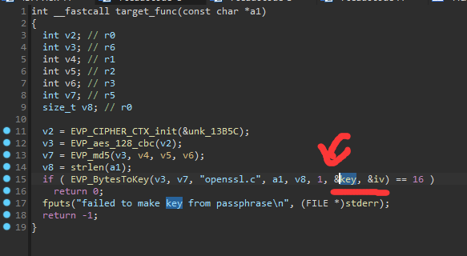
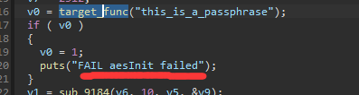
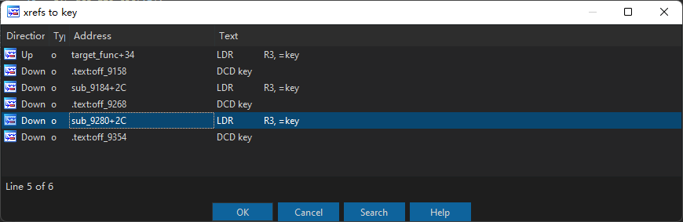
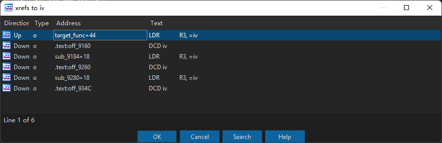

# Summary

| Pattern | # of Raw Misuses | # of Reported Misuses | # of Grouped Misuses |
| ------- | ---------------- | --------------------- | -------------------- |
| ITP-1   | 0                | 0                     | 0                    |
| ITP-2   | 0                | 0                     | 0                    |
| ITP-3   | 6                | 3                     | 1                    |
| TP      | 0                | 0                     | 0                    |
| FP      | 0                | 0                     | 0                    |
| Total   | 6                | 3                     | 1                    |

# Misuse-1 (ITP-3)

Pattern: ITP-3

Sum: 6

Desc: This function is merely used to test whether `EVP_aes_128_cbc` works well, and the derived `key` and `iv` are never **READ** in any places:









```
--------------------------------------
File: /home/xx/CRYPTOREX/CRYPTOREX_criticism/tmp/extract/Linksys/FW_EA6200_1.1.41.188556_prod.img/_FW_EA6200_1.1.41.188556_prod.img.extracted/squashfs-root/usr/sbin/eurl
Rule: Rule-6. Do not use fewer than 1000 iterations for PBE
Function name: EVP_BytesToKey (0x0)
Data: 1
Path: ['0x9100']
Count: 2
Call stack:
--------------------------------------
--------------------------------------
File: /home/xx/CRYPTOREX/CRYPTOREX_criticism/tmp/extract/Linksys/FW_EA3500_1.1.40.162464_prod.zip/FW_EA3500_1.1.40.162464_prod/_FW_EA3500_1.1.40.162464_prod.SSA.extracted/jffs2-root/usr/sbin/eurl
Rule: Rule-6. Do not use fewer than 1000 iterations for PBE
Function name: EVP_BytesToKey (0x0)
Data: 1
Path: ['0x9cf4']
Count: 1
Call stack:
--------------------------------------
--------------------------------------
File: /home/xx/CRYPTOREX/CRYPTOREX_criticism/tmp/extract/Linksys/FW_WRT1200ACV2_2.0.6.191786_prod.img/_FW_WRT1200ACV2_2.0.6.191786_prod.img.extracted/jffs2-root/usr/sbin/eurl
Rule: Rule-6. Do not use fewer than 1000 iterations for PBE
Function name: EVP_BytesToKey (0x0)
Data: 1
Path: ['0x1150c']
Count: 3
Call stack:
--------------------------------------
```


