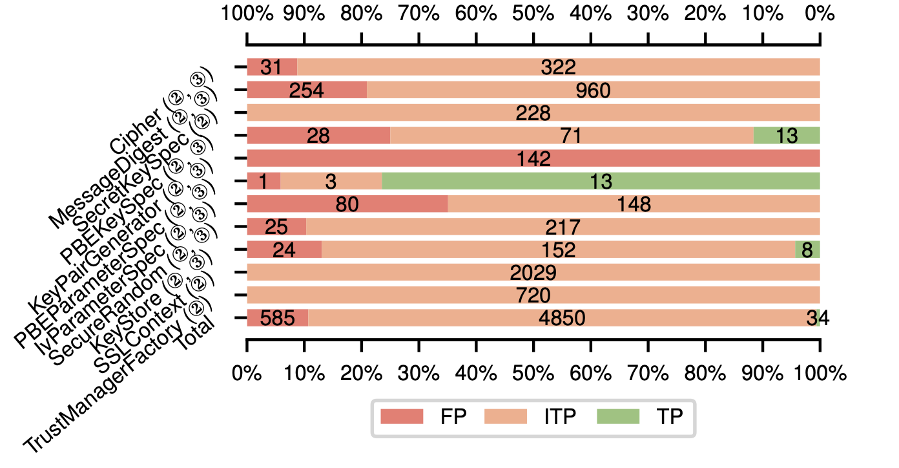

# Crysl Experiment on 3489 fdroid apks 

version: [commit id 1405ebdde9c6980084e3fa9f9de7782f80e420a4](https://github.com/CROSSINGTUD/CryptoAnalysis/tree/1405ebdde9c6980084e3fa9f9de7782f80e420a4)

setting:
    - max memory limit: 16GB
    - timeout limit: crysl self internal timeout

Please check our [instructions](./DOCKER-RUN.md) to reproduce the experiment.

---

F-droid datasets: 3489 apks. Apk name list: `fdroid-3489apks-list`

Latest JCA rules (`/Repo-JCA-rules` directory) is from their rule repo here: [version commit id 6d844ab402229aaefa4c5e45bf080987b787624b](https://github.com/CROSSINGTUD/Crypto-API-Rules/tree/6d844ab402229aaefa4c5e45bf080987b787624b)

Original fdroid results: `/result`

Rule-based results: `/result_rulebased`

Verification results: `/verified_alarms`

Minimal working examples: `/MWEs`

#### Note that we target following class rules to verify, as they are classes that are targeted by Cryptoguard.

| Targeted  Class                    |
| ---------------------------------- |
| javax.crypto.spec.SecretKeySpec    |
| java.security.KeyStore             |
| javax.net.ssl.TrustManagerFactory  |
| javax.net.ssl.SSLContext           |
| java.security.SecureRandom         |
| javax.crypto.spec.PBEKeySpec       |
| javax.crypto.spec.PBEParameterSpec |
| javax.crypto.Cipher                |
| javax.crypto.spec.IvParameterSpec  |
| java.security.KeyPairGenerator     |
| java.security.MessageDigest        |

---

All original results are shown as [Original fdroid results](./result/). Based on the merged results [Rule-based results](./result_rulebased/), we manually verified the top-10 offending methods and some other sample misuses. The overall verification results are shown as the following figure.

